# Setup-Mac Comprehensive Roadmap Analysis

**Date Created:** 2025-10-31_03-47
**Analysis Type:** Pareto Impact Assessment
**Focus Areas:** Development Environment Setup, Reliability, Performance

## 🎯 PARETO IMPACT ANALYSIS

### 1% → 51% IMPACT (Critical Path - Must Complete First)

| Priority | Task | Impact | Effort | Time (min) | Why Critical |
|----------|------|--------|--------|------------|--------------|
| #1 | Fix Netdata Deployment - Complete interrupted installation | 51% | 45min | **30** | Core monitoring completely broken, blocks all reliability improvements |
| #2 | Enable Home Manager Integration - Restore user-specific configs | 48% | 30min | **30** | Blocks all user-level customization and declarative management |
| #3 | Resolve Security Tools Installation - Objective-See suite failures | 45% | 60min | **30** | Critical security gap, compromises system protection |

### 4% → 64% IMPACT (High-Value Foundation)

| Priority | Task | Impact | Effort | Time (min) | Strategic Value |
|----------|------|--------|--------|------------|----------------|
| #4 | Fish Shell Performance Regression - Restore 10ms startup | 40% | 45min | **30** | Core user experience, major performance degradation |
| #5 | ntopng Network Monitoring Research & Implementation | 35% | 90min | **60** | Complete monitoring stack, network visibility |
| #6 | Automated Health Check System - Continuous validation | 32% | 120min | **90** | Prevents regressions, enables proactive maintenance |
| #7 | Documentation Accuracy - Align docs with reality | 28% | 60min | **60** | Critical for user trust and adoption |
| #8 | Zero-Downtime Configuration Updates | 25% | 90min | **75** | Improves development workflow, reduces friction |

### 20% → 80% IMPACT (Professional Polish)

| Priority | Task | Impact | Effort | Time (min) | Business Value |
|----------|------|--------|--------|------------|----------------|
| #9 | Performance Threshold Implementation & Alerting | 22% | 45min | **45** | Automated regression detection |
| #10 | Simplified Onboarding Flow - Reduce manual steps | 20% | 75min | **60** | Improves user adoption, reduces support |
| #11 | Cross-Platform Compatibility Research | 18% | 120min | **90** | Expands user base, future-proofing |
| #12 | Team Deployment Templates | 15% | 150min | **120** | Enterprise readiness, scaling |
| #13 | Advanced Monitoring Integration - Custom dashboards | 12% | 90min | **75** | Enhanced observability, professional features |
| #14 | CI/CD Pipeline for Config Validation | 10% | 105min | **90** | Quality assurance, automated testing |
| #15 | Automated Backup & Recovery System | 8% | 60min | **45** | Data safety, disaster recovery |

## 🚀 EXECUTION STRATEGY: START WITH 1%

### Phase 1: Critical Infrastructure (1% → 51% Impact)
**Timeline: 90 minutes total | Blocks: Everything else**

1. **Netdata Deployment Completion** (30min)
   - Locate interrupted deployment state
   - Complete installation and service configuration
   - Verify web interface at http://localhost:19999
   - Test basic monitoring functionality

2. **Home Manager Re-activation** (30min)
   - Uncomment Home Manager configuration in flake.nix
   - Restore user-specific declarative settings
   - Test configuration application
   - Verify user environment management

3. **Security Tools Resolution** (30min)
   - Debug Objective-See tools installation failures
   - Implement alternative security configuration
   - Verify protection functionality
   - Test security alerting system

### Phase 2: Foundation Strengthening (4% → 64% Impact)
**Timeline: 315 minutes total | Blocks: Advanced features**

4. **Fish Shell Performance Fix** (30min)
5. **ntopng Implementation** (60min)
6. **Health Check System** (90min)
7. **Documentation Updates** (60min)
8. **Zero-Downtime Updates** (75min)

### Phase 3: Professional Excellence (20% → 80% Impact)
**Timeline: 525 minutes total | Business value & scaling**

9-15: Complete remaining high-value improvements

## 📊 IMPACT METRICS & SUCCESS CRITERIA

### Critical Success Indicators
- **Netdata**: Web interface accessible, collecting real metrics
- **Home Manager**: User configs apply declaratively via Nix
- **Security Tools**: All protection active, no installation errors
- **Fish Performance**: Startup time <20ms (target 10ms)
- **System Health**: Automated validation passes 100%

### Business Impact Targets
- **User Success Rate**: From 60% → 95% on first setup
- **Support Burden**: Reduced by 80% through automation
- **Performance**: Shell startup <20ms, system alerts functional
- **Documentation Accuracy**: 100% alignment with functionality
- **Enterprise Readiness**: Team deployment capability

## 🔄 EXECUTION GRAPH

```mermaid
graph TD
    A[Start: Git Clean] --> B[Phase 1: Critical Infrastructure]
    B --> B1[Netdata Fix - 30min]
    B1 --> B2[Home Manager - 30min]
    B2 --> B3[Security Tools - 30min]
    B3 --> C[Phase 1 Complete: 51% Impact]

    C --> D[Phase 2: Foundation Strengthening]
    D --> D1[Fish Performance - 30min]
    D1 --> D2[ntopng Setup - 60min]
    D2 --> D3[Health Check System - 90min]
    D3 --> D4[Documentation Update - 60min]
    D4 --> D5[Zero-Downtime Updates - 75min]
    D5 --> E[Phase 2 Complete: 64% Impact]

    E --> F[Phase 3: Professional Excellence]
    F --> F1[Performance Thresholds - 45min]
    F1 --> F2[Simplified Onboarding - 60min]
    F2 --> F3[Cross-Platform Research - 90min]
    F3 --> F4[Team Templates - 120min]
    F4 --> F5[Advanced Monitoring - 75min]
    F5 --> F6[CI/CD Pipeline - 90min]
    F6 --> F7[Backup System - 45min]
    F7 --> G[Phase 3 Complete: 80% Impact]

    G --> H[Final: 80% Impact Achieved]

    style B fill:#ff6b6b,stroke:#ff0000,stroke-width:3px
    style C fill:#ffd93d,stroke:#ff9800,stroke-width:2px
    style E fill:#6bcf7f,stroke:#4caf50,stroke-width:2px
    style H fill:#4a90e2,stroke:#2196f3,stroke-width:3px
```

## 📋 COMPREHENSIVE TASK BREAKDOWN (100+ Tasks)

### CRITICAL PATH (Tasks 1-30) - 15min Each

1. Netdata state assessment - Check current installation status
2. Netdata service configuration - Configure daemon settings
3. Netdata web interface verification - Test http://localhost:19999
4. Netdata metrics collection validation - Verify data flow
5. Home Manager flake.nix uncomment - Restore configuration
6. Home Manager rebuild test - Validate Nix configuration
7. Home Manager user config test - Verify user-level settings
8. Home Manager service integration - Test service management
9. Security tools error analysis - Debug installation failures
10. BlockBlock alternative research - Find working solution
11. Oversight monitoring setup - Implement webcam/mic protection
12. KnockKnock persistence scanning - Setup security scanning
13. Security tools integration test - Verify all protections
14. Fish shell configuration audit - Identify performance bottlenecks
15. Fish shell optimization implementation - Restore 10ms startup
16. Fish shell performance benchmarking - Measure improvement
17. Fish shell default system setting - Set as default shell
18. ntopng package availability research - Check Nix/Homebrew
19. ntopng installation implementation - Deploy network monitor
20. ntopng interface configuration - Setup web interface
21. ntopng network verification - Test traffic analysis
22. Health check script creation - Automated validation system
23. Health check scheduling - Setup periodic validation
24. Health check alerting - Configure notification system
25. Documentation accuracy audit - Review all docs vs reality
26. Netdata documentation update - Fix monitoring docs
27. Home Manager documentation update - Fix config docs
28. Security tools documentation update - Fix security docs
29. Documentation testing - Verify all instructions work
30. Zero-downtime update mechanism research - Plan implementation

### FOUNDATION STRENGTHENING (Tasks 31-60) - 15min Each

31. Performance threshold definition - Establish alert criteria
32. Performance monitoring implementation - Setup automated checks
33. Performance alerting system - Configure notifications
34. Onboarding step analysis - Map current manual processes
35. Onboarding automation implementation - Reduce friction
36. Onboarding testing - Validate user experience
37. Cross-platform requirements analysis - Linux compatibility
38. Cross-platform implementation planning - Architecture design
39. Team configuration template creation - Standardize setups
40. Team deployment testing - Verify multi-user scenarios
41. Monitoring dashboard customization - Create professional UI
42. Monitoring alert refinement - Optimize notifications
43. CI/CD pipeline design - Plan automated validation
44. CI/CD implementation - Setup testing infrastructure
45. Backup system design - Plan recovery strategy
46. Backup implementation - Deploy automated backups
47. Recovery testing - Validate restore procedures
48. Performance regression detection setup - Automated monitoring
49. System dependency analysis - Map all requirements
50. Dependency optimization - Streamline installations
51. Configuration validation enhancement - Improve error handling
52. Error reporting system - Better user feedback
53. Update automation - Streamline Nix operations
54. Rollback procedures enhancement - Improve recovery
55. Community contribution guidelines - Standardize development
56. Code quality automation - Enhanced linting/testing
57. Security audit implementation - Regular validation
58. User feedback collection - Improvement mechanisms
59. Performance analytics - Detailed monitoring
60. Release process automation - Streamline deployments

### PROFESSIONAL EXCELLENCE (Tasks 61-100) - 15min Each

61. Advanced user configuration options - Power user features
62. Plugin system design - Extensible architecture
63. Third-party integration framework - External tools
64. API documentation creation - Developer resources
65. Community contribution system - Open source workflow
66. Testing infrastructure enhancement - Comprehensive coverage
67. Documentation website creation - Professional presentation
68. Video tutorial creation - Visual learning resources
69. User community setup - Support infrastructure
70. Enterprise sales materials - Business development
71. Support ticketing system - Professional support
72. Training program development - User education
73. Certification program - Expert validation
74. Partner ecosystem development - Third-party integrations
75. International support expansion - Global compatibility
76. Accessibility improvements - Universal design
77. Mobile companion app development - Extended functionality
78. Cloud integration services - Remote management
79. Managed service offering - Business expansion
80. Research & development pipeline - Innovation system
81. Patent portfolio development - IP protection
82. Academic research partnerships - Knowledge advancement
83. Industry conference presence - Thought leadership
84. Open source foundation establishment - Governance
85. Standardization participation - Industry influence
86. Regulatory compliance verification - Legal requirements
87. Data privacy enhancement - User protection
88. Environmental impact assessment - Sustainability
89. Social responsibility program - Community impact
90. Diversity & inclusion initiatives - Workplace improvement
91. Employee training programs - Skill development
92. Customer success programs - User achievement
93. Product roadmap development - Strategic planning
94. Competitive analysis system - Market intelligence
95. Brand development - Market positioning
96. Marketing automation - Growth acceleration
97. Sales channel development - Revenue expansion
98. Financial planning system - Business stability
99. Investor relations setup - Funding preparation
100. Exit strategy planning - Business outcomes

## 🎯 IMMEDIATE NEXT STEPS

**TODAY (First 90 minutes):**
1. Fix Netdata deployment (critical monitoring)
2. Enable Home Manager (user configuration)
3. Resolve security tools (system protection)

**THIS WEEK (Complete 64% impact):**
4-8: Foundation strengthening tasks
9-15: Additional high-value improvements

**THIS MONTH (Reach 80% impact):**
16-30: Professional excellence features
31-100: Strategic business value

**Success Metrics:**
- Working monitoring stack (Netdata + ntopng)
- Declarative user configuration (Home Manager)
- Functional security protection (Objective-See tools)
- Sub-20ms shell startup (Fish optimization)
- 95%+ user setup success rate

## 📈 EXPECTED OUTCOMES

### After Phase 1 (1% → 51% Impact)
- ✅ Complete monitoring infrastructure operational
- ✅ Declarative user configuration restored
- ✅ Full security protection active
- ✅ Foundation stable for advanced features

### After Phase 2 (4% → 64% Impact)
- ✅ Professional-grade user experience
- ✅ Automated health monitoring
- ✅ Network traffic analysis capabilities
- ✅ Zero-downtime configuration updates

### After Phase 3 (20% → 80% Impact)
- ✅ Enterprise-ready deployment capabilities
- ✅ Comprehensive performance monitoring
- ✅ Simplified onboarding experience
- ✅ Production-ready infrastructure

This roadmap prioritizes fixing the broken core functionality first, then building professional-grade features, and finally implementing strategic business value. The 1% tasks deliver over half the total impact by restoring the project's core value propositions.