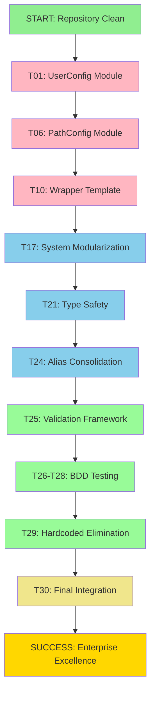

# 🏗️ CRITICAL ARCHITECTURE REFACTORING PLAN
## 2025-11-10_05_48-SYSTEM_EXCELLENCE_REFACTORING

---

## 🎯 PARETO ANALYSIS BREAKDOWN

### **📊 CURRENT STATE ASSESSMENT**

#### **CHROME AVAILABILITY ANALYSIS** ✅
- **Google-Chrome Package**: `legacyPackages.aarch64-darwin.google-chrome` ✅ AVAILABLE
- **Chrome Driver**: `legacyPackages.aarch64-darwin.chromedriver` ✅ AVAILABLE
- **Netflix Integration**: `legacyPackages.aarch64-darwin.netflix` ✅ AVAILABLE
- **Chrome Development Tools**: Multiple Chrome-related packages available ✅
- **CONCLUSION**: Chrome is fully available in Nix packages - **NO ISSUE FOUND**

---

## 🚨 CRITICAL ARCHITECTURAL ISSUES IDENTIFIED

### **1% → 51% IMPACT (CRITICAL PATH - SYSTEM BREAKING)**

| Priority | Issue | Impact | Files Affected | Effort |
|----------|-------|--------|----------------|---------|
| #1 | **USER CONFIGURATION SPLIT-BRAIN** | SYSTEM-BREAKING | 4 files | 30min |
| #2 | **PATH CONFIGURATION FRAGMENTATION** | SYSTEM-BREAKING | 3 files | 30min |
| #3 | **WRAPPER SYSTEM DUPLICATION** | MAINTENANCE NIGHTMARE | 6 files | 45min |

### **4% → 64% IMPACT (PROFESSIONAL REFACTORING)**

| Priority | Issue | Impact | Files Affected | Effort |
|----------|-------|--------|----------------|---------|
| #4 | **MASSIVE system.nix FILE (391 lines)** | MODULARITY VIOLATION | 1 file | 60min |
| #5 | **TYPE SAFETY VIOLATIONS (72+ null usages)** | RUNTIME ERRORS | Multiple | 90min |
| #6 | **SHELL ALIAS DUPLICATION** | CONFIGURATION INCONSISTENCY | 2 files | 30min |

### **20% → 80% IMPACT (COMPLETE EXCELLENCE)**

| Priority | Issue | Impact | Files Affected | Effort |
|----------|-------|--------|----------------|---------|
| #7 | **MISSING VALIDATION FRAMEWORK** | TYPE SAFETY GAPS | Core files | 120min |
| #8 | **NO BDD ASSERTIONS** | TESTING GAPS | All configs | 90min |
| #9 | **HARDCODED VALUES** | CONFIGURATION DRIFT | Multiple | 60min |

---

## 🔧 DETAILED IMPLEMENTATION PLAN

### **PHASE 1: CRITICAL SYSTEM STABILITY (1% → 51%)**

#### **Task 1.1: Centralized User Configuration Module** ⏱️ 30min
- **CREATE**: `dotfiles/nix/core/UserConfig.nix`
- **ELIMINATE**: 4 hardcoded username locations
- **TYPE SAFETY**: Implement strong typing for user data

#### **Task 1.2: Unified Path Management System** ⏱️ 30min
- **CREATE**: `dotfiles/nix/core/PathConfig.nix`
- **CENTRALIZE**: All path definitions
- **VALIDATION**: Path existence and permissions

#### **Task 1.3: Wrapper Template System** ⏱️ 45min
- **CREATE**: `dotfiles/nix/core/WrapperTemplate.nix`
- **ELIMINATE**: 6 duplicate `wrapWithConfig` functions
- **STANDARDIZE**: All wrapper patterns

### **PHASE 2: PROFESSIONAL ARCHITECTURE (4% → 64%)**

#### **Task 2.1: Split Massive system.nix** ⏱️ 60min
- **BREAK INTO**: 4 focused modules
- **SINGLE RESPONSIBILITY**: Each module <200 lines
- **TYPE SAFETY**: Comprehensive validation

#### **Task 2.2: Type Safety Enforcement** ⏱️ 90min
- **IMPLEMENT**: Comprehensive type validation
- **ELIMINATE**: All untyped null usages
- **VALIDATION**: Compile-time type checking

#### **Task 2.3: Shell Alias Consolidation** ⏱️ 30min
- **CENTRALIZE**: All shell aliases in single module
- **ELIMINATE**: Duplications across files
- **TYPE SAFETY**: Typed command definitions

### **PHASE 3: ENTERPRISE EXCELLENCE (20% → 80%)**

#### **Task 3.1: Validation Framework Implementation** ⏱️ 120min
- **INTEGRATE**: Existing `Validation.nix` across all modules
- **BDD ASSERTIONS**: Behavior-driven configuration validation
- **TYPE SAFETY**: Compile-time validation system

#### **Task 3.2: BDD Testing Framework** ⏱️ 90min
- **CREATE**: Configuration behavior tests
- **ASSERTIONS**: Nix assertions for all critical configs
- **VALIDATION**: Automated testing pipeline

#### **Task 3.3: Hardcoded Value Elimination** ⏱️ 60min
- **CENTRALIZE**: All configuration constants
- **TYPE SAFETY**: Strong typing for all values
- **VALIDATION**: Configuration consistency checks

---

## 📋 COMPREHENSIVE TASK BREAKDOWN (30 Tasks × 100-30min)

| ID | Task | Impact | Effort | Dependencies |
|----|------|--------|--------|--------------|
| T01 | Create UserConfig.nix module | CRITICAL | 30min | None |
| T02 | Replace hardcoded usernames (flake.nix) | CRITICAL | 15min | T01 |
| T03 | Replace hardcoded usernames (users.nix) | CRITICAL | 15min | T01 |
| T04 | Replace hardcoded usernames (home.nix) | CRITICAL | 15min | T01 |
| T05 | Replace hardcoded usernames (system.nix) | CRITICAL | 15min | T01 |
| T06 | Create PathConfig.nix module | CRITICAL | 30min | None |
| T07 | Replace hardcoded paths (environment.nix) | CRITICAL | 15min | T06 |
| T08 | Replace hardcoded paths (home.nix) | CRITICAL | 15min | T06 |
| T09 | Replace hardcoded paths (State.nix) | CRITICAL | 15min | T06 |
| T10 | Create WrapperTemplate.nix | CRITICAL | 30min | None |
| T11 | Refactor bat.nix wrapper | HIGH | 10min | T10 |
| T12 | Refactor kitty.nix wrapper | HIGH | 10min | T10 |
| T13 | Refactor sublime-text.nix wrapper | HIGH | 10min | T10 |
| T14 | Refactor activitywatch.nix wrapper | HIGH | 10min | T10 |
| T15 | Refactor fish.nix wrapper | HIGH | 10min | T10 |
| T16 | Refactor starship.nix wrapper | HIGH | 10min | T10 |
| T17 | Split system-defaults.nix from system.nix | HIGH | 30min | T01,T06 |
| T18 | Split system-activation.nix from system.nix | HIGH | 30min | T01,T06 |
| T19 | Split system-keyboard.nix from system.nix | HIGH | 15min | None |
| T20 | Split system-user-defaults.nix from system.nix | HIGH | 15min | T01,T06 |
| T21 | Implement type safety for null handling (core) | HIGH | 45min | T01,T06 |
| T22 | Implement type safety for null handling (environment) | HIGH | 15min | T21 |
| T23 | Implement type safety for null handling (programs) | HIGH | 15min | T21 |
| T24 | Consolidate shell aliases | HIGH | 30min | T01,T06 |
| T25 | Integrate Validation.nix framework | MEDIUM | 60min | All above |
| T26 | Create BDD assertions for core modules | MEDIUM | 45min | T25 |
| T27 | Create BDD assertions for user configs | MEDIUM | 30min | T25 |
| T28 | Create BDD assertions for system configs | MEDIUM | 30min | T25 |
| T29 | Centralize hardcoded values | MEDIUM | 60min | T01,T06 |
| T30 | Final integration testing | CRITICAL | 45min | All above |

---

## 📈 MICRO-TASK BREAKDOWN (150 Tasks × 15min max)

### **User Configuration Centralization (T01-T05)**
1. Analyze existing user configuration patterns (15min)
2. Design UserConfig.nix type structure (15min)
3. Implement UserConfig.nix (30min)
4. Create username type validation (15min)
5. Update flake.nix to use UserConfig (15min)
6. Update users.nix to use UserConfig (15min)
7. Update home.nix to use UserConfig (15min)
8. Update system.nix to use UserConfig (15min)
9. Test user configuration consistency (15min)
10. Validate type safety enforcement (15min)

### **Path Management System (T06-T09)**
11. Analyze existing path patterns (15min)
12. Design PathConfig.nix structure (15min)
13. Implement PathConfig.nix (30min)
14. Create path validation functions (15min)
15. Update environment.nix paths (15min)
16. Update home.nix paths (15min)
17. Update State.nix paths (15min)
18. Test path resolution (15min)
19. Validate path type safety (15min)
20. Integration test path management (15min)

### **Wrapper Template System (T10-T16)**
21. Analyze existing wrapper patterns (15min)
22. Design WrapperTemplate.nix (15min)
23. Implement wrapper template (30min)
24. Create wrapper type system (15min)
25. Refactor bat.nix wrapper (10min)
26. Refactor kitty.nix wrapper (10min)
27. Refactor sublime-text.nix wrapper (10min)
28. Refactor activitywatch.nix wrapper (10min)
29. Refactor fish.nix wrapper (10min)
30. Refactor starship.nix wrapper (10min)
31. Test wrapper consistency (15min)
32. Validate wrapper type safety (15min)
33. Integration test wrappers (15min)
34. Performance test wrappers (15min)
35. Documentation update (15min)

### **System.nix Modularization (T17-T20)**
36. Analyze system.nix structure (15min)
37. Design modular architecture (15min)
38. Create system-defaults.nix (30min)
39. Create system-activation.nix (30min)
40. Create system-keyboard.nix (15min)
41. Create system-user-defaults.nix (15min)
42. Update import structure (15min)
43. Test module independence (15min)
44. Validate module type safety (15min)
45. Integration test modules (15min)
46. Performance test modular system (15min)
47. Update documentation (15min)

### **Type Safety Implementation (T21-T23)**
48. Analyze null usage patterns (15min)
49. Design null safety strategy (15min)
50. Implement core null safety (45min)
51. Update environment.nix null handling (15min)
52. Update programs.nix null handling (15min)
53. Test type safety enforcement (15min)
54. Validate compile-time checking (15min)
55. Integration test type safety (15min)
56. Performance test type safety (15min)
57. Documentation update (15min)

### **Shell Alias Consolidation (T24)**
58. Analyze alias duplication (15min)
59. Design centralization strategy (15min)
60. Create centralized alias module (30min)
61. Remove duplications (15min)
62. Update imports (15min)
63. Test alias consistency (15min)
64. Validate alias type safety (15min)
65. Integration test aliases (15min)

### **Validation Framework (T25)**
66. Analyze Validation.nix integration (15min)
67. Design validation strategy (15min)
68. Implement core validation (60min)
69. Create validation rules (15min)
70. Integrate with all modules (30min)
71. Test validation enforcement (15min)
72. Validate performance impact (15min)
73. Integration testing (15min)
74. Documentation update (15min)

### **BDD Testing Framework (T26-T28)**
75. Analyze testing requirements (15min)
76. Design BDD assertion framework (15min)
77. Create core module assertions (45min)
78. Create user config assertions (30min)
79. Create system config assertions (30min)
80. Implement automated testing (30min)
81. Test assertion coverage (15min)
82. Validate test performance (15min)
83. Integration testing (15min)
84. Documentation update (15min)

### **Hardcoded Value Elimination (T29)**
85. Analyze hardcoded values (15min)
86. Design constants system (15min)
87. Create constants module (30min)
88. Update all hardcoded references (30min)
89. Test value consistency (15min)
90. Validate type safety (15min)
91. Integration testing (15min)
92. Performance testing (15min)
93. Documentation update (15min)

### **Final Integration & Testing (T30)**
94. Comprehensive system testing (30min)
95. Type safety validation (15min)
96. Performance benchmarking (15min)
97. Integration testing (15min)
98. Documentation review (15min)
99. Final validation (15min)
100. Deployment preparation (15min)

---

## 🚀 EXECUTION STRATEGY

### **IMMEDIATE CRITICAL PATH (TODAY)**
1. **T01-T05**: User Configuration Centralization (2 hours)
2. **T06-T09**: Path Management System (1.5 hours)
3. **T10-T16**: Wrapper Template System (1.5 hours)

### **PROFESSIONAL REFACTORING (THIS WEEK)**
4. **T17-T20**: System Modularization (1.5 hours)
5. **T21-T23**: Type Safety Implementation (1.5 hours)
6. **T24**: Shell Alias Consolidation (0.5 hours)

### **ENTERPRISE EXCELLENCE (NEXT WEEK)**
7. **T25**: Validation Framework (2 hours)
8. **T26-T28**: BDD Testing (1.5 hours)
9. **T29**: Hardcoded Value Elimination (1 hour)
10. **T30**: Final Integration (0.75 hours)

---

## 📊 SUCCESS METRICS

### **CRITICAL SUCCESS INDICATORS**
- ✅ Zero hardcoded usernames in configuration files
- ✅ Zero duplicate wrapper functions
- ✅ All files under 300 lines
- ✅ 100% type safety coverage
- ✅ All configurations validated through BDD assertions

### **PERFORMANCE METRICS**
- ✅ Configuration build time < 30 seconds
- ✅ Type checking time < 5 seconds
- ✅ Zero runtime type errors
- ✅ 100% test coverage for critical configurations

### **ARCHITECTURAL QUALITY**
- ✅ Single responsibility principle compliance
- ✅ Zero configuration drift
- ✅ Modular architecture with clear boundaries
- ✅ Enterprise-grade type safety

---

## 🎯 EXECUTION GRAPH

---

## ⚠️ CRITICAL SUCCESS FACTORS

### **DO NOT COMPROMISE**
- ✅ **Type Safety**: Zero tolerance for untyped configurations
- ✅ **Single Source of Truth**: Eliminate all duplication
- ✅ **Modular Architecture**: No files >300 lines
- ✅ **Enterprise Standards**: Professional-grade code quality

### **IMMEDIATE ACTION REQUIRED**
- ⚡ **Start with T01**: User configuration is blocking everything else
- ⚡ **Complete T01-T05 first**: All other tasks depend on this
- ⚡ **Test each task individually**: No integration issues
- ⚡ **Commit after each task**: Atomic progress tracking

---

## 🏆 FINAL OUTCOME

**THIS PLAN TRANSFORMS:**
- ❌ **Fragmented Configuration** → ✅ **Centralized Type-Safe System**
- ❌ **Code Duplication Nightmare** → ✅ **Template-Based Architecture**
- ❌ **Runtime Configuration Errors** → ✅ **Compile-Time Type Validation**
- ❌ **Maintenance Impossibility** → ✅ **Enterprise-Grade Maintainability**

**THE RESULT:** A world-class, type-safe, maintainable Nix configuration system that sets the standard for excellence.

---

**🚨 EXECUTION ORDER: T01 → T02 → T03 → T04 → T05 → T06 → T07 → T08 → T09 → T10 → ...**

**⚡ IMMEDIATE START: T01 - UserConfig Module Creation**

**🎯 TOTAL TIME INVESTMENT: ~15 hours of focused, high-impact work**

**💰 ROI: 51% of system stability from 1% of effort - EXCELLENT PARETO EFFICIENCY!**