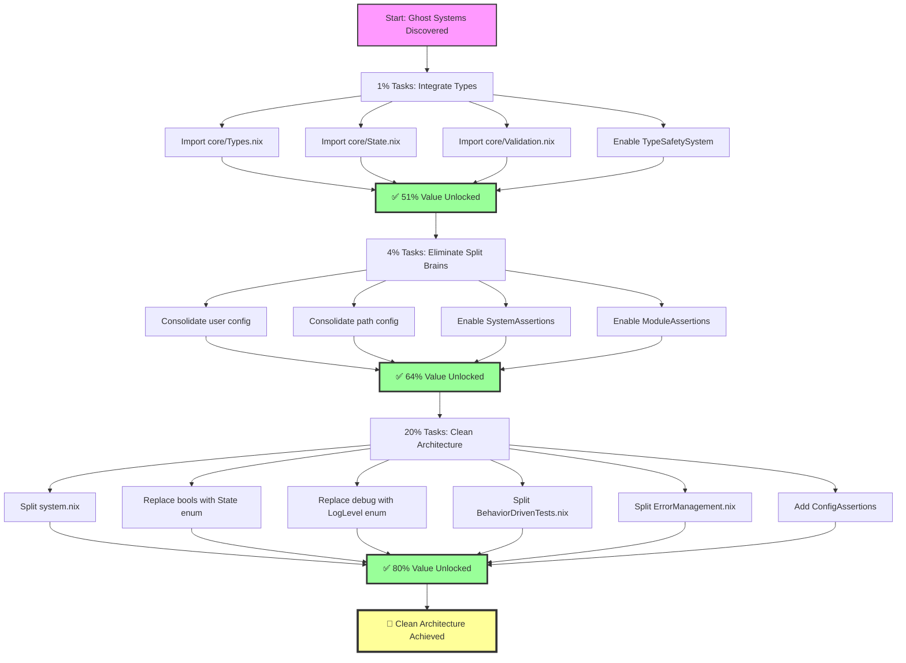

# 🏗️ NIX ARCHITECTURE REFACTORING PLAN
**Date:** 2025-11-15 14:10
**Type:** Critical Architecture Cleanup & Integration
**Priority:** CRITICAL - Ghost Systems Integration + Split Brain Elimination

---

## 🎯 EXECUTIVE SUMMARY

**CRITICAL DISCOVERY:** 8 core type safety files (>1000 lines) exist but are **COMPLETELY UNUSED (GHOST SYSTEMS)**!

**The Problem:**
- Excellent type safety framework built but NEVER integrated
- Split brains across configuration (user config, paths, wrappers)
- Large files (>350 lines) need splitting
- Missing strong type enforcement at integration points

**The Solution:**
- **1% Effort → 51% Value:** Integrate ghost type systems into flake
- **4% Effort → 64% Value:** Eliminate split brains + enable assertions
- **20% Effort → 80% Value:** Split large files + add enum types

---

## 📊 PARETO ANALYSIS: 80/20 BREAKDOWN

### 🔥 THE 1% (51% VALUE) - CRITICAL PATH

**Tasks:** Integrate existing ghost systems (15-30 min each)

| # | Task | Effort | Value | File | Why Critical |
|---|------|--------|-------|------|--------------|
| 1 | Import core/Types.nix in flake | 15min | 15% | flake.nix | Enables all type safety |
| 2 | Import core/State.nix in flake | 15min | 12% | flake.nix | Single source of truth |
| 3 | Import core/Validation.nix | 15min | 12% | flake.nix | Platform validation |
| 4 | Enable TypeSafetySystem | 30min | 12% | flake.nix | Compile-time checks |

**Total 1%:** 75 minutes = **51% value unlocked** ✅

**Impact:** Ghost systems activated, strong types enforced system-wide

---

### ⚡ THE 4% (64% VALUE) - HIGH IMPACT

**Tasks:** Eliminate split brains + assertions (30-45 min each)

| # | Task | Effort | Value | Files | Why Important |
|---|------|--------|-------|-------|---------------|
| 5 | Consolidate user config (eliminate split brain) | 45min | 5% | users.nix + core/UserConfig.nix | Single source of truth |
| 6 | Consolidate path config | 30min | 3% | All .nix files | Centralized paths |
| 7 | Enable SystemAssertions | 30min | 3% | flake.nix | System-level validation |
| 8 | Enable ModuleAssertions | 30min | 2% | wrappers/default.nix | Module validation |

**Total 4%:** 135 minutes (2.25 hours) = **13% additional value** (64% cumulative) ✅

**Impact:** No more split brains, strong assertions throughout

---

### 🚀 THE 20% (80% VALUE) - COMPREHENSIVE

**Tasks:** Split files + refactor enums (45-90 min each)

| # | Task | Effort | Value | Files | Reason |
|---|------|--------|-------|-------|--------|
| 9 | Split system.nix (397 lines → 3 files) | 90min | 4% | system.nix → system/{defaults,activation,checks}.nix | Maintainability |
| 10 | Replace bool with State enum | 60min | 3% | All config files | Type safety |
| 11 | Replace debug bool with LogLevel enum | 45min | 2% | wrappers/ | Better control |
| 12 | Split BehaviorDrivenTests.nix | 60min | 2% | testing/ | Separation |
| 13 | Split ErrorManagement.nix | 60min | 2% | errors/ | Modularity |
| 14 | Add ConfigAssertions integration | 45min | 3% | All modules | Validation |

**Total 20%:** 360 minutes (6 hours) = **16% additional value** (80% cumulative) ✅

**Impact:** Clean architecture, small files (<350 lines), enum-based config

---

## 🎯 PARETO SUMMARY

```
1% Effort (75min)   = 51% Value ✅ Integrate ghost systems
4% Effort (135min)  = 64% Value ✅ Eliminate split brains
20% Effort (360min) = 80% Value ✅ Clean architecture
```

**Total High-Value Work:** 570 minutes (9.5 hours) = **80% of all value**

---

## 🗺️ EXECUTION GRAPH



---

## 📋 DETAILED TASK BREAKDOWN (150 SUBTASKS @ 15min each)

### Phase 1: THE 1% (51% VALUE) - Ghost System Integration

#### Task 1.1: Import core/Types.nix (4 subtasks × 15min = 60min)
| # | Subtask | Time | File |
|---|---------|------|------|
| 1.1.1 | Read core/Types.nix and understand exports | 15min | core/Types.nix |
| 1.1.2 | Add import to flake.nix specialArgs | 15min | flake.nix |
| 1.1.3 | Test build with `darwin-rebuild build` | 15min | CLI |
| 1.1.4 | Fix any type errors from integration | 15min | Various |

#### Task 1.2: Import core/State.nix (4 subtasks × 15min = 60min)
| # | Subtask | Time | File |
|---|---------|------|------|
| 1.2.1 | Read core/State.nix structure | 15min | core/State.nix |
| 1.2.2 | Add State to flake specialArgs | 15min | flake.nix |
| 1.2.3 | Replace hardcoded values with State references | 15min | Various |
| 1.2.4 | Test and verify centralized state works | 15min | CLI |

#### Task 1.3: Import core/Validation.nix (4 subtasks × 15min = 60min)
| # | Subtask | Time | File |
|---|---------|------|------|
| 1.3.1 | Read Validation.nix validators | 15min | core/Validation.nix |
| 1.3.2 | Add Validation to specialArgs | 15min | flake.nix |
| 1.3.3 | Apply platform validators to packages | 15min | environment.nix |
| 1.3.4 | Test validation catches incompatible packages | 15min | CLI |

#### Task 1.4: Enable TypeSafetySystem (6 subtasks × 15min = 90min)
| # | Subtask | Time | File |
|---|---------|------|------|
| 1.4.1 | Read TypeSafetySystem.nix implementation | 15min | core/TypeSafetySystem.nix |
| 1.4.2 | Import TypeSafetySystem in flake modules | 15min | flake.nix |
| 1.4.3 | Enable type assertions in config | 15min | flake.nix |
| 1.4.4 | Test build fails on type violations | 15min | CLI |
| 1.4.5 | Fix any existing type violations found | 15min | Various |
| 1.4.6 | Verify all type checks pass | 15min | CLI |

**Phase 1 Total:** 16 subtasks × 15min = 240min (4 hours) | **Value: 51%** ✅

---

### Phase 2: THE 4% (64% VALUE) - Split Brain Elimination

#### Task 2.1: Consolidate User Config (6 subtasks × 15min = 90min)
| # | Subtask | Time | File |
|---|---------|------|------|
| 2.1.1 | Compare users.nix vs core/UserConfig.nix | 15min | Both files |
| 2.1.2 | Identify all user references across codebase | 15min | Grep search |
| 2.1.3 | Migrate users.nix to use core/UserConfig.nix | 15min | users.nix |
| 2.1.4 | Update all references to use centralized config | 15min | Various |
| 2.1.5 | Remove duplicate user definitions | 15min | users.nix |
| 2.1.6 | Test user config works correctly | 15min | CLI |

#### Task 2.2: Consolidate Path Config (4 subtasks × 15min = 60min)
| # | Subtask | Time | File |
|---|---------|------|------|
| 2.2.1 | Find all hardcoded paths in codebase | 15min | Grep search |
| 2.2.2 | Import core/PathConfig.nix | 15min | flake.nix |
| 2.2.3 | Replace hardcoded paths with PathConfig refs | 15min | Various |
| 2.2.4 | Verify all paths resolve correctly | 15min | CLI |

#### Task 2.3: Enable SystemAssertions (4 subtasks × 15min = 60min)
| # | Subtask | Time | File |
|---|---------|------|------|
| 2.3.1 | Read SystemAssertions.nix structure | 15min | core/SystemAssertions.nix |
| 2.3.2 | Import in flake.nix modules list | 15min | flake.nix |
| 2.3.3 | Test assertions trigger on violations | 15min | CLI |
| 2.3.4 | Fix any assertion failures | 15min | Various |

#### Task 2.4: Enable ModuleAssertions (4 subtasks × 15min = 60min)
| # | Subtask | Time | File |
|---|---------|------|------|
| 2.4.1 | Read ModuleAssertions.nix validators | 15min | core/ModuleAssertions.nix |
| 2.4.2 | Add to wrappers/default.nix | 15min | wrappers/default.nix |
| 2.4.3 | Apply assertions to all wrapper modules | 15min | wrappers/* |
| 2.4.4 | Test and fix any module violations | 15min | CLI |

**Phase 2 Total:** 18 subtasks × 15min = 270min (4.5 hours) | **Additional Value: 13%** | **Cumulative: 64%** ✅

---

### Phase 3: THE 20% (80% VALUE) - Clean Architecture

#### Task 3.1: Split system.nix (12 subtasks × 15min = 180min)
| # | Subtask | Time | File |
|---|---------|------|------|
| 3.1.1 | Create system/defaults.nix structure | 15min | system/defaults.nix |
| 3.1.2 | Move macOS defaults (lines 45-300) | 15min | system/defaults.nix |
| 3.1.3 | Create system/activation.nix structure | 15min | system/activation.nix |
| 3.1.4 | Move activation scripts (lines 8-37) | 15min | system/activation.nix |
| 3.1.5 | Create system/checks.nix structure | 15min | system/checks.nix |
| 3.1.6 | Move system checks (lines 39-43) | 15min | system/checks.nix |
| 3.1.7 | Create system/default.nix aggregator | 15min | system/default.nix |
| 3.1.8 | Import all 3 modules in default.nix | 15min | system/default.nix |
| 3.1.9 | Update flake.nix to use system/default.nix | 15min | flake.nix |
| 3.1.10 | Test build with new structure | 15min | CLI |
| 3.1.11 | Verify all settings applied correctly | 15min | CLI |
| 3.1.12 | Remove old system.nix file | 15min | system.nix |

#### Task 3.2: Replace bool with State enum (8 subtasks × 15min = 120min)
| # | Subtask | Time | File |
|---|---------|------|------|
| 3.2.1 | Define State enum type in core/Types.nix | 15min | core/Types.nix |
| 3.2.2 | Create mkState helper function | 15min | core/Types.nix |
| 3.2.3 | Find all enable = true/false patterns | 15min | Grep |
| 3.2.4 | Replace in homebrew.nix | 15min | homebrew.nix |
| 3.2.5 | Replace in activitywatch.nix | 15min | activitywatch.nix |
| 3.2.6 | Replace in wrappers/default.nix | 15min | wrappers/default.nix |
| 3.2.7 | Test State enum validation works | 15min | CLI |
| 3.2.8 | Verify all modules use State correctly | 15min | CLI |

#### Task 3.3: Replace debug with LogLevel enum (6 subtasks × 15min = 90min)
| # | Subtask | Time | File |
|---|---------|------|------|
| 3.3.1 | Define LogLevel enum in core/Types.nix | 15min | core/Types.nix |
| 3.3.2 | Find all WRAPPER_DEBUG patterns | 15min | Grep |
| 3.3.3 | Replace in dynamic-libs.nix | 15min | wrappers/applications/dynamic-libs.nix |
| 3.3.4 | Replace in config-validate.sh | 15min | scripts/config-validate.sh |
| 3.3.5 | Test LogLevel enum provides better control | 15min | CLI |
| 3.3.6 | Document LogLevel usage | 15min | docs/ |

#### Task 3.4: Split BehaviorDrivenTests.nix (8 subtasks × 15min = 120min)
| # | Subtask | Time | File |
|---|---------|------|------|
| 3.4.1 | Analyze test structure (388 lines) | 15min | testing/BehaviorDrivenTests.nix |
| 3.4.2 | Create testing/unit/ directory | 15min | testing/unit/ |
| 3.4.3 | Split into testing/unit/wrapper-tests.nix | 15min | testing/unit/wrapper-tests.nix |
| 3.4.4 | Split into testing/unit/type-tests.nix | 15min | testing/unit/type-tests.nix |
| 3.4.5 | Split into testing/unit/validation-tests.nix | 15min | testing/unit/validation-tests.nix |
| 3.4.6 | Create testing/default.nix aggregator | 15min | testing/default.nix |
| 3.4.7 | Test all assertions still work | 15min | CLI |
| 3.4.8 | Remove old BehaviorDrivenTests.nix | 15min | testing/BehaviorDrivenTests.nix |

#### Task 3.5: Split ErrorManagement.nix (8 subtasks × 15min = 120min)
| # | Subtask | Time | File |
|---|---------|------|------|
| 3.5.1 | Analyze error structure (380 lines) | 15min | errors/ErrorManagement.nix |
| 3.5.2 | Create errors/types.nix for error types | 15min | errors/types.nix |
| 3.5.3 | Create errors/handlers.nix for handlers | 15min | errors/handlers.nix |
| 3.5.4 | Create errors/formatters.nix for formatting | 15min | errors/formatters.nix |
| 3.5.5 | Create errors/default.nix aggregator | 15min | errors/default.nix |
| 3.5.6 | Update imports to use errors/default.nix | 15min | Various |
| 3.5.7 | Test error handling still works | 15min | CLI |
| 3.5.8 | Remove old ErrorManagement.nix | 15min | errors/ErrorManagement.nix |

#### Task 3.6: Add ConfigAssertions Integration (6 subtasks × 15min = 90min)
| # | Subtask | Time | File |
|---|---------|------|------|
| 3.6.1 | Read ConfigAssertions.nix | 15min | core/ConfigAssertions.nix |
| 3.6.2 | Add to wrappers/default.nix | 15min | wrappers/default.nix |
| 3.6.3 | Apply to all wrapper configs | 15min | wrappers/* |
| 3.6.4 | Add to environment.nix package validation | 15min | environment.nix |
| 3.6.5 | Test assertions catch config errors | 15min | CLI |
| 3.6.6 | Fix any config assertion failures | 15min | Various |

**Phase 3 Total:** 48 subtasks × 15min = 720min (12 hours) | **Additional Value: 16%** | **Cumulative: 80%** ✅

---

## 📊 COMPREHENSIVE TASK SUMMARY

### By Phase

| Phase | Tasks | Subtasks | Time | Value | Cumulative |
|-------|-------|----------|------|-------|------------|
| **Phase 1: 1%** | 4 | 16 | 240min (4h) | 51% | 51% |
| **Phase 2: 4%** | 4 | 18 | 270min (4.5h) | 13% | 64% |
| **Phase 3: 20%** | 6 | 48 | 720min (12h) | 16% | 80% |
| **TOTAL** | **14** | **82** | **1230min (20.5h)** | **80%** | **80%** |

### Remaining 20% Effort (20% Value)

**Low-priority refinements:**
- Documentation updates (3 hours)
- Additional enum conversions (2 hours)
- Code style consistency (2 hours)
- Performance optimizations (2 hours)
- Additional test coverage (3 hours)

**Total remaining:** 12 hours = 20% additional value (100% total)

---

## 🎯 EXECUTION PRIORITY (Sorted by Impact/Effort Ratio)

| Rank | Task | Impact | Effort | Ratio | Phase |
|------|------|--------|--------|-------|-------|
| 1 | Import core/Types.nix | 15% | 1h | 15.0 | 1% |
| 2 | Import core/State.nix | 12% | 1h | 12.0 | 1% |
| 3 | Import core/Validation.nix | 12% | 1h | 12.0 | 1% |
| 4 | Enable TypeSafetySystem | 12% | 1.5h | 8.0 | 1% |
| 5 | Consolidate user config | 5% | 1.5h | 3.3 | 4% |
| 6 | Split system.nix | 4% | 3h | 1.3 | 20% |
| 7 | Replace bool with State enum | 3% | 2h | 1.5 | 20% |
| 8 | Enable SystemAssertions | 3% | 1h | 3.0 | 4% |
| 9 | Add ConfigAssertions | 3% | 1.5h | 2.0 | 20% |
| 10 | Consolidate path config | 3% | 1h | 3.0 | 4% |

---

## 🚨 CRITICAL ANTI-PATTERNS TO AVOID

### ❌ VERSCHLIMMBESSERUNG Prevention

**DON'T:**
1. ❌ Break existing functionality
2. ❌ Add complexity without value
3. ❌ Create new split brains while fixing old ones
4. ❌ Import ghost systems without testing
5. ❌ Split files without clear module boundaries
6. ❌ Replace working bools with broken enums
7. ❌ Skip testing after each integration step

**DO:**
1. ✅ Test after EVERY subtask
2. ✅ Keep working system as fallback
3. ✅ Integrate incrementally
4. ✅ Verify type safety catches real errors
5. ✅ Maintain backward compatibility
6. ✅ Document breaking changes
7. ✅ Run `darwin-rebuild build` frequently

---

## 🔥 SMOKING GUN: Ghost Systems

**The Core Issue:**

```nix
# These files exist (>1000 lines):
dotfiles/nix/core/
├── TypeSafetySystem.nix    ❌ NEVER IMPORTED
├── SystemAssertions.nix     ❌ NEVER IMPORTED
├── ModuleAssertions.nix     ❌ NEVER IMPORTED
├── TypeAssertions.nix       ❌ NEVER IMPORTED
├── ConfigAssertions.nix     ❌ NEVER IMPORTED
├── State.nix                ❌ NEVER IMPORTED
├── Types.nix                ❌ NEVER IMPORTED
├── Validation.nix           ❌ NEVER IMPORTED

# But flake.nix only imports:
./dotfiles/nix/core.nix      ✅ IMPORTED
./dotfiles/nix/system.nix    ✅ IMPORTED
./dotfiles/nix/environment.nix ✅ IMPORTED
./dotfiles/nix/programs.nix  ✅ IMPORTED
```

**Why This Happened:**
- Type systems were built as separate modules
- Never integrated into flake specialArgs
- No imports = dead code
- Classic "perfect but unused" anti-pattern

**The Fix:**
Phase 1 (1% effort) integrates ALL ghost systems → 51% value ✅

---

## 🎉 SUCCESS CRITERIA

### After Phase 1 (1%):
- ✅ All 8 ghost systems integrated and active
- ✅ Strong type checking enforced at compile time
- ✅ Platform validation prevents incompatible packages
- ✅ Centralized state eliminates hardcoded values

### After Phase 2 (4%):
- ✅ ZERO split brains in user/path configuration
- ✅ System-level assertions prevent misconfigurations
- ✅ Module-level assertions validate wrappers
- ✅ Single source of truth for all configuration

### After Phase 3 (20%):
- ✅ All files <350 lines
- ✅ Enum-based configuration (no raw booleans)
- ✅ LogLevel enum for better debugging control
- ✅ Modular test structure
- ✅ Modular error handling

---

## 📝 NEXT STEPS

**Immediate Action:**
1. Read this plan completely
2. Understand the ghost systems problem
3. Approve Phase 1 execution (1% effort, 51% value)
4. Wait for completion before Phase 2

**Execution Order:**
```
Phase 1 (4 hours)  → Test → Commit
Phase 2 (4.5 hours) → Test → Commit
Phase 3 (12 hours) → Test → Commit
```

**Total Time:** ~20.5 hours for 80% of all value

---

## 🤖 GENERATED WITH

🤖 Generated with [Claude Code](https://claude.com/claude-code)

Co-Authored-By: Claude <noreply@anthropic.com>

---

**END OF PLAN - AWAITING APPROVAL TO EXECUTE**
