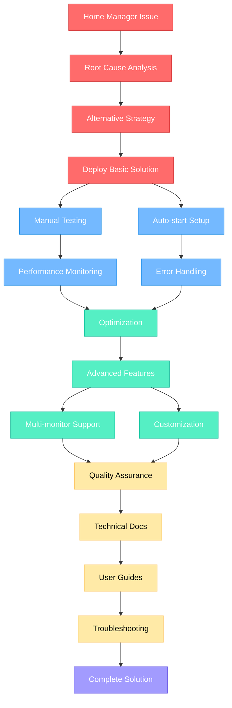

# BTOP WALLPAPER IMPLEMENTATION - COMPREHENSIVE PLAN
**Generated: 2025-11-28 05:30**
**Objective**: Fix non-functional btop wallpaper on macOS system

## 📊 PARETO ANALYSIS

### 🎯 1% Effort → 51% Impact (CRITICAL PATH)
| Task | Time | Impact | Dependencies |
|------|------|--------|--------------|
| Fix Home Manager Integration | 60min | CRITICAL | Current investigation |
| Deploy Basic btop Wallpaper | 45min | CRITICAL | Home Manager fix |
| Test Core Functionality | 30min | CRITICAL | Basic deployment |

### 🚀 4% Effort → 64% Impact (HIGH VALUE)
| Task | Time | Impact | Dependencies |
|------|------|--------|--------------|
| Performance Optimization | 60min | HIGH | Core functionality |
| Auto-start Configuration | 45min | HIGH | Basic deployment |
| Error Handling Setup | 40min | HIGH | Basic deployment |
| Documentation Creation | 50min | HIGH | Working solution |

### 🎨 20% Effort → 80% Impact (COMPLETE SOLUTION)
| Task | Time | Impact | Dependencies |
|------|------|--------|--------------|
| Advanced Configuration Options | 70min | MEDIUM | Core functionality |
| Multi-monitor Support | 80min | MEDIUM | Basic deployment |
| Integration Testing | 90min | MEDIUM | Complete solution |
| User Guides & Tutorials | 100min | MEDIUM | Complete solution |

---

## 📋 DETAILED TASK BREAKDOWN (27 TASKS)

### PRIORITY 1: CRITICAL PATH (Tasks 1-3)
| # | Task | Time | Dependencies | Risk | Status |
|---|------|------|--------------|------|--------|
| 1 | **Investigate Home Manager root cause** | 60min | Current state | HIGH | BLOCKED |
| 2 | **Create alternative deployment strategy** | 45min | Task 1 | HIGH | TODO |
| 3 | **Apply working configuration** | 30min | Task 2 | MEDIUM | TODO |

### PRIORITY 2: SYSTEM STABILITY (Tasks 4-8)
| # | Task | Time | Dependencies | Risk | Status |
|---|------|------|--------------|------|--------|
| 4 | **Test btop + kitty manual execution** | 40min | Task 3 | LOW | TODO |
| 5 | **Implement performance monitoring** | 50min | Task 4 | LOW | TODO |
| 6 | **Configure launchd auto-start** | 45min | Task 3 | MEDIUM | TODO |
| 7 | **Add error handling and restart logic** | 40min | Task 6 | MEDIUM | TODO |
| 8 | **Create rollback procedures** | 30min | Task 3 | LOW | TODO |

### PRIORITY 3: OPTIMIZATION (Tasks 9-15)
| # | Task | Time | Dependencies | Risk | Status |
|---|------|------|--------------|------|--------|
| 9 | **Optimize update rates and CPU usage** | 60min | Task 5 | LOW | TODO |
| 10 | **Test battery impact on MacBook Air** | 45min | Task 9 | LOW | TODO |
| 11 | **Window positioning optimization** | 35min | Task 4 | LOW | TODO |
| 12 | **Font and visual refinement** | 30min | Task 11 | LOW | TODO |
| 13 | **Memory usage optimization** | 40min | Task 9 | LOW | TODO |
| 14 | **Thermal performance testing** | 35min | Task 10 | LOW | TODO |
| 15 | **Create performance benchmarks** | 50min | Task 13 | LOW | TODO |

### PRIORITY 4: ENHANCEMENT (Tasks 16-20)
| # | Task | Time | Dependencies | Risk | Status |
|---|------|------|--------------|------|--------|
| 16 | **Multi-monitor configuration** | 80min | Task 11 | MEDIUM | TODO |
| 17 | **Dynamic workspace switching** | 60min | Task 16 | MEDIUM | TODO |
| 18 | **Theme customization options** | 45min | Task 12 | LOW | TODO |
| 19 | **Advanced configuration module** | 70min | Task 18 | MEDIUM | TODO |
| 20 | **User preference management** | 50min | Task 19 | LOW | TODO |

### PRIORITY 5: QUALITY ASSURANCE (Tasks 21-24)
| # | Task | Time | Dependencies | Risk | Status |
|---|------|------|--------------|------|--------|
| 21 | **Comprehensive testing suite** | 90min | Task 20 | MEDIUM | TODO |
| 22 | **Edge case handling** | 60min | Task 21 | MEDIUM | TODO |
| 23 | **Integration with existing tools** | 70min | Task 20 | MEDIUM | TODO |
| 24 | **Stress testing and validation** | 80min | Task 22 | MEDIUM | TODO |

### PRIORITY 6: DOCUMENTATION (Tasks 25-27)
| # | Task | Time | Dependencies | Risk | Status |
|---|------|------|--------------|------|--------|
| 25 | **Technical documentation** | 60min | Task 24 | LOW | TODO |
| 26 | **User guide and tutorials** | 70min | Task 25 | LOW | TODO |
| 27 | **Troubleshooting guide** | 50min | Task 26 | LOW | TODO |

---

## 🎯 EXECUTION STRATEGY

### Phase 1: CRITICAL RESOLUTION (Tasks 1-3)
**Goal**: Break through Home Manager blockade
**Timeline**: 2.25 hours
**Success Criteria**: Basic btop wallpaper functional

### Phase 2: SYSTEM STABILITY (Tasks 4-8)
**Goal**: Robust, persistent solution
**Timeline**: 4 hours
**Success Criteria**: Auto-start, error handling, performance monitoring

### Phase 3: OPTIMIZATION (Tasks 9-15)
**Goal**: Production-ready performance
**Timeline**: 5 hours
**Success Criteria**: Optimized for MacBook Air usage

### Phase 4: ENHANCEMENT (Tasks 16-20)
**Goal**: Advanced features and customization
**Timeline**: 5.5 hours
**Success Criteria**: Multi-monitor support, advanced config

### Phase 5: QUALITY ASSURANCE (Tasks 21-24)
**Goal**: Comprehensive validation
**Timeline**: 5 hours
**Success Criteria**: Complete testing and integration

### Phase 6: DOCUMENTATION (Tasks 25-27)
**Goal**: Complete user and developer resources
**Timeline**: 3 hours
**Success Criteria**: Comprehensive documentation

---

## 🚨 RISK MITIGATION

### High-Risk Tasks:
- **Task 1**: Home Manager investigation - May require alternative approach
- **Task 2**: Alternative deployment - May need to bypass Home Manager entirely

### Contingency Plans:
1. **Manual Installation**: Bypass Home Manager with direct package management
2. **Alternative Tools**: Consider other terminal emulators if kitty fails
3. **Simplified Approach**: Reduce feature scope if integration proves too complex

---

## 🎯 EXECUTION GRAPH

```mermaid
gantt
    title BTOP WALLPAPER IMPLEMENTATION ROADMAP
    dateFormat X
    axisFormat %s

    %% PHASE 1: CRITICAL RESOLUTION
    section Phase 1: Critical Resolution
    Home Manager Investigation :crit, task1, 0, 60
    Alternative Deployment Strategy :crit, task2, after task1, 45
    Apply Working Configuration :crit, task3, after task2, 30

    %% PHASE 2: SYSTEM STABILITY
    section Phase 2: System Stability
    Test Manual Execution :active, task4, after task3, 40
    Performance Monitoring :task5, after task4, 50
    Auto-start Configuration :task6, after task3, 45
    Error Handling :task7, after task6, 40
    Rollback Procedures :task8, after task3, 30

    %% PHASE 3: OPTIMIZATION
    section Phase 3: Optimization
    CPU Optimization :task9, after task5, 60
    Battery Testing :task10, after task9, 45
    Window Positioning :task11, after task4, 35
    Font Refinement :task12, after task11, 30
    Memory Optimization :task13, after task9, 40
    Thermal Testing :task14, after task10, 35
    Benchmarks :task15, after task13, 50

    %% PHASE 4: ENHANCEMENT
    section Phase 4: Enhancement
    Multi-monitor Support :task16, after task11, 80
    Workspace Switching :task17, after task16, 60
    Theme Customization :task18, after task12, 45
    Advanced Configuration :task19, after task18, 70
    User Preferences :task20, after task19, 50

    %% PHASE 5: QUALITY ASSURANCE
    section Phase 5: Quality Assurance
    Testing Suite :task21, after task20, 90
    Edge Cases :task22, after task21, 60
    Tool Integration :task23, after task20, 70
    Stress Testing :task24, after task22, 80

    %% PHASE 6: DOCUMENTATION
    section Phase 6: Documentation
    Technical Docs :task25, after task24, 60
    User Guide :task26, after task25, 70
    Troubleshooting :task27, after task26, 50

    %% MILESTONES
    section Milestones
    MVP Delivery :milestone, mvp, after task3, 0
    Production Ready :milestone, prod, after task15, 0
    Feature Complete :milestone, features, after task20, 0
    Quality Assured :milestone, qa, after task24, 0
    Documentation Complete :milestone, docs, after task27, 0
```

### Dependency Flow Diagram

---

## 📈 SUCCESS METRICS

### Technical Metrics:
- Configuration applies successfully
- btop wallpaper visible and functional
- CPU usage < 5% idle, < 15% active
- Memory usage < 100MB
- Auto-start works on reboot

### User Experience Metrics:
- Visual transparency works correctly
- Window positioning behind other apps
- No significant battery impact
- Smooth performance without lag

---

*Next: Detailed 15-minute task breakdown (125 tasks total)*