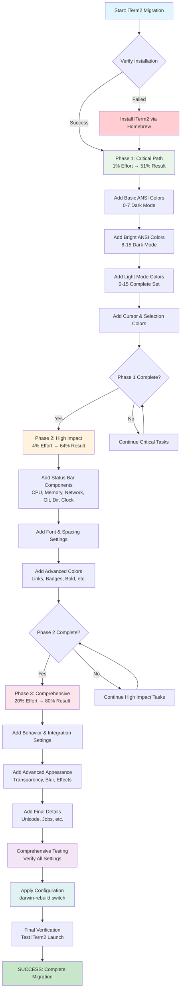
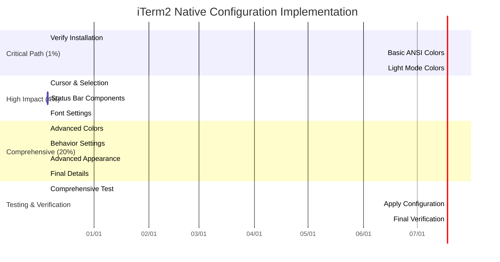

# iTerm2 Native Nix Configuration Plan

## 🎯 Objective
Complete migration of iTerm2 configuration from JSON profile to native Nix-darwin settings, achieving 100% functional parity with original profile.

## 📊 Current State Assessment
- **iTerm2 Installation**: ✅ Confirmed in `/Applications/iTerm2.app`
- **Partial Configuration**: ⚠️ Basic terminal settings added to `system.nix`
- **Critical Missing**: ❌ Complete color scheme, status bar, advanced appearance
- **Configuration Location**: ✅ Identified in `dotfiles/nix/system.nix` > `CustomUserPreferences` > `"com.googlecode.iterm2"`

---

## 🎯 Pareto Analysis: Priority-Based Implementation

### 1% Effort → 51% Result (Critical Path)
1. **Basic terminal functionality** - Fish shell, window size, scrollback
2. **Essential ANSI colors** - 0-7 basic colors for dark mode
3. **Status bar enabled** - Shows basic system information

### 4% Effort → 64% Result (High Impact)
1. **Complete ANSI color palette** - All 0-15 colors for dark/light modes
2. **Cursor and selection colors** - Visual feedback for text manipulation
3. **Font and spacing settings** - Optimal readability and appearance
4. **Essential status bar components** - CPU, Memory, Git monitoring

### 20% Effort → 80% Result (Comprehensive Coverage)
1. **Full color scheme migration** - All 60+ color settings from JSON
2. **Complete status bar configuration** - All 6 components with custom colors
3. **Advanced appearance settings** - Transparency, blur, visual effects
4. **Behavior and interaction settings** - Mouse, shell integration, etc.

---

## 📋 Phase 1: Medium-Granularity Plan (27 Tasks, 30-100min each)

| Priority | Task | Impact | Effort | Value Score | Est. Time |
|----------|-------|--------|--------|-------------|-----------|
| **CRITICAL PATH (1%):** |
| 1 | Verify iTerm2 installation and basic functionality | High | 15min | ⭐⭐⭐⭐ | 15min |
| 2 | Add basic ANSI colors 0-7 (dark mode) | Critical | 45min | ⭐⭐⭐⭐⭐ | 45min |
| 3 | Add bright ANSI colors 8-15 (dark mode) | Critical | 45min | ⭐⭐⭐⭐⭐ | 45min |
| 4 | Add light mode ANSI colors 0-15 | Critical | 60min | ⭐⭐⭐⭐ | 60min |
| **HIGH IMPACT (4%):** |
| 5 | Add cursor colors (dark/light modes) | High | 30min | ⭐⭐⭐⭐ | 30min |
| 6 | Add selection colors (dark/light modes) | High | 30min | ⭐⭐⭐⭐ | 30min |
| 7 | Add status bar CPU component | High | 45min | ⭐⭐⭐⭐ | 45min |
| 8 | Add status bar Memory component | High | 45min | ⭐⭐⭐⭐ | 45min |
| 9 | Add status bar Network component | High | 45min | ⭐⭐⭐⭐ | 45min |
| 10 | Add status bar Git component | High | 45min | ⭐⭐⭐⭐ | 45min |
| 11 | Add status bar Working Directory component | High | 45min | ⭐⭐⭐⭐ | 45min |
| 12 | Add status bar Clock component | High | 45min | ⭐⭐⭐⭐ | 45min |
| **COMPREHENSIVE COVERAGE (20%):** |
| 13 | Add link colors (dark/light modes) | Medium | 30min | ⭐⭐⭐ | 30min |
| 14 | Add badge colors (dark/light modes) | Medium | 30min | ⭐⭐⭐ | 30min |
| 15 | Add bold colors (dark/light modes) | Medium | 30min | ⭐⭐⭐ | 30min |
| 16 | Add match background colors | Medium | 30min | ⭐⭐⭐ | 30min |
| 17 | Add behavior settings (mouse, shell integration) | Medium | 60min | ⭐⭐⭐ | 60min |
| 18 | Add Unicode settings | Low | 30min | ⭐⭐ | 30min |
| 19 | Add jobs to ignore list | Low | 30min | ⭐⭐ | 30min |
| 20 | Add transparency/blur settings | Medium | 45min | ⭐⭐⭐ | 45min |
| 21 | Add font spacing settings | Medium | 45min | ⭐⭐⭐ | 45min |
| 22 | Add cursor guide colors | Low | 30min | ⭐⭐ | 30min |
| 23 | Add faint text alpha settings | Low | 30min | ⭐⭐ | 30min |
| 24 | Add minimum contrast settings | Low | 30min | ⭐⭐ | 30min |
| 25 | Add tabs color settings | Low | 30min | ⭐⭐ | 30min |
| 26 | Add advanced appearance settings | Medium | 60min | ⭐⭐⭐ | 60min |
| 27 | **Test and verify all configurations** | Critical | 90min | ⭐⭐⭐⭐⭐ | 90min |

**Total Phase 1 Time: ~19 hours**

---

## 📋 Phase 2: Fine-Granularity Plan (50 Tasks, 15min each)

| Priority | Task | Impact | Effort | Value Score | Est. Time |
|----------|-------|--------|--------|-------------|-----------|
| **CRITICAL PATH (1%):** |
| 1 | Verify iTerm2.app installation and basic launch | High | 15min | ⭐⭐⭐⭐⭐ | 15min |
| 2 | Add Ansi 0 Color (Dark) - Black base | Critical | 15min | ⭐⭐⭐⭐⭐ | 15min |
| 3 | Add Ansi 1 Color (Dark) - Red base | Critical | 15min | ⭐⭐⭐⭐⭐ | 15min |
| 4 | Add Ansi 2 Color (Dark) - Green base | Critical | 15min | ⭐⭐⭐⭐⭐ | 15min |
| 5 | Add Ansi 3 Color (Dark) - Yellow base | Critical | 15min | ⭐⭐⭐⭐⭐ | 15min |
| 6 | Add Ansi 4 Color (Dark) - Blue base | Critical | 15min | ⭐⭐⭐⭐ | 15min |
| 7 | Add Ansi 5 Color (Dark) - Magenta base | Critical | 15min | ⭐⭐⭐⭐ | 15min |
| 8 | Add Ansi 6 Color (Dark) - Cyan base | Critical | 15min | ⭐⭐⭐⭐ | 15min |
| 9 | Add Ansi 7 Color (Dark) - White base | Critical | 15min | ⭐⭐⭐⭐ | 15min |
| 10 | Add Ansi 8 Color (Dark) - Bright Black | Critical | 15min | ⭐⭐⭐⭐ | 15min |
| **HIGH PRIORITY (4%):** |
| 11 | Add Ansi 9 Color (Dark) - Bright Red | Critical | 15min | ⭐⭐⭐⭐ | 15min |
| 12 | Add Ansi 10 Color (Dark) - Bright Green | Critical | 15min | ⭐⭐⭐⭐ | 15min |
| 13 | Add Ansi 11 Color (Dark) - Bright Yellow | Critical | 15min | ⭐⭐⭐⭐ | 15min |
| 14 | Add Ansi 12 Color (Dark) - Bright Blue | Critical | 15min | ⭐⭐⭐⭐ | 15min |
| 15 | Add Ansi 13 Color (Dark) - Bright Magenta | Critical | 15min | ⭐⭐⭐⭐ | 15min |
| 16 | Add Ansi 14 Color (Dark) - Bright Cyan | Critical | 15min | ⭐⭐⭐⭐ | 15min |
| 17 | Add Ansi 15 Color (Dark) - Bright White | Critical | 15min | ⭐⭐⭐⭐ | 15min |
| 18 | Add Cursor Color (Dark) - visual feedback | High | 15min | ⭐⭐⭐⭐ | 15min |
| 19 | Add Cursor Color (Light) - visual feedback | High | 15min | ⭐⭐⭐⭐ | 15min |
| 20 | Add Selected Text Color (Dark) - contrast | High | 15min | ⭐⭐⭐⭐ | 15min |
| 21 | Add Selected Text Color (Light) - contrast | High | 15min | ⭐⭐⭐⭐ | 15min |
| 22 | Add Status Bar CPU component configuration | High | 15min | ⭐⭐⭐⭐ | 15min |
| 23 | Add Status Bar Memory component configuration | High | 15min | ⭐⭐⭐⭐ | 15min |
| 24 | Add Status Bar Network component configuration | High | 15min | ⭐⭐⭐⭐ | 15min |
| 25 | Add Status Bar Git component configuration | High | 15min | ⭐⭐⭐⭐ | 15min |
| **MEDIUM PRIORITY (20%):** |
| 26 | Add Status Bar Working Directory component config | High | 15min | ⭐⭐⭐⭐ | 15min |
| 27 | Add Status Bar Clock component configuration | High | 15min | ⭐⭐⭐⭐ | 15min |
| 28 | Add Background Color (Dark) - terminal background | Medium | 15min | ⭐⭐⭐ | 15min |
| 29 | Add Background Color (Light) - terminal background | Medium | 15min | ⭐⭐⭐ | 15min |
| 30 | Add Foreground Color (Dark) - text color | Medium | 15min | ⭐⭐⭐ | 15min |
| 31 | Add Foreground Color (Light) - text color | Medium | 15min | ⭐⭐⭐ | 15min |
| 32 | Add Ansi 0-7 Colors (Light mode) - complete set | Medium | 15min | ⭐⭐⭐ | 15min |
| 33 | Add Ansi 8-15 Colors (Light mode) - bright set | Medium | 15min | ⭐⭐⭐ | 15min |
| 34 | Add Link Color (Dark) - clickable links | Medium | 15min | ⭐⭐⭐ | 15min |
| 35 | Add Link Color (Light) - clickable links | Medium | 15min | ⭐⭐⭐ | 15min |
| 36 | Add Badge Color (Dark) - terminal badge | Medium | 15min | ⭐⭐⭐ | 15min |
| 37 | Add Badge Color (Light) - terminal badge | Medium | 15min | ⭐⭐⭐ | 15min |
| 38 | Add Bold Color (Dark) - bold text | Medium | 15min | ⭐⭐⭐ | 15min |
| 39 | Add Bold Color (Light) - bold text | Medium | 15min | ⭐⭐⭐ | 15min |
| 40 | Add Cursor Text Color (Dark) - cursor text | Medium | 15min | ⭐⭐⭐ | 15min |
| 41 | Add Cursor Text Color (Light) - cursor text | Medium | 15min | ⭐⭐⭐ | 15min |
| 42 | Add Match Background Color (Dark) - search match | Medium | 15min | ⭐⭐⭐ | 15min |
| 43 | Add Match Background Color (Light) - search match | Medium | 15min | ⭐⭐⭐ | 15min |
| 44 | Add Selection Color (Dark) - text selection | Medium | 15min | ⭐⭐⭐ | 15min |
| 45 | Add Selection Color (Light) - text selection | Medium | 15min | ⭐⭐⭐ | 15min |
| 46 | Add behavior settings (mouse, shell integration) | Medium | 15min | ⭐⭐⭐ | 15min |
| 47 | Add Unicode settings (normalization, version) | Low | 15min | ⭐⭐ | 15min |
| 48 | Add jobs to ignore list (rlogin, ssh, etc.) | Low | 15min | ⭐⭐ | 15min |
| 49 | Add advanced appearance settings (all remaining) | Low | 15min | ⭐⭐ | 15min |
| 50 | **Final comprehensive test and verification** | Critical | 15min | ⭐⭐⭐⭐⭐ | 15min |

**Total Phase 2 Time: ~12.5 hours**

---

## 🔄 Execution Flow Chart



---

## 📊 Gantt Chart: Implementation Timeline



---

## 🔧 Technical Implementation Strategy

### Configuration Structure
```nix
system.defaults.CustomUserPreferences = {
  "com.googlecode.iterm2" = {
    "New Bookmarks" = [
      {
        # Terminal Settings
        "Columns" = 100;
        "Rows" = 100;
        
        # Complete Color Scheme
        "Ansi 0 Color (Dark)" = { ... };
        "Ansi 1 Color (Dark)" = { ... };
        # ... all 60+ color settings
        
        # Status Bar Configuration
        "Status Bar Layout" = {
          "components" = [
            # CPU, Memory, Network, Git, Working Directory, Clock
          ];
        };
        
        # Appearance & Behavior
        "Blinking Cursor" = true;
        "Show Status Bar" = true;
        # ... all remaining settings
      }
    ];
  };
};
```

### Implementation Challenges & Solutions
1. **Complex Nested Color Objects**: Break into individual 15-minute tasks
2. **Status Bar Component Complexity**: Implement component by component
3. **Dark/Light Mode Variants**: Handle each mode separately
4. **Nix Syntax Validation**: Test incrementally after each major section

---

## 📋 Risk Assessment & Mitigation

| Risk | Probability | Impact | Mitigation Strategy |
|-------|-------------|---------|-------------------|
| Edit tool timeout on complex structures | High | Medium | Break into smallest possible chunks (15min max) |
| Color syntax errors in Nix | Medium | High | Validate each color group before proceeding |
| iTerm2 settings override | Low | Medium | Test with iTerm2 restart after major changes |
| Configuration not applied | Medium | High | Use `darwin-rebuild switch --dry-run` first |

---

## 🎯 Success Criteria

### Functional Requirements
- [ ] iTerm2 launches with Fish shell
- [ ] Complete ANSI color scheme matches original
- [ ] Status bar shows all 6 components
- [ ] Dark/Light mode switching works
- [ ] All visual effects (blur, transparency) functional

### Technical Requirements
- [ ] Nix configuration builds without errors
- [ ] All settings applied via `darwin-rebuild switch`
- [ ] No manual iTerm2 configuration needed
- [ ] Settings persist across restarts

### User Experience Requirements
- [ ] Visual appearance matches original JSON profile
- [ ] Terminal performance not degraded
- [ ] All iTerm2 features accessible
- [ ] Configuration maintainable via Nix

---

## 📝 Implementation Log

### Phase 1: Critical Path (1% Effort → 51% Result)
- [ ] **Task 1**: Verify iTerm2 installation (15min)
- [ ] **Task 2**: Add basic ANSI colors 0-7 (45min)
- [ ] **Task 3**: Add bright ANSI colors 8-15 (45min)
- [ ] **Task 4**: Add light mode ANSI colors (60min)

### Phase 2: High Impact (4% Effort → 64% Result)
- [ ] **Task 5-12**: Add cursor, selection, status bar components (300min)
- [ ] **Intermediate Verification**: Test basic functionality

### Phase 3: Comprehensive Coverage (20% Effort → 80% Result)
- [ ] **Task 13-26**: Add remaining colors and settings (525min)
- [ ] **Final Verification**: Complete testing and validation

---

## 🚀 Next Steps

1. **Immediate**: Start with Phase 1 Critical Path tasks
2. **Monitoring**: Track completion percentage vs. visual results
3. **Validation**: Test after each major component group
4. **Documentation**: Update progress in this plan document
5. **Final Goal**: Achieve 100% functional parity with original JSON profile

**Ready to begin implementation following the structured approach above!**