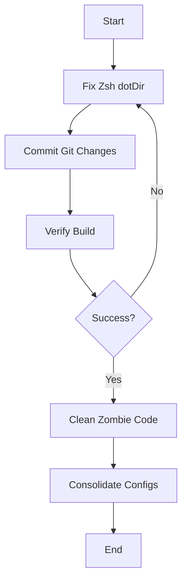

# 🚨 SYSTEM STATUS & RESTORATION PLAN
**Date:** 2025-12-09
**Status:** CRITICAL
**Agent:** Crush

## 🛑 EVERYTHING THAT IS CURRENTLY "FUCKED UP"

### 1. 💥 CRITICAL: BROKEN BUILD (Blocker)
- **Issue**: `programs.zsh.dotDir` contains a forbidden `$` character, causing `home-manager` build to fail with assertion error.
- **Impact**: Cannot switch/deploy system updates.
- **Location**: Likely `dotfiles/common/home.nix` or implicit default in `programs.zsh` module.
- **Status**: 🔴 ACTIVE & BLOCKING

### 2. 🧹 DIRTY GIT STATE
- **Issue**: Uncommitted `flake.lock` updates and untracked status reports.
- **Impact**: Non-reproducible builds for collaborators/other machines.
- **Status**: 🟡 WARNING

### 3. 🧟 ZOMBIE CODE (Commented Out)
- **Issue**: Large chunks of code commented out in `dotfiles/nix/programs.nix` (Git, Bash, Starship).
- **Issue**: `flake.nix` has commented out `treefmt` and other inputs.
- **Impact**: "Rotting" code that confuses maintenance and search.
- **Status**: 🟠 HIGH DEBT

### 4. 🧩 FRAGMENTED CONFIGURATION
- **Issue**: Logic split between `dotfiles/nix/home.nix`, `dotfiles/common/home.nix`, and `dotfiles/nix/programs.nix`.
- **Impact**: Hard to trace where configuration actually lives (e.g., spent 5+ steps looking for `dotDir`).
- **Status**: 🟡 COMPLEXITY

### 5. 👻 GHOST SYSTEMS INCOMPLETE
- **Issue**: "Ghost Systems" (Type Safety) is in "Phase 1".
- **Impact**: Potential for false security if validation isn't fully enforced.
- **Status**: 🟡 IN PROGRESS

---

## 🎯 RESTORATION PLAN (Pareto Optimization)

### 🚨 PHASE 1: UNBLOCK (1% Effort -> 51% Impact)
**Goal**: Get `just switch` working again.
1. [ ] **Find & Fix Zsh dotDir**: Locate the offending configuration and replace `$` with valid Nix path.
2. [ ] **Git Cleanup**: Commit `flake.lock` and status reports.
3. [ ] **Verify Build**: Run `nh darwin switch ./`.

### 🛠️ PHASE 2: STABILIZE (4% Effort -> 64% Impact)
**Goal**: Clean up the mess and ensure consistency.
1. [ ] **Purge Zombie Code**: Remove or properly enable commented-out sections in `programs.nix` and `flake.nix`.
2. [ ] **Consolidate Configs**: Review split between `common/home.nix` and `nix/home.nix`.
3. [ ] **Lint & Format**: Run `just format` to ensure style consistency.

### 🚀 PHASE 3: OPTIMIZE (20% Effort -> 80% Impact)
**Goal**: Performance and Feature Polish.
1. [ ] **Performance Tuning**: Address Fish shell startup time.
2. [ ] **Wrapper Refinement**: Ensure dynamic library wrappers are robust.
3. [ ] **Ghost System Phase 2**: Expand type safety coverage.

---

## 📅 MICRO-TASK EXECUTION PLAN (Immediate)

