# SUPERB EXECUTION PLAN - NIX DEVELOPMENT RECOVERY

**Date:** 2025-12-18
**Time:** 02:00 CET
**Plan Type:** Pareto-Optimized Execution Strategy
**Total Duration:** 31.25 hours for 100% recovery
**Primary Goal:** Maximum value with minimum effort

---

## 🎯 EXECUTION GRAPH (Mermaid.js)

```mermaid
graph TD
    A[Phase 1: Critical Path<br/>2.5 hours<br/>51% recovery] --> B{Verification Success?}
    B -->|Yes| C[Phase 2: Expanded Productivity<br/>4.5 hours<br/>+29% recovery]
    B -->|No| D[Rollback & Debug<br/>+1 hour]

    C --> E[Phase 3: Enhanced Capabilities<br/>6 hours<br/>+20% recovery]
    E --> F[Phase 4: System Optimization<br/>12 hours<br/>+15% recovery]
    F --> G[Phase 5: Advanced Features<br/>6.75 hours<br/>+5% recovery]

    G --> H[🎉 COMPLETE SYSTEM<br/>100% functionality]

    D --> A

    style A fill:#ff6b6b,stroke:#000,color:#fff
    style C fill:#4ecdc4,stroke:#000,color:#000
    style E fill:#45b7d1,stroke:#000,color:#000
    style F fill:#96ceb4,stroke:#000,color:#000
    style G fill:#feca57,stroke:#000,color:#000
    style H fill:#26de81,stroke:#000,color:#000
```

---

## 📊 PARETO OPTIMIZATION BREAKDOWN

### 🎯 1% EFFORT → 51% RESULTS (Tasks 1-5)

| Task | Time | Impact | Value Ratio | Dependencies | Success Metric |
|-------|------|--------|-------------|-------------|---------------|
| **T1: Verify Minimal Config** | 15min | 51% | **3.4** | None | Build succeeds |
| **T2: Enable Home Manager** | 30min | 20% | **0.67** | T1 | User environment loads |
| **T3: Essential CLI Tools** | 30min | 15% | **0.5** | T2 | git/nvim/tmux work |
| **T4: Shell Configuration** | 20min | 10% | **0.5** | T3 | Shell functional |
| **T5: Go Development** | 45min | 4% | **0.09** | T4 | Go compiles |

**Total Investment:** 2.5 hours
**Total Recovery:** 51%
**ROI:** Exceptional

### 🔥 4% EFFORT → 64% RESULTS (Tasks 6-20)

| Task | Time | Impact | Value Ratio | Dependencies | Success Metric |
|-------|------|--------|-------------|-------------|---------------|
| **T6: Enhanced Git Config** | 15min | 3% | **0.2** | T5 | Git workflow optimized |
| **T7: Dev Utilities** | 15min | 3% | **0.2** | T6 | htop/jq/ripgrep work |
| **T8: Neovim Setup** | 30min | 3% | **0.1** | T7 | Editor functional |
| **T9: Tmux Setup** | 20min | 2% | **0.1** | T8 | Multiplexing works |
| **T10: Package Management** | 20min | 2% | **0.1** | T9 | nh tool functional |
| **T11-T20:** Additional productivity tools | 60min | 13% | **0.22** | T10 | Full dev workflow |

**Additional Investment:** 1.5 hours
**Additional Recovery:** 13%
**Cumulative ROI:** Very Good

### 🚀 20% EFFORT → 80% RESULTS (Tasks 21-50)

| Task | Time | Impact | Value Ratio | Dependencies | Success Metric |
|-------|------|--------|-------------|-------------|---------------|
| **T21-T30:** Advanced development setup | 150min | 16% | **0.11** | T20 | Multi-language support |
| **T31-T40:** System optimization | 150min | 16% | **0.11** | T30 | Professional environment |
| **T41-T50:** Quality & automation | 150min | 20% | **0.13** | T40 | Production-ready system |

**Additional Investment:** 7.5 hours
**Additional Recovery:** 16%
**Cumulative ROI:** Good

---

## ⚡ MICRO-TASK BREAKDOWN (15min each)

### 🚨 CRITICAL PATH - PHASE 1 (Tasks 1-25)
**Timeline:** 6.25 hours → 80% recovery

---

## 🎯 DETAILED EXECUTION STRATEGY

### IMMEDIATE CRITICAL PATH (First 2.5 hours)

1. **[15min] TASK 1: SYSTEM VERIFICATION**
   - **Action:** `darwin-rebuild build --flake .#Lars-MacBook-Air`
   - **Success:** Build completes without errors
   - **Failure:** Debug and rollback to minimal working state
   - **Risk:** HIGH - Could reveal deeper configuration issues

2. **[30min] TASK 2: HOME MANAGER FOUNDATION**
   - **Action:** Add home-manager input and enable module
   - **Success:** Home Manager loads user configurations
   - **Failure:** Remove input, debug dependency issues
   - **Risk:** HIGH - Complex input resolution

3. **[30min] TASK 3: ESSENTIAL CLI TOOLS**
   - **Action:** Add git, neovim, tmux, curl packages
   - **Success:** Basic development tools available
   - **Failure:** Check package availability, fix imports
   - **Risk:** MEDIUM - Standard packages should work

4. **[20min] TASK 4: SHELL CONFIGURATION**
   - **Action:** Configure .bashrc/.zshrc with prompt and aliases
   - **Success:** Usable development shell
   - **Failure:** Use default shell, debug configuration
   - **Risk:** LOW - Shell config is straightforward

5. **[45min] TASK 5: GO DEVELOPMENT ENVIRONMENT**
   - **Action:** Install Go, configure GOPATH, add LSP
   - **Success:** Can compile and edit Go code
   - **Failure:** Use system Go, debug configuration
   - **Risk:** MEDIUM - Go installation can be complex

### EXPANDED PRODUCTIVITY PATH (Next 4.5 hours)

**Tasks 6-20:** Enhanced git, utilities, editor configuration, security tools, monitoring
**Goal:** Professional development environment
**Success Metric:** Can develop, test, and commit code efficiently

### SYSTEM OPTIMIZATION PATH (Next 6 hours)

**Tasks 21-40:** Advanced development tools, system optimization, quality assurance
**Goal:** Production-ready development environment
**Success Metric:** System is stable, monitored, and optimized

---

## 📈 VALUE/effort ANALYSIS

### High Value Tasks (>1.0 ratio):
- **Task 1:** 3.4 (Exceptional ROI)
- **Task 2:** 0.67 (High ROI)
- **Tasks 3-4:** 0.5 (Good ROI)

### Medium Value Tasks (0.3-1.0 ratio):
- **Tasks 5-25:** 0.1-0.3 (Acceptable ROI)

### Optimization Priority:
1. **Immediate:** Complete Task 1 (Critical path verification)
2. **High Priority:** Complete Tasks 2-4 (Foundation establishment)
3. **Medium Priority:** Complete Tasks 5-25 (Productivity enhancement)

---

## 🚨 RISK MITIGATION STRATEGY

### HIGH RISK TASKS:
1. **Task 1:** System verification could fail catastrophically
2. **Task 2:** Home Manager has complex dependencies
3. **Task 5:** Go environment setup can be tricky

### MITIGATION ACTIONS:
1. **Incremental Testing:** Verify after each task
2. **Git Checkpoints:** Create restore points every 5 tasks
3. **Rollback Strategy:** Document rollback procedures for each phase
4. **Parallel Testing:** Test complex changes in isolation

### FAILURE RECOVERY:
1. **Task 1 Failure:** Debug build errors, simplify configuration
2. **Task 2 Failure:** Remove Home Manager, use manual user config
3. **Task 5 Failure:** Use system Go, add LSP later
4. **General Failure:** Rollback to last working git checkpoint

---

## 🎯 SUCCESS METRICS

### Phase 1 Success (2.5 hours):
- ✅ Build system works
- ✅ User configuration loads
- ✅ Essential tools available
- ✅ Shell environment usable
- ✅ Go development possible
- **Metric:** 51% functionality restored

### Phase 2 Success (7 hours total):
- ✅ All Phase 1 successes
- ✅ Professional development workflow
- ✅ Security tools configured
- ✅ System monitoring active
- **Metric:** 80% functionality restored

### Complete Success (31.25 hours total):
- ✅ All phases complete
- ✅ System optimized and monitored
- ✅ Advanced features working
- ✅ Documentation complete
- **Metric:** 100% functionality restored

---

## 🚀 IMMEDIATE ACTION PLAN

**RIGHT NOW (Next 15 minutes):**
1. Execute Task 1 - Verify minimal configuration works
2. Document results and any issues
3. Create git checkpoint if successful

**NEXT 2.5 HOURS:**
1. Complete Tasks 2-5 (Critical path)
2. Achieve 51% system recovery
3. Verify all basic functionality works

**NEXT 7 HOURS:**
1. Complete Tasks 6-25 (Expanded productivity)
2. Achieve 80% system recovery
3. Test complete development workflow

**NEXT 24 HOURS:**
1. Complete all tasks 1-125
2. Achieve 100% system recovery
3. Verify all advanced features work

---

## 📊 PERFORMANCE EXPECTATIONS

### Time Investment:
- **Phase 1 (51% recovery):** 2.5 hours
- **Phase 2 (29% recovery):** 4.5 hours
- **Phase 3 (20% recovery):** 6 hours
- **Total (100% recovery):** 31.25 hours

### Value Delivered:
- **Hour 1:** 51% of total value delivered
- **Hour 7:** 80% of total value delivered
- **Hour 31.25:** 100% of total value delivered

### ROI Optimization:
- **Exceptional:** First hour (51% value/hour)
- **Very Good:** Next 6 hours (4.8% value/hour average)
- **Good:** Remaining 25 hours (0.8% value/hour average)

---

## 🎯 CONCLUSION

This plan delivers **maximum value with minimum effort** through Pareto optimization. The first 2.5 hours deliver over half the total value, creating a fully functional development environment. Subsequent phases gradually add sophistication while maintaining strong ROI.

The micro-task approach (15min each) ensures continuous progress with minimal risk and quick feedback loops. Each task is verifiable and rollbackable, providing a safe path to complete system recovery.

**Recommended Execution:** Start immediately with Task 1 and follow the sequence as documented.