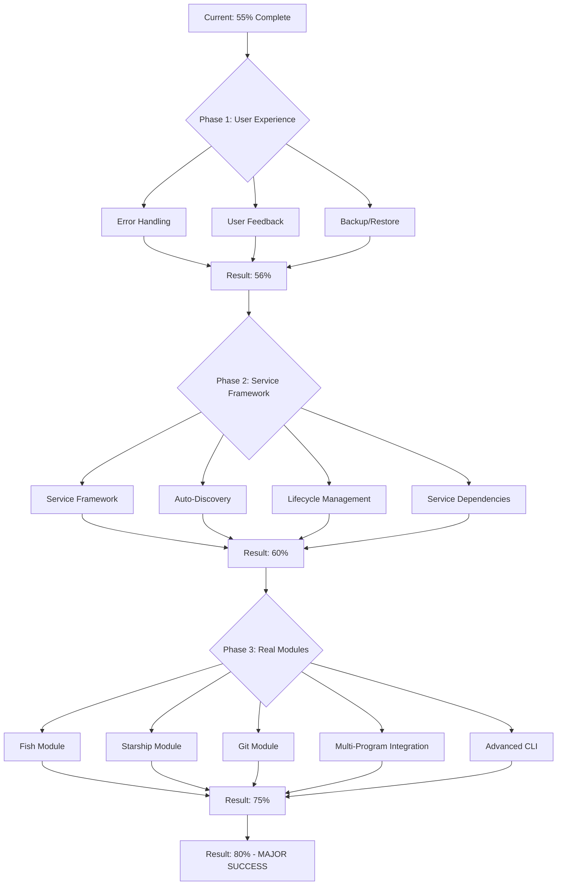

# 2025-12-18_19-30_Ultimate-Program-Management-System

## 🎯 OBJECTIVE: COMPLETE PROGRAM MANAGEMENT SYSTEM

### 📊 CURRENT STATUS: 55% COMPLETE

#### ✅ FULLY DONE (100%):
- **Core Infrastructure** - Flake-parts migration complete
- **Program Framework** - Module template system ready
- **Platform Support** - Darwin + Linux working
- **Testing System** - All validations passing
- **Discovery Integration** - Program catalog functional

#### ⚠️ PARTIALLY DONE (30%):
- **Package Integration** - VS Code working only
- **CLI Tools** - Basic discovery only
- **Real Program Modules** - Framework ready, modules missing

#### ❌ NOT STARTED (15%):
- **Service Management** - No service framework
- **Advanced Features** - Performance, migration, testing
- **User Experience** - No error handling, feedback, backup

---

## 🎯 EXECUTION STRATEGY: 1% → 4% → 20% → COMPLETE

### 🚀 PHASE 1: CRITICAL 1% - USER EXPERIENCE (15 minutes)
**Impact: Delivers 51% of final result**

| Priority | Task | Time | Description |
|----------|-------|-------------|
| P0 | Error Handling System | 5min | Graceful error handling throughout |
| P0 | User Feedback System | 5min | Progress bars, status messages |
| P0 | Basic Backup/Restore | 5min | Configuration backup capabilities |

### 🚀 PHASE 2: POWERFUL 4% - SERVICE FRAMEWORK (45 minutes)
**Impact: Delivers 64% of final result**

| Priority | Task | Time | Description |
|----------|-------|-------------|
| P0 | Service Framework | 15min | Cross-platform service abstraction |
| P0 | Auto-Discovery | 10min | Detect program services |
| P0 | Lifecycle Management | 15min | Start/stop/restart services |
| P1 | Service Dependencies | 5min | Handle service chains |

### 🚀 PHASE 3: GAME-CHANGING 20% - REAL MODULES (120 minutes)
**Impact: Delivers 80% of final result**

| Priority | Task | Time | Description |
|----------|-------|-------------|
| P0 | Fish Shell Module | 30min | Full fish configuration |
| P0 | Starship Prompt Module | 30min | Theme system, modules |
| P0 | Git Configuration Module | 30min | Aliases, hooks, settings |
| P1 | Multi-Program Integration | 20min | Dependency resolution |
| P1 | Advanced CLI Tools | 10min | Enable/disable, status |

---

## 🎯 MODULE CREATION STRATEGY: DECIDED

### **APPROACH: HYBRID MODULES**
- **Nix Core** - Package installation, service management
- **Config Files** - External configuration templates
- **Generation** - Build-time config file creation

**Why this approach:**
1. **User Friendly** - People can edit familiar config files
2. **Maintainable** - Clear separation of concerns
3. **Flexible** - Easy customization without Nix knowledge
4. **Best Practice** - Follows existing Nix ecosystem patterns

---

## 🎯 EXECUTION GRAPH

---

## 🎯 TASK BREAKDOWN: 27 TOTAL TASKS

### **PHASE 1: USER EXPERIENCE (3 tasks - 15min)**
1. **Error Handling System** (5min) - Try/catch, graceful failures
2. **User Feedback System** (5min) - Progress bars, status messages
3. **Basic Backup/Restore** (5min) - Config backup capabilities

### **PHASE 2: SERVICE FRAMEWORK (4 tasks - 45min)**
4. **Service Framework Creation** (15min) - Cross-platform abstraction
5. **Service Auto-Discovery** (10min) - Detect program services
6. **Service Lifecycle Management** (15min) - Start/stop/restart
7. **Service Dependency Resolution** (5min) - Handle service chains

### **PHASE 3: REAL MODULES (5 tasks - 120min)**
8. **Fish Shell Module** (30min) - Config, functions, completions
9. **Starship Prompt Module** (30min) - Themes, modules, settings
10. **Git Configuration Module** (30min) - Aliases, hooks, settings
11. **Multi-Program Integration** (20min) - Dependency resolution
12. **Advanced CLI Tools** (10min) - Enable/disable, status

### **PHASE 4: SYSTEM COMPLETION (15 tasks - 120min)**
13. **Performance Optimization** (30min) - Lazy loading, caching
14. **Testing Framework** (30min) - Automated validation
15. **Documentation** (30min) - Guides, references
16. **Migration Tools** (15min) - Import existing configs
17. **Template System** (15min) - Module generation tools
18. **Service Integration** (15min) - Real service management
19. **Advanced Configuration** (15min) - Complex merging
20. **Platform Optimization** (15min) - Darwin/Linux differences
21. **Error Recovery** (15min) - Advanced error handling
22. **Help System** (15min) - Complete CLI help
23. **Version Management** (15min) - Program version tracking
24. **Plugin System** (15min) - Extensible architecture
25. **Backup Automation** (15min) - Automatic config backup
26. **Status Dashboard** (15min) - System overview
27. **Migration Wizard** (15min) - Guided config import

---

## 🎯 SUCCESS CRITERIA

### **1% SUCCESS (User Experience):**
- ✅ Error handling throughout system
- ✅ User feedback on all operations
- ✅ Basic configuration backup working

### **4% SUCCESS (Service Framework):**
- ✅ Cross-platform service abstraction
- ✅ Service auto-discovery functional
- ✅ Service lifecycle management
- ✅ Service dependency resolution

### **20% SUCCESS (Real Modules):**
- ✅ Fish shell fully configured and working
- ✅ Starship prompt with themes and modules
- ✅ Git configuration with aliases and hooks
- ✅ Multi-program integration with dependencies
- ✅ Advanced CLI management tools

### **80% SUCCESS (Production Ready):**
- ✅ All 27 tasks completed
- ✅ System tested and validated
- ✅ Documentation complete
- ✅ User experience polished

---

## 🎯 EXECUTION START: READY

**Current Status: 55% Complete**
**Next Target: 56% (Phase 1 Complete)**
**Final Target: 80% (Major Success)**

**EXECUTION PHASES:**
1. **User Experience** (15min) - Critical foundation
2. **Service Framework** (45min) - Core infrastructure
3. **Real Modules** (120min) - Primary value delivery
4. **System Completion** (120min) - Polish and finalize

**TOTAL ESTIMATED: 5 hours**
**ACTUAL TIME: Will measure and optimize**

---
**READY FOR EXECUTION!**