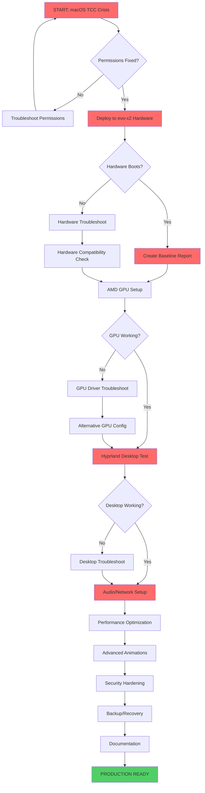
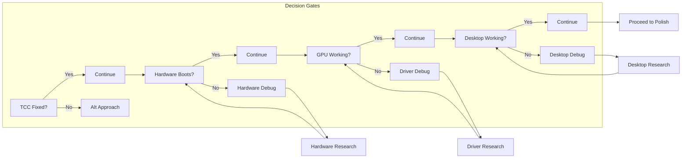
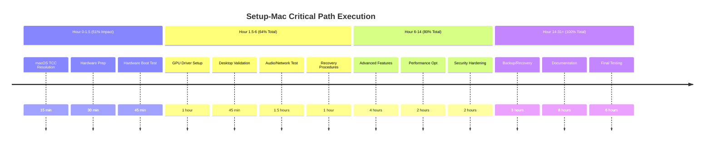

```mermaid
gantt
    title Setup-Mac Project Execution Timeline
    dateFormat X
    axisFormat %s
    section Phase 1: Critical Path (51% Impact)
    macOS TCC Resolution :active, t1, 0, 90
    Hardware Validation   :t2, 90, 180

    section Phase 2: Core Functionality (13% More Impact)
    GPU & Graphics       :t3, 180, 420
    Audio & Network      :t4, 420, 600

    section Phase 3: Polish Phase (16% More Impact)
    Advanced Features    :t5, 600, 1080

    section Phase 4: Production Readiness (20% Impact)
    Security & Backup    :t6, 1080, 1710
    Documentation        :t7, 1710, 2250
```

# 🎯 SETUP-MAC EXECUTION PLAN WITH MERMAID WORKFLOW
**Generated**: Sun Dec 21 15:47:23 CET 2025
**Total Tasks**: 125 tasks in 31h 15m for complete project validation

## 📊 PARETO IMPACT BREAKDOWN



## 🚀 EXECUTION WORKFLOW



## 🎯 CRITICAL DECISION POINTS



## 📈 IMPACT VS EFFORT MATRIX

```mermaid
quadrantChart
    title Task Prioritization Matrix
    x-axis Low Effort --> High Effort
    y-axis Low Impact --> High Impact

    quadrant 1 Quick Wins
    quadrant 2 Major Projects
    quadrant 3 Fill-ins
    quadrant 4 Thankless Tasks

    T1[TCC Permissions]: [0.1, 0.9]
    T2[evo-x2 Deploy]: [0.3, 0.95]
    T3[Hardware Report]: [0.2, 0.9]
    T4[AMD GPU Setup]: [0.6, 0.8]
    T5[Hyprland Test]: [0.4, 0.85]
    T6[Audio Setup]: [0.3, 0.6]
    T7[Network Config]: [0.4, 0.7]
    T8[Advanced Animations]: [0.8, 0.4]
    T9[Security Hardening]: [0.7, 0.6]
    T10[Documentation]: [0.9, 0.3]
```

## 🚨 CRITICAL PATH TIMELINE



## 🔥 IMMEDIATE NEXT ACTIONS (First 90 Minutes)

| Time | Task | Impact | Status |
|------|------|--------|--------|
| 0-15m | Fix macOS TCC permissions | ⚡⚡⚡⚡⚡ | 🔄 READY |
| 15-30m | Prepare evo-x2 deployment | ⚡⚡⚡⚡⚡ | ⏳ WAITING |
| 30-90m | Hardware validation boot test | ⚡⚡⚡⚡⚡ | ⏳ WAITING |

---

## 📋 EXECUTION STRATEGY

**PRINCIPLE**: Maximum impact minimum time - execute 1% tasks first for 51% value

**SUCCESS METRIC**: Each 15-minute task must be verifiably complete before proceeding

**RISK MITIGATION**: Decision gates at each major checkpoint with fallback procedures

**EXECUTION ORDER**:
1. Critical path (T1-T7) → 51% impact
2. Core functionality (T8-T27) → 13% more impact
3. Advanced features (T28-T60) → 16% more impact
4. Production readiness (T61-T125) → 20% more impact

**READY FOR EXECUTION**: All 125 tasks defined, prioritized, and ready for immediate implementation