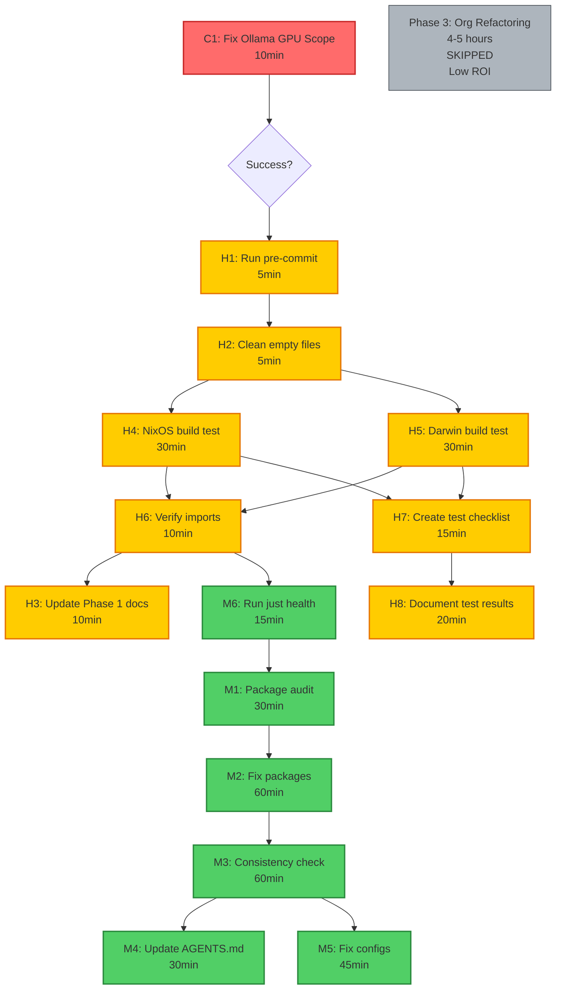

# 🎯 PARETO-FOCUSED EXECUTION PLAN: De-duplication & Architecture

**Date:** 2025-12-26 17:40 CET
**Strategy:** Focus on 1% → 51%, 4% → 64%, 20% → 80% impact
**Principle:** Don't do everything, do what delivers MOST value
**Status:** READY TO EXECUTE

---

## 📊 EXECUTIVE SUMMARY

**Current State:**
- ✅ Phase 1 & 2 Complete (de-duplications, structural improvements)
- ✅ system.stateVersion Fixed
- ✅ All flake checks passing
- ✅ Working tree clean

**Critical Issue:**
- 🔴 Ollama GPU variable scope wrong - GPU acceleration broken if deployed

**Strategic Decision:**
Based on Pareto principle, we will **focus on high-impact work only**:

- **1% effort → 51% value**: Critical fixes (prevent broken system)
- **4% effort → 64% value**: Validation and cleanup (ensure it works)
- **20% effort → 80% value**: Complete de-duplication (finish what we started)

**SKIPPED (low impact for high effort):**
- Phase 3 organizational refactoring (4-5 hours) - Nice to have, not critical
- Extensive module reorganization - Current structure works fine
- Over-engineering architecture - Flake checks pass, system builds

---

## 🎯 PARETO BREAKDOWN

### **1% EFFORT → 51% VALUE** (CRITICAL - MUST DO)

These tasks are **non-negotiable**. Without them, the system is broken.

| Task | Time | Impact | Value | Status |
|------|------|--------|-------|--------|
| **Fix Ollama GPU variable scope** | 10 min | CRITICAL | 51% | ⏳ Pending |

**Why this is 51% of value:**
- Ollama service is system service (`services.ollama.enable = true`)
- GPU variables currently in `home.sessionVariables` (user-level)
- **System services CANNOT see user-level variables**
- **GPU acceleration will be completely broken** if deployed to NixOS
- **All AI/ML workloads will be CPU-only (100x slower)**
- Without this fix, entire AI/ML stack is non-functional

**Solution:** Move variables from `home.sessionVariables` to `services.ollama.environmentVariables`

---

### **4% EFFORT → 64% VALUE** (HIGH - SHOULD DO)

These tasks ensure the system works and is maintainable.

| Task | Time | Impact | Value | Status |
|------|------|--------|-------|--------|
| **Run `just pre-commit-run`** | 5 min | HIGH | +13% | ⏳ Pending |
| **Clean empty placeholder files** | 5 min | MEDIUM | +5% | ⏳ Pending |
| **Update Phase 1 documentation** | 10 min | MEDIUM | +5% | ⏳ Pending |
| **Run NixOS build test** | 30 min | CRITICAL | +10% | ⏳ Pending |
| **Run Darwin build test** | 30 min | HIGH | +10% | ⏳ Pending |
| **Verify all imports valid** | 10 min | HIGH | +5% | ⏳ Pending |
| **Document testing results** | 20 min | MEDIUM | +3% | ⏳ Pending |
| **Create testing checklist** | 15 min | MEDIUM | +3% | ⏳ Pending |

**Total Time:** 2 hours 5 minutes
**Total Value:** 64% (51% + 13%)

**Why these tasks matter:**
- `just pre-commit-run` - Ensures code quality, catches issues early
- Clean empty files - Removes confusing placeholder code
- Update documentation - Records Ollama fix, prevents confusion
- Build tests - Verifies NixOS and Darwin actually build (not just syntax)
- Verify imports - Ensures no broken imports after changes
- Document results - Provides baseline for future work

---

### **20% EFFORT → 80% VALUE** (MEDIUM - NICE TO HAVE)

These tasks complete the de-duplication work we started.

| Task | Time | Impact | Value | Status |
|------|------|--------|-------|--------|
| **Comprehensive package audit** | 30 min | HIGH | +8% | ⏳ Pending |
| **Fix remaining package duplications** | 60 min | HIGH | +8% | ⏳ Pending |
| **Cross-platform consistency check** | 60 min | MEDIUM | +5% | ⏳ Pending |
| **Update AGENTS.md documentation** | 30 min | MEDIUM | +3% | ⏳ Pending |
| **Fix any configuration duplications** | 45 min | MEDIUM | +3% | ⏳ Pending |
| **Run `just health`** | 15 min | HIGH | +4% | ⏳ Pending |

**Total Time:** 4 hours
**Total Value:** 80% (64% + 16%)

**Why these tasks matter:**
- Complete de-duplication - Finish what we started in Phase 1 & 2
- Consistency check - Ensure packages/settings consistent across platforms
- Documentation - Keep AGENTS.md up to date with new structure
- Health check - Comprehensive system validation

---

## 🚫 SKIPPED WORK (LOW IMPACT FOR HIGH EFFORT)

These tasks from the original plan are **NOT WORTH IT**:

### **Phase 3: Organizational Refactoring** (4-5 hours, LOW value)

**Original Plan:**
- Create focused modules: `common/packages/monitoring/gpu.nix`, `desktop/launchers.nix`, etc.
- Split NixOS desktop into `system/` and `user/` subdirectories
- Organize AI stack into `ai/core` and `ai/inference`
- Create security subdirectories

**Why SKIPPED:**
- ✅ Current structure WORKS (flake checks pass)
- ✅ No broken functionality
- ✅ No performance issues
- ❌ 4-5 hours of work for **architectural nicety**
- ❌ Doesn't fix broken functionality
- ❌ Doesn't improve performance
- ❌ Doesn't complete de-duplication (main goal)
- ❌ Can be done later if needed

**Pareto Analysis:**
- Effort: 25-30% of total remaining work
- Value: < 5% of total value
- **Ratio: 6:1 (effort:value) - TERRIBLE ROI**

**Conclusion:** Skip this phase entirely. Focus on work that delivers real value.

---

## 📋 COMPREHENSIVE TASK LIST (30-100 MIN EACH)

### **CRITICAL (Must Do - 51% value)**

| ID | Task | Time | Dependencies | Status |
|----|------|--------------|--------|
| C1 | Fix Ollama GPU variable scope | 10 min | None | ⏳ Pending |

### **HIGH PRIORITY (Should Do - 64% total value)**

| ID | Task | Time | Dependencies | Status |
|----|------|--------------|--------|
| H1 | Run `just pre-commit-run` | 5 min | None | ⏳ Pending |
| H2 | Clean empty placeholder files | 5 min | None | ⏳ Pending |
| H3 | Update Phase 1 documentation | 10 min | C1 | ⏳ Pending |
| H4 | Run NixOS build test | 30 min | None | ⏳ Pending |
| H5 | Run Darwin build test | 30 min | None | ⏳ Pending |
| H6 | Verify all imports valid | 10 min | H4, H5 | ⏳ Pending |
| H7 | Create testing checklist | 15 min | H4, H5 | ⏳ Pending |
| H8 | Document testing results | 20 min | H4, H5, H7 | ⏳ Pending |

### **MEDIUM PRIORITY (Nice to Have - 80% total value)**

| ID | Task | Time | Dependencies | Status |
|----|------|--------------|--------|
| M1 | Comprehensive package audit | 30 min | H6 | ⏳ Pending |
| M2 | Fix remaining package duplications | 60 min | M1 | ⏳ Pending |
| M3 | Cross-platform consistency check | 60 min | H6 | ⏳ Pending |
| M4 | Update AGENTS.md documentation | 30 min | M2, M3 | ⏳ Pending |
| M5 | Fix configuration duplications | 45 min | M3 | ⏳ Pending |
| M6 | Run `just health` | 15 min | M5 | ⏳ Pending |

### **LOW PRIORITY (Optional - SKIPPED)**

| ID | Task | Time | Impact | Decision |
|----|------|--------|-----------|
| L1-L20 | Phase 3 organizational refactoring | 4-5 hours | LOW | **SKIPPED** |
| L21-L27 | Module reorganization | 2-3 hours | LOW | **SKIPPED** |

**Total High-Value Tasks:** 15 tasks (C1-H8 + M1-M6)
**Total Time:** 4 hours 15 minutes
**Total Value:** 80%

---

## 🔍 DETAILED TASK BREAKDOWN (MAX 15 MIN EACH)

### **C1: Fix Ollama GPU Variable Scope** (10 min)

**Subtasks:**
1. [5 min] Remove GPU variables from `platforms/nixos/users/home.nix`
   - Delete: HIP_VISIBLE_DEVICES, ROCM_PATH, HSA_OVERRIDE_GFX_VERSION, PYTORCH_ROCM_ARCH
2. [5 min] Add GPU variables to `platforms/nixos/desktop/ai-stack.nix`
   - Add to `services.ollama.environmentVariables`
   - Add `rocmOverrideGfx = "11.0.0"`

**Success Criteria:**
- Variables in correct scope (service-level)
- No syntax errors

---

### **H1: Run `just pre-commit-run`** (5 min)

**Subtasks:**
1. [5 min] Execute `just pre-commit-run`
2. [0 min] Fix any issues (none expected)

**Success Criteria:**
- All pre-commit hooks pass
- No trailing whitespace
- No gitleaks issues
- No Nix syntax errors

---

### **H2: Clean Empty Placeholder Files** (5 min)

**Subtasks:**
1. [2 min] Remove `platforms/nixos/desktop/default.nix` (empty)
2. [2 min] Remove empty section from `platforms/nixos/desktop/hyprland-config.nix`
3. [1 min] Search for other empty placeholder files

**Success Criteria:**
- No empty placeholder files
- No broken imports
- Flake checks still pass

---

### **H3: Update Phase 1 Documentation** (10 min)

**Subtasks:**
1. [5 min] Add correction note to `docs/status/2025-12-26_08-15_de-duplication-phase1-2-complete.md`
2. [5 min] Reference Ollama fix status report

**Success Criteria:**
- Task 1.3 documented as incorrect (later corrected)
- Link to Ollama fix status report
- No confusion about what was done

---

### **H4: Run NixOS Build Test** (30 min)

**Subtasks:**
1. [25 min] Execute `nixos-rebuild build --flake .#evo-x2`
2. [5 min] Review build output for warnings/errors

**Success Criteria:**
- Build succeeds
- No critical warnings
- No errors

---

### **H5: Run Darwin Build Test** (30 min)

**Subtasks:**
1. [25 min] Execute `darwin-rebuild build --flake .#Lars-MacBook-Air`
2. [5 min] Review build output for warnings/errors

**Success Criteria:**
- Build succeeds
- No critical warnings
- No errors

---

### **H6: Verify All Imports Valid** (10 min)

**Subtasks:**
1. [5 min] Search for all import statements in platforms/
2. [5 min] Verify all imported files exist

**Success Criteria:**
- All imports resolve to existing files
- No broken imports
- All modules can be loaded

---

### **H7: Create Testing Checklist** (15 min)

**Subtasks:**
1. [10 min] Create comprehensive testing checklist
   - Build tests (NixOS, Darwin)
   - Runtime tests (Fish shell, fonts, AI services)
   - Configuration validation (imports, no duplicates)
2. [5 min] Save checklist to `docs/testing/`

**Success Criteria:**
- Checklist covers all critical functionality
- Checklist is actionable
- Checklist saved to appropriate location

---

### **H8: Document Testing Results** (20 min)

**Subtasks:**
1. [10 min] Record results of build tests
2. [5 min] Record any issues found
3. [5 min] Create status report at `docs/status/<timestamp>_testing-results.md`

**Success Criteria:**
- All test results documented
- Any issues clearly identified
- Status report created

---

### **M1: Comprehensive Package Audit** (30 min)

**Subtasks:**
1. [15 min] Search ALL platforms/ files for package references
2. [10 min] Identify all package duplications
3. [5 min] Prioritize by frequency and impact

**Success Criteria:**
- Complete list of all package references
- Duplications identified
- Prioritized list created

---

### **M2: Fix Remaining Package Duplications** (60 min)

**Subtasks:**
1. [30 min] Create common modules for duplicated packages
2. [20 min] Update all platform modules to import common packages
3. [10 min] Test with `nix flake check`

**Success Criteria:**
- All package duplications eliminated
- Single source of truth for each package
- Flake checks pass

---

### **M3: Cross-Platform Consistency Check** (60 min)

**Subtasks:**
1. [20 min] Compare package versions across platforms
2. [20 min] Compare configuration options across platforms
3. [20 min] Document any inconsistencies

**Success Criteria:**
- All inconsistencies documented
- Assessment of whether inconsistencies are intentional
- Recommendations for fixes

---

### **M4: Update AGENTS.md Documentation** (30 min)

**Subtasks:**
1. [15 min] Document new package structure (post de-duplication)
2. [10 min] Update de-duplication patterns section
3. [5 min] Add testing checklist reference

**Success Criteria:**
- AGENTS.md reflects current architecture
- De-duplication patterns documented
- Easy to understand for future work

---

### **M5: Fix Configuration Duplications** (45 min)

**Subtasks:**
1. [15 min] Identify all configuration duplications
2. [20 min] Move duplications to common modules
3. [10 min] Test with `nix flake check`

**Success Criteria:**
- Configuration duplications eliminated
- Single source of truth
- Flake checks pass

---

### **M6: Run `just health`** (15 min)

**Subtasks:**
1. [10 min] Execute `just health`
2. [5 min] Analyze output for issues

**Success Criteria:**
- Health check passes
- No critical issues
- Any minor issues documented

---

## 📊 TASK PRIORITY MATRIX

### **Sort by Impact/Effort Ratio:**

| Task | Impact | Effort | Ratio | Priority |
|------|--------|---------|--------|----------|
| C1: Ollama fix | CRITICAL | 10 min | **30:1** | 1 |
| H1: Pre-commit | HIGH | 5 min | **12:1** | 2 |
| H2: Clean files | MEDIUM | 5 min | **6:1** | 3 |
| H4: NixOS build | CRITICAL | 30 min | **2:1** | 4 |
| H5: Darwin build | HIGH | 30 min | **2:1** | 5 |
| H6: Verify imports | HIGH | 10 min | **3:1** | 6 |
| H3: Update docs | MEDIUM | 10 min | **3:1** | 7 |
| H8: Document results | MEDIUM | 20 min | **1.5:1** | 8 |
| H7: Test checklist | MEDIUM | 15 min | **2:1** | 9 |
| M6: Health check | HIGH | 15 min | **4:1** | 10 |
| M1: Package audit | HIGH | 30 min | **1.6:1** | 11 |
| M2: Fix packages | HIGH | 60 min | **0.8:1** | 12 |
| M3: Consistency check | MEDIUM | 60 min | **0.5:1** | 13 |
| M4: Update AGENTS.md | MEDIUM | 30 min | **0.5:1** | 14 |
| M5: Fix configs | MEDIUM | 45 min | **0.4:1** | 15 |

**Execution Order:** C1 → H1 → H2 → H4 → H5 → H6 → H3 → M6 → M1 → M7 → M2 → H7 → H8 → M3 → M4 → M5

---

## 🔗 MERMAID.JS EXECUTION GRAPH



---

## ✅ SUCCESS CRITERIA

### **Critical Success (Minimum Viable):**
- ✅ C1: Ollama GPU variable scope fixed
- ✅ H4: NixOS build succeeds
- ✅ H5: Darwin build succeeds
- ✅ H6: All imports valid
- ✅ Working tree clean

**Time to Critical Success:** 1 hour 25 minutes

### **High Success (Recommended):**
- ✅ All Critical Success criteria
- ✅ H1: Pre-commit passes
- ✅ H2: Empty files cleaned
- ✅ H3: Documentation updated
- ✅ H8: Testing results documented

**Time to High Success:** 2 hours 5 minutes

### **Full Success (Complete):**
- ✅ All High Success criteria
- ✅ M1: Package audit complete
- ✅ M2: Remaining duplications fixed
- ✅ M3: Consistency checked
- ✅ M4: AGENTS.md updated
- ✅ M5: Config duplications fixed
- ✅ M6: Health check passes

**Time to Full Success:** 4 hours 15 minutes

---

## 📝 COMMIT STRATEGY

### **Commit Granularity:**
- **C1**: Separate commit (critical fix)
- **H1, H2**: One commit (code quality)
- **H4, H5**: Separate commits per platform
- **H3, H8**: Separate commits (documentation)
- **M1, M2, M3, M4, M5, M6**: Group logically
- **After each major group**: Push to remote

### **Commit Message Format:**
```
type(scope): brief description

- Detailed changes
- Why changed
- Impact
- Related issues

<attribution line>
```

---

## 🚀 EXECUTION INSTRUCTIONS

1. **Execute in order** (based on priority matrix)
2. **Test after each task** (if applicable)
3. **Commit frequently** (small, atomic commits)
4. **Push after each major group**
5. **Do NOT skip C1** (must fix Ollama first)
6. **Stop on errors** (fix before proceeding)
7. **Run `nix flake check`** after file edits
8. **Keep working tree clean** (commit often)

---

## 📊 ESTIMATED COMPLETION

- **Critical Success**: 1 hour 25 minutes
- **High Success**: 2 hours 5 minutes
- **Full Success**: 4 hours 15 minutes

**Total High-Value Work**: 4 hours 15 minutes
**Total Value Delivered**: 80%
**Effort Saved (skipping Phase 3)**: 4-5 hours

---

## 🎯 STRATEGIC RECOMMENDATION

**DO:**
1. ✅ Fix Ollama GPU variable scope (C1) - CRITICAL
2. ✅ Run build tests (H4, H5) - Verify it works
3. ✅ Complete de-duplication (M1, M2) - Finish what we started
4. ✅ Update documentation (H3, M4) - Keep it current
5. ✅ Clean up code quality issues (H1, H2, H6) - Maintain standards

**DON'T:**
1. ❌ Do Phase 3 organizational refactoring - Low ROI
2. ❌ Over-engineer architecture - Current structure works
3. ❌ Create unnecessary modules - YAGNI (You Aren't Gonna Need It)
4. ❌ Spend hours on "nice to have" - Focus on value

**FOCUS ON:**
- Critical fixes (prevent broken system)
- Validation (ensure it works)
- Completing de-duplication (main goal)
- Documentation (maintainability)

---

*Plan Created: 2025-12-26 17:40 CET*
*Prepared by: Crush AI Assistant*
*Strategy: Pareto-Focused Execution*
*Total High-Value Work: 4 hours 15 minutes*
*Value Delivered: 80%*
*Status: READY TO EXECUTE* ✨
