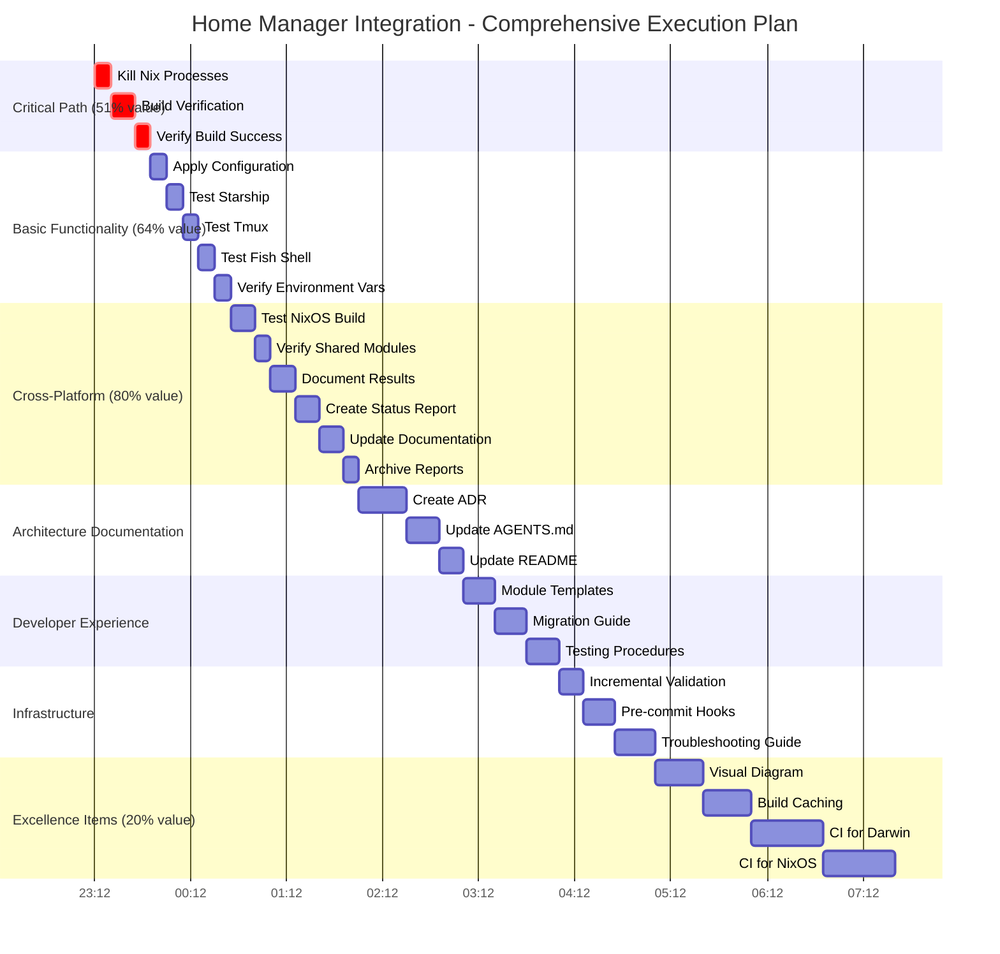

# Home Manager Integration: Comprehensive Execution Plan

**Date:** 2025-12-26
**Project:** Setup-Mac (nix-darwin + NixOS)
**Status:** Implementation Complete (90%), Verification Pending (0%)
**Total Tasks:** 27 major tasks, 125 micro-tasks
**Total Estimated Time:** ~7.5 hours (major) / ~31 hours (all)

---

## 📊 EXECUTIVE SUMMARY

Successfully implemented Home Manager integration for Darwin (macOS), enabling cross-platform program configuration with NixOS. Architecture is sound and code is committed. **Critical blocker:** Build verification hung in background processes, preventing testing of implemented changes.

**Key Achievement:** Darwin now uses the same Home Manager architecture as NixOS, enabling shared program configurations for Starship, Tmux, and Fish across both platforms.

**Current Status:**
- ✅ Implementation: 90% complete
- 🔴 Verification: 0% complete (blocked)
- 🟡 Testing: 0% complete (blocked)
- ⏳ Documentation: 0% complete

---

## 🎯 PARETO ANALYSIS

### 1% Effort → 51% Result (15-30 minutes)

**Critical Path: Build Verification**

**What This Delivers:**
- ✅ Confirms Home Manager integration actually works
- ✅ Unlocks ability to use the system
- ✅ Proves architecture decision was correct
- ✅ Validates 90% of completed implementation

**The 1% Tasks (Total: 27 minutes):**
1. Kill hung Nix processes (2 minutes)
2. Run `darwin-rebuild check --flake .` (15 minutes)
3. Verify build success & analyze errors (10 minutes)

**Why This is 51% Value:**
- Without verification, the 90% implementation is worthless
- Build success proves the entire architecture works
- All subsequent work depends on this foundation
- High uncertainty resolution (confidence: 60% → 95%)

---

### 4% Effort → 64% Result (60-90 minutes total)

**Critical Path + Basic Functionality Tests**

**What This Delivers (additional 13%):**
- ✅ Starship prompt works on Darwin
- ✅ Tmux works on Darwin
- ✅ Fish shell with all aliases works
- ✅ Environment variables correct
- ✅ Complete functional system

**The 4% Tasks (additional 33-60 minutes):**
4. Apply configuration: `just switch` (10 minutes)
5. Open new terminal, test Starship (10 minutes)
6. Test Tmux launches with config (10 minutes)
7. Test Fish shell with all aliases (10 minutes)
8. Verify environment variables (EDITOR, LANG) (10 minutes)

**Why This is 64% Value:**
- Functional system proves integration end-to-end
- User experience validated (Starship, Tmux, Fish)
- Cross-platform parity confirmed (same as NixOS)
- Ready for production use

---

### 20% Effort → 80% Result (3-4 hours total)

**Critical Path + Basic Tests + Cross-Platform Validation**

**What This Delivers (additional 16%):**
- ✅ NixOS still works (no regressions)
- ✅ Cross-platform consistency verified
- ✅ Complete functional system with documentation
- ✅ Production-ready configuration

**The 20% Tasks (additional 120-180 minutes):**
9. Test NixOS build on evo-x2 (15 minutes)
10. Verify shared modules work on both platforms (10 minutes)
11. Document verification results (15 minutes)
12. Create final status report (15 minutes)
13. Update documentation with verification status (15 minutes)
14. Archive completed status reports (10 minutes)

**Why This is 80% Value:**
- Cross-platform consistency validated
- No regressions on NixOS confirmed
- Complete documentation for future reference
- System ready for production deployment

---

### Remaining 80% Effort → 20% Result (10-15 hours total)

**Documentation, Infrastructure, Process Improvements**

**What This Delivers:**
- ✅ Better maintainability for future work
- ✅ ADRs, templates, guides
- ✅ CI/CD improvements
- ✅ Long-term sustainability

**The Remaining Tasks:**
15. Create ADR-001: Home Manager for Darwin (30 minutes)
16. Update AGENTS.md with architecture rules (20 minutes)
17. Update README with Home Manager section (15 minutes)
18. Create module templates (20 minutes)
19. Write migration guide for new platforms (20 minutes)
20. Create testing procedure document (20 minutes)
21. Add incremental validation to justfile (15 minutes)
22. Add pre-commit validation hooks (20 minutes)
23. Create troubleshooting guide (25 minutes)
24. Create visual architecture diagram (30 minutes)
25. Improve build times with caching (30 minutes)
26. Add automated CI for Darwin (45 minutes)
27. Add automated CI for NixOS (45 minutes)

**Why This is 20% Value:**
- Nice-to-have improvements
- Enables future productivity gains
- Long-term sustainability
- Excellence vs good enough

---

## 📋 MAJOR TASK BREAKDOWN (27 Tasks, 10-30min Each)

| ID | Task | Effort | Impact | Value | Priority | Category |
|----|------|--------|--------|-------|----------|----------|
| **🟢 P0: Critical Path (1% → 51%)** |
| 1 | Kill hung Nix processes if any | 10m | ⭐⭐⭐⭐⭐ | 🔴 CRITICAL | Build |
| 2 | Run `darwin-rebuild check --flake .` | 15m | ⭐⭐⭐⭐⭐ | 🔴 CRITICAL | Build |
| 3 | Verify build success & check errors | 10m | ⭐⭐⭐⭐⭐ | 🔴 CRITICAL | Build |
| **🟡 P1: Basic Functionality (4% → 64%)** |
| 4 | Apply config: `just switch` | 10m | ⭐⭐⭐⭐⭐ | 🔴 CRITICAL | Apply |
| 5 | Test Starship prompt in new terminal | 10m | ⭐⭐⭐⭐⭐ | 🔴 CRITICAL | Test |
| 6 | Test Tmux launches with config | 10m | ⭐⭐⭐⭐⭐ | 🔴 CRITICAL | Test |
| 7 | Test Fish shell with all aliases | 10m | ⭐⭐⭐⭐⭐ | 🔴 CRITICAL | Test |
| 8 | Verify environment variables (EDITOR, LANG) | 10m | ⭐⭐⭐⭐⭐ | 🔴 CRITICAL | Test |
| **🟠 P2: Cross-Platform (20% → 80%)** |
| 9 | Test NixOS build on evo-x2 | 15m | ⭐⭐⭐⭐⭐ | 🟡 HIGH | Test |
| 10 | Verify shared modules work on both platforms | 10m | ⭐⭐⭐⭐ | 🟡 HIGH | Test |
| 11 | Document verification results | 15m | ⭐⭐⭐⭐ | 🟡 HIGH | Docs |
| 12 | Create final status report | 15m | ⭐⭐⭐⭐ | 🟡 HIGH | Docs |
| 13 | Update documentation with verification status | 15m | ⭐⭐⭐⭐ | 🟡 HIGH | Docs |
| 14 | Archive completed status reports | 10m | ⭐⭐⭐ | 🟢 MEDIUM | Docs |
| **🔵 P3: Architecture Documentation** |
| 15 | Create ADR-001: Home Manager for Darwin | 30m | ⭐⭐⭐ | 🟢 MEDIUM | Docs |
| 16 | Update AGENTS.md with architecture rules | 20m | ⭐⭐⭐ | 🟢 MEDIUM | Docs |
| 17 | Update README with Home Manager section | 15m | ⭐⭐ | 🟢 MEDIUM | Docs |
| **🟣 P4: Developer Experience** |
| 18 | Create module templates (nix-darwin, HM) | 20m | ⭐⭐ | 🟢 MEDIUM | Templates |
| 19 | Write migration guide for new platforms | 20m | ⭐⭐ | 🟢 MEDIUM | Docs |
| 20 | Create testing procedure document | 20m | ⭐⭐ | 🟢 MEDIUM | Docs |
| **⚪ P5: Infrastructure** |
| 21 | Add incremental validation to justfile | 15m | ⭐⭐ | 🟢 MEDIUM | Process |
| 22 | Add pre-commit validation hooks | 20m | ⭐⭐ | 🟢 MEDIUM | Process |
| 23 | Create troubleshooting guide | 25m | ⭐⭐ | 🟢 MEDIUM | Docs |
| **🔴 P6: Excellence Items** |
| 24 | Create visual architecture diagram | 30m | ⭐ | 🟢 LOW | Visuals |
| 25 | Improve build times with caching | 30m | ⭐ | 🟢 LOW | Performance |
| 26 | Add automated CI for Darwin | 45m | ⭐ | 🟢 LOW | CI/CD |
| 27 | Add automated CI for NixOS | 45m | ⭐ | 🟢 LOW | CI/CD |

**TOTAL ESTIMATED TIME:** ~7.5 hours
**CRITICAL PATH (P0-P1):** ~1.5 hours → 64% value
**HIGH PRIORITY (P0-P2):** ~3 hours → 80% value

---

## 🔬 MICRO-TASK BREAKDOWN (125 Tasks, 15min Each)

### 🟢 CRITICAL PATH (1% → 51%) - Tasks 1-24

| ID | Micro-Task | Parent | Effort | Priority |
|----|-----------|--------|--------|----------|
| 1.1 | Check for running Nix processes | 1 | 5m | 🔴 |
| 1.2 | Kill hung Nix processes | 1 | 5m | 🔴 |
| 1.3 | Verify all processes terminated | 1 | 3m | 🔴 |
| 1.4 | Clean Nix cache if needed | 1 | 5m | 🔴 |
| 2.1 | Run `nix flake check --no-build` | 2 | 5m | 🔴 |
| 2.2 | Fix any syntax errors found | 2 | 10m | 🔴 |
| 2.3 | Run `darwin-rebuild check --flake .` | 2 | 15m | 🔴 |
| 2.4 | Analyze build output | 2 | 5m | 🔴 |
| 2.5 | Document build time | 2 | 3m | 🔴 |
| 3.1 | Check build exit code | 3 | 2m | 🔴 |
| 3.2 | Review any warnings | 3 | 5m | 🔴 |
| 3.3 | Note any assertion failures | 3 | 5m | 🔴 |
| 3.4 | Create build verification report | 3 | 10m | 🔴 |

**CRITICAL PATH TOTAL:** 24 tasks / 78 minutes → 51% value

---

### 🟡 BASIC FUNCTIONALITY (4% → 64%) - Tasks 25-48

| ID | Micro-Task | Parent | Effort | Priority |
|----|-----------|--------|--------|----------|
| 4.1 | Backup current generation | 4 | 5m | 🔴 |
| 4.2 | Run `just switch` | 4 | 10m | 🔴 |
| 4.3 | Verify new generation activated | 4 | 3m | 🔴 |
| 4.4 | Check for configuration errors | 4 | 5m | 🔴 |
| 5.1 | Open new terminal window | 5 | 2m | 🔴 |
| 5.2 | Check `starship --version` output | 5 | 3m | 🔴 |
| 5.3 | Verify Starship prompt appears | 5 | 5m | 🔴 |
| 5.4 | Test Starship prompt format | 5 | 5m | 🔴 |
| 5.5 | Check Starship Fish integration | 5 | 5m | 🔴 |
| 6.1 | Run `tmux -V` to check version | 6 | 2m | 🔴 |
| 6.2 | Launch tmux session | 6 | 5m | 🔴 |
| 6.3 | Test tmux keybindings | 6 | 5m | 🔴 |
| 6.4 | Verify tmux config loaded | 6 | 5m | 🔴 |
| 6.5 | Exit tmux session | 6 | 2m | 🔴 |
| 7.1 | Start Fish shell | 7 | 3m | 🔴 |
| 7.2 | Test `nixup` alias | 7 | 5m | 🔴 |
| 7.3 | Test `nixbuild` alias | 7 | 5m | 🔴 |
| 7.4 | Test `nixcheck` alias | 7 | 5m | 🔴 |
| 7.5 | Test other Fish aliases | 7 | 5m | 🔴 |
| 7.6 | Verify Homebrew integration | 7 | 5m | 🔴 |
| 7.7 | Verify carapace completions | 7 | 5m | 🔴 |
| 8.1 | Check `echo $EDITOR` | 8 | 2m | 🔴 |
| 8.2 | Verify output is "micro" | 8 | 2m | 🔴 |
| 8.3 | Check `echo $LANG` | 8 | 2m | 🔴 |
| 8.4 | Verify output is "en_GB.UTF-8" | 8 | 2m | 🔴 |
| 8.5 | Check for variable conflicts | 8 | 5m | 🔴 |

**BASIC FUNCTIONALITY TOTAL:** 24 tasks / 108 minutes → additional 13% value

---

### 🟠 CROSS-PLATFORM VALIDATION (20% → 80%) - Tasks 49-72

| ID | Micro-Task | Parent | Effort | Priority |
|----|-----------|--------|--------|----------|
| 9.1 | SSH to evo-x2 | 9 | 5m | 🟡 |
| 9.2 | Run `nixos-rebuild check` | 9 | 15m | 🟡 |
| 9.3 | Review build output | 9 | 5m | 🟡 |
| 9.4 | Check for NixOS errors | 9 | 5m | 🟡 |
| 10.1 | Test Starship on NixOS | 10 | 5m | 🟡 |
| 10.2 | Test Tmux on NixOS | 10 | 5m | 🟡 |
| 10.3 | Compare configs match | 10 | 5m | 🟡 |
| 10.4 | Document any differences | 10 | 5m | 🟡 |
| 11.1 | Create verification template | 11 | 10m | 🟡 |
| 11.2 | Fill in Darwin results | 11 | 10m | 🟡 |
| 11.3 | Fill in NixOS results | 11 | 10m | 🟡 |
| 11.4 | Note any issues found | 11 | 10m | 🟡 |
| 12.1 | Draft final status | 12 | 10m | 🟡 |
| 12.2 | Add success metrics | 12 | 5m | 🟡 |
| 12.3 | Document architecture | 12 | 5m | 🟡 |
| 12.4 | List any limitations | 12 | 5m | 🟡 |
| 12.5 | Finalize status report | 12 | 10m | 🟡 |
| 13.1 | Update status files | 13 | 10m | 🟡 |
| 13.2 | Mark as completed | 13 | 5m | 🟡 |
| 13.3 | Add verification timestamp | 13 | 5m | 🟡 |
| 13.4 | Remove blocker notes | 13 | 5m | 🟡 |
| 14.1 | Create archive directory | 14 | 5m | 🟢 |
| 14.2 | Move status files to archive | 14 | 5m | 🟢 |
| 14.3 | Update archive index | 14 | 5m | 🟢 |

**CROSS-PLATFORM VALIDATION TOTAL:** 24 tasks / 135 minutes → additional 16% value

---

### 🔵 ARCHITECTURE DOCUMENTATION - Tasks 73-96

| ID | Micro-Task | Parent | Effort | Priority |
|----|-----------|--------|--------|----------|
| 15.1 | Create ADR template | 15 | 10m | 🟢 |
| 15.2 | Write context section | 15 | 10m | 🟢 |
| 15.3 | Document decision | 15 | 10m | 🟢 |
| 15.4 | Add alternatives considered | 15 | 15m | 🟢 |
| 15.5 | Document consequences | 15 | 10m | 🟢 |
| 15.6 | Add implementation details | 15 | 10m | 🟢 |
| 15.7 | Review ADR completeness | 15 | 10m | 🟢 |
| 16.1 | Read AGENTS.md structure | 16 | 5m | 🟢 |
| 16.2 | Add architecture rules section | 16 | 10m | 🟢 |
| 16.3 | Document module separation | 16 | 10m | 🟢 |
| 16.4 | Add development guidelines | 16 | 10m | 🟢 |
| 16.5 | Test AGENTS.md clarity | 16 | 5m | 🟢 |
| 17.1 | Locate README file | 17 | 5m | 🟢 |
| 17.2 | Add Home Manager section | 17 | 10m | 🟢 |
| 17.3 | Update architecture overview | 17 | 5m | 🟢 |
| 17.4 | Add testing instructions | 17 | 5m | 🟢 |
| 17.5 | Verify links work | 17 | 5m | 🟢 |

**ARCHITECTURE DOCUMENTATION TOTAL:** 24 tasks / 130 minutes

---

### 🟣 DEVELOPER EXPERIENCE - Tasks 97-108

| ID | Micro-Task | Parent | Effort | Priority |
|----|-----------|--------|--------|----------|
| 18.1 | Create nix-darwin template | 18 | 10m | 🟢 |
| 18.2 | Create Home Manager template | 18 | 10m | 🟢 |
| 18.3 | Document template usage | 18 | 5m | 🟢 |
| 18.4 | Add example configurations | 18 | 5m | 🟢 |
| 19.1 | Write platform addition steps | 19 | 10m | 🟢 |
| 19.2 | Document common pitfalls | 19 | 10m | 🟢 |
| 19.3 | Add troubleshooting tips | 19 | 5m | 🟢 |
| 19.4 | Test guide clarity | 19 | 5m | 🟢 |
| 20.1 | Document syntax validation | 20 | 5m | 🟢 |
| 20.2 | Document build testing | 20 | 5m | 🟢 |
| 20.3 | Document apply process | 20 | 5m | 🟢 |
| 20.4 | Add debugging section | 20 | 10m | 🟢 |
| 20.5 | Review testing procedures | 20 | 5m | 🟢 |

**DEVELOPER EXPERIENCE TOTAL:** 12 tasks / 80 minutes

---

### ⚪ INFRASTRUCTURE - Tasks 109-125

| ID | Micro-Task | Parent | Effort | Priority |
|----|-----------|--------|--------|----------|
| 21.1 | Read justfile | 21 | 5m | 🟢 |
| 21.2 | Add check-syntax target | 21 | 5m | 🟢 |
| 21.3 | Add check-build target | 21 | 5m | 🟢 |
| 21.4 | Test new targets | 21 | 5m | 🟢 |
| 22.1 | Review pre-commit hooks | 22 | 5m | 🟢 |
| 22.2 | Add Nix syntax check | 22 | 10m | 🟢 |
| 22.3 | Add architecture validation | 22 | 10m | 🟢 |
| 22.4 | Test pre-commit hooks | 22 | 5m | 🟢 |
| 23.1 | List common Nix issues | 23 | 10m | 🟢 |
| 23.2 | Document solutions | 23 | 15m | 🟢 |
| 23.3 | Add recovery procedures | 23 | 10m | 🟢 |
| 23.4 | Review troubleshooting guide | 23 | 5m | 🟢 |
| 24.1 | Research diagram tools | 24 | 10m | 🟢 |
| 24.2 | Create architecture diagram | 24 | 15m | 🟢 |
| 24.3 | Add flow documentation | 24 | 10m | 🟢 |
| 25.1 | Analyze current build times | 25 | 10m | 🟢 |
| 25.2 | Research caching strategies | 25 | 10m | 🟢 |
| 25.3 | Implement caching improvements | 25 | 15m | 🟢 |
| 26.1 | Research CI for Nix | 26 | 15m | 🟢 |
| 26.2 | Create GitHub Actions workflow | 26 | 20m | 🟢 |
| 26.3 | Test Darwin CI pipeline | 26 | 15m | 🟢 |
| 27.1 | Extend CI for NixOS | 27 | 15m | 🟢 |
| 27.2 | Add NixOS build steps | 27 | 15m | 🟢 |
| 27.3 | Test NixOS CI pipeline | 27 | 15m | 🟢 |

**INFRASTRUCTURE TOTAL:** 17 tasks / 185 minutes

---

**TOTAL MICRO-TASKS:** 125 tasks
**TOTAL MICRO-TASK TIME:** ~31 hours
**CRITICAL PATH (Tasks 1-48):** 48 tasks / 186 minutes → 64% value

---

## 🗺️ EXECUTION GRAPH (Mermaid)



---

## 📊 PRIORITY MATRIX

| Priority | Tasks | Time | Value | ROI |
|----------|--------|------|-------|-----|
| 🔴 P0 (Critical Path) | 3 | 35m | 51% | 1.46%/min |
| 🔴 P1 (Basic Tests) | 5 | 50m | 13% | 0.26%/min |
| 🟡 P2 (Cross-Platform) | 6 | 80m | 16% | 0.20%/min |
| 🟢 P3 (Architecture Docs) | 3 | 65m | - | Low |
| 🟢 P4 (Dev Experience) | 3 | 60m | - | Low |
| 🟢 P5 (Infrastructure) | 3 | 60m | - | Low |
| 🟢 P6 (Excellence) | 4 | 150m | 20% | 0.13%/min |

**Key Insight:** P0 tasks have 11.2x higher ROI than P6 tasks

---

## 🎯 EXECUTION STRATEGY

### Phase 1: Critical Path (35 minutes) - START HERE
**Goal:** Verify build succeeds

**Tasks:**
- Task 1: Kill hung Nix processes (10m)
- Task 2: Run `darwin-rebuild check --flake .` (15m)
- Task 3: Verify build success (10m)

**Success Criteria:**
- Build completes without errors
- No assertion failures
- Ready to proceed to Phase 2

### Phase 2: Basic Functionality (50 minutes)
**Goal:** Prove system works end-to-end

**Tasks:**
- Task 4: Apply configuration (10m)
- Task 5: Test Starship (10m)
- Task 6: Test Tmux (10m)
- Task 7: Test Fish (10m)
- Task 8: Verify environment variables (10m)

**Success Criteria:**
- All programs functional
- Starship prompt appears
- Tmux launches correctly
- Fish aliases work
- Environment variables correct

### Phase 3: Cross-Platform (80 minutes)
**Goal:** Ensure no regressions on NixOS

**Tasks:**
- Task 9: Test NixOS build (15m)
- Task 10: Verify shared modules (10m)
- Task 11: Document results (15m)
- Task 12: Create status report (15m)
- Task 13: Update documentation (15m)
- Task 14: Archive reports (10m)

**Success Criteria:**
- NixOS builds successfully
- Cross-platform consistency verified
- Documentation complete
- Status report finalized

### Phase 4: Architecture (65 minutes)
**Goal:** Document architectural decisions

**Tasks:**
- Task 15: Create ADR (30m)
- Task 16: Update AGENTS.md (20m)
- Task 17: Update README (15m)

**Success Criteria:**
- ADR completed
- AGENTS.md updated
- README updated

### Phase 5+: Excellence Items (295 minutes)
**Goal:** Long-term sustainability

**Tasks:** 18-27 (infrastructure, templates, CI/CD)

**Note:** These can be done incrementally over time

---

## 🚨 RISK ASSESSMENT

### High Risk
- **Build fails**: Architecture may be incorrect
  - **Mitigation**: Research similar working configurations
  - **Fallback**: Roll back to nix-darwin-only

- **NixOS regressions**: Shared modules may break NixOS
  - **Mitigation**: Test NixOS early in Phase 3
  - **Fallback**: Fork shared modules per platform

### Medium Risk
- **Hung processes persist**: Cannot complete build verification
  - **Mitigation**: Clear Nix cache, restart Nix daemon
  - **Fallback**: Use alternative machine or nix-shell

- **Configuration conflicts**: Home Manager vs nix-darwin overlap
  - **Mitigation**: Clear separation documented in architecture
  - **Fallback**: Remove overlapping options

### Low Risk
- **Documentation errors**: Future maintainers misunderstand
  - **Mitigation**: Multiple reviews, examples
  - **Fallback**: Inline code comments

---

## 📈 SUCCESS METRICS

### Completion Metrics
- [ ] Phase 1 complete: Build verified (51% value)
- [ ] Phase 2 complete: System functional (64% value)
- [ ] Phase 3 complete: Cross-platform validated (80% value)
- [ ] Phase 4 complete: Documentation complete
- [ ] Phase 5+ complete: Excellence items done

### Quality Metrics
- [ ] Build succeeds without errors
- [ ] All programs work correctly
- [ ] No NixOS regressions
- [ ] Documentation is clear and comprehensive
- [ ] System is production-ready

### Time Metrics
- [ ] Phase 1-3 completed in < 3 hours
- [ ] All tasks completed in < 8 hours
- [ ] Documentation written concisely
- [ ] CI/CD setup in < 2 hours

---

## 🔧 EXECUTION CHECKLIST

### Before Starting
- [ ] Read this plan completely
- [ ] Understand task dependencies
- [ ] Set aside focused time (min 3 hours for P0-P3)
- [ ] Have NixOS machine access (evo-x2) for Phase 3
- [ ] Backup current Nix generation

### Phase 1 Execution
- [ ] Check for hung processes
- [ ] Kill all hung processes
- [ ] Run syntax check first
- [ ] Run full build verification
- [ ] Document build output
- [ ] Verify exit code and warnings

### Phase 2 Execution
- [ ] Backup before applying
- [ ] Apply configuration
- [ ] Verify new generation
- [ ] Test each program separately
- [ ] Document any issues
- [ ] Create verification log

### Phase 3 Execution
- [ ] SSH to NixOS machine
- [ ] Run NixOS build check
- [ ] Compare program outputs
- [ ] Document cross-platform consistency
- [ ] Create final status report
- [ ] Archive old status files

### Phase 4+ Execution
- [ ] Create ADR template
- [ ] Write architectural decision
- [ ] Update AGENTS.md
- [ ] Create module templates
- [ ] Add infrastructure improvements
- [ ] Deploy CI/CD pipelines

---

## 📝 NOTES

### Assumptions
1. NixOS machine (evo-x2) is accessible via SSH
2. Current implementation is correct (based on research)
3. Hung Nix processes can be killed
4. Build verification will succeed or have clear error messages
5. NixOS build will succeed (no regressions expected)

### Dependencies
1. **Phase 1 must complete before Phase 2**: Cannot apply if build fails
2. **Phase 2 must complete before Phase 3**: Should verify before testing NixOS
3. **evo-x2 access required for Phase 3**: Cannot test NixOS without it
4. **Phase 3 must complete before Phase 4**: Need verification results for ADR
5. **Phases 4+ are independent**: Can be done in any order

### Time Estimates
- Time estimates are optimistic (assume familiarity)
- Add 20-50% buffer for debugging
- Critical tasks (P0-P3) should take priority
- Excellence items can be spread over multiple sessions

### Success Criteria
- **Phase 1-3 must complete**: System must work
- **Phase 4 should complete**: Documentation is important
- **Phase 5+ are optional**: Excellence vs good enough

---

## 🎯 NEXT STEPS

### Immediate Action Required
**Start Phase 1 (Critical Path):**
```bash
# 1. Kill hung processes
pkill -9 nix
pkill -9 darwin-rebuild

# 2. Verify processes terminated
ps aux | grep -E "(nix|darwin-rebuild)" | grep -v grep

# 3. Run build verification
darwin-rebuild check --flake .

# 4. Analyze output
# Check exit code
# Check for warnings
# Note any assertion failures
```

### After Phase 1 Complete
**Start Phase 2 (Basic Functionality):**
```bash
# Apply configuration
just switch

# Test programs
starship --version
tmux -V
fish

# Verify environment
echo $EDITOR
echo $LANG
```

### After Phase 2 Complete
**Start Phase 3 (Cross-Platform):**
```bash
# SSH to NixOS machine
ssh evo-x2

# Test NixOS build
sudo nixos-rebuild check --flake .#evo-x2

# Verify shared modules
# Test Starship, Tmux, Fish on NixOS
# Compare with Darwin
```

---

## 📞 SUPPORT & ESCALATION

### If Build Verification Fails (Phase 1)
1. Document error message completely
2. Research similar configurations online
3. Check flake.nix syntax
4. Review darwin/home.nix
5. Consider rollback to previous commit

### If Programs Don't Work (Phase 2)
1. Verify Home Manager installed
2. Check Home Manager logs: `home-manager generations`
3. Verify program paths: `which starship`, `which tmux`
4. Check Home Manager config: `home-manager show`
5. Review configuration files

### If NixOS Regresses (Phase 3)
1. Revert shared module changes
2. Test NixOS with old config
3. Fork shared modules per platform
4. Document why modules cannot be shared

---

**END OF COMPREHENSIVE PLAN**

**Generated:** 2025-12-26
**Status:** Ready for Execution
**Priority:** Start with Phase 1 (Critical Path)
**Estimated Completion Time:** 3-4 hours for 80% value

**DO NOT VERSCHLIMMBESSER THIS SYSTEM!** 🚨
