# Nix Anti-Patterns Remediation - Phase 3 & 4 Execution Plan

**Created:** 2026-01-12 19:09
**Status:** Ready to Execute
**Goal:** Complete migration of remaining imperative configurations to declarative Nix management

---

## 📊 Pareto Analysis - Impact vs Effort

### 1% That Delivers 51% Impact (CRITICAL PATH)
1. **Remove obsolete bash scripts** (15 min) - Eliminates technical debt, prevents confusion
2. **Remove ActivityWatch dotfiles** (10 min) - Cleanup of already-migrated configs
3. **Verify configuration** (5 min) - Ensure system still works after cleanup

**Total Time:** ~30 minutes
**Impact:** Removes all obsolete imperative scripts and cleans up configuration

---

### 4% That Delivers 64% Impact (HIGH VALUE)
4. **Migrate Go tools to Nix packages** (45 min) - 10 tools, reproducible builds
5. **Clean up justfile recipes** (30 min) - Remove obsolete recipes, update help
6. **Update documentation (README.md, AGENTS.md)** (45 min) - Reflect Nix-first architecture

**Total Time:** ~2 hours
**Impact:** Completes Go tool migration and updates documentation

---

### 20% That Delivers 80% Impact (COMPREHENSIVE)
7. **Evaluate wrapper system** (60 min) - Simplify if over-engineered
8. **Update progress reports** (30 min) - Update docs/status/ with final state
9. **Final verification and testing** (30 min) - Complete system validation

**Total Time:** ~2 hours
**Impact:** Simplifies architecture and completes documentation

---

## 📋 Detailed Task Breakdown (27 Tasks, 5-60 min each)

### BLOCK 1: Critical Cleanup (30 min total)

#### Task 1: Remove obsolete ActivityWatch setup script
- **Time:** 10 min
- **Impact:** High - Removes confusing obsolete script
- **Action:** `trash scripts/nix-activitywatch-setup.sh`
- **Verification:** Check that LaunchAgent is managed by Nix
- **Commit:** `chore(scripts): remove obsolete ActivityWatch setup script`

#### Task 2: Remove obsolete manual linking script
- **Time:** 5 min
- **Impact:** High - Removes obsolete manual linking mechanism
- **Action:** `trash scripts/manual-linking.sh`
- **Verification:** Check that all linking is done by Home Manager
- **Commit:** `chore(scripts): remove obsolete manual linking script`

#### Task 3: Remove ActivityWatch dotfiles
- **Time:** 10 min
- **Impact:** High - Cleans up already-managed configs
- **Action:** `trash dotfiles/activitywatch/` (LaunchAgent already in Nix)
- **Verification:** Check that no other files reference this directory
- **Commit:** `chore(dotfiles): remove ActivityWatch configs (now managed by Nix)`

#### Task 4: Verify Nix flake check
- **Time:** 5 min
- **Impact:** Critical - Ensures system is still valid
- **Action:** `nix flake check --no-build`
- **Verification:** All checks pass
- **Commit:** None (verification only)

---

### BLOCK 2: Go Tools Migration (2 hours total)

#### Task 5: Audit Go tools in justfile
- **Time:** 15 min
- **Impact:** High - Understand what needs migration
- **Action:** List all `go install` commands and check if already in Nix
- **Verification:** Create checklist of tools to migrate
- **Commit:** None (research only)

#### Task 6: Check Nixpkgs for Go tools availability
- **Time:** 30 min
- **Impact:** High - Determine what can be migrated
- **Action:** `nix search nixpkgs <tool>` for each Go tool
- **Verification:** Mark which tools are available in Nix
- **Commit:** None (research only)

#### Task 7: Add Go tools to base.nix (available in Nix)
- **Time:** 15 min
- **Impact:** High - Migrates available tools
- **Action:** Add gofumpt, gotests, wire, mockgen, protoc-gen-go, buf, dlv to `developmentPackages`
- **Verification:** Syntax check with `nix flake check --no-build`
- **Commit:** `feat(go): add Go development tools to Nix packages`

#### Task 8: Create gup wrapper (if not in Nix)
- **Time:** 10 min
- **Impact:** Medium - Adds Go tool update automation
- **Action:** Check if gup available in Nix, create wrapper if not
- **Verification:** Test gup functionality
- **Commit:** `feat(go): add gup tool for Go binary management`

#### Task 9: Remove go install recipes from justfile
- **Time:** 20 min
- **Impact:** High - Removes imperative Go tool management
- **Action:** Remove `go-update-tools-manual` recipe, replace with Nix-managed message
- **Verification:** Justfile syntax check
- **Commit:** `refactor(justfile): remove go install recipes (now Nix-managed)`

#### Task 10: Update Go-related justfile help
- **Time:** 10 min
- **Impact:** Medium - Updates documentation in justfile
- **Action:** Update help text to reflect Nix-managed Go tools
- **Verification:** Check help output
- **Commit:** `docs(justfile): update Go tools help text`

---

### BLOCK 3: Justfile Cleanup (30 min total)

#### Task 11: Remove ActivityWatch setup recipe
- **Time:** 5 min
- **Impact:** High - Removes obsolete recipe
- **Action:** Remove `activitywatch-setup` recipe from justfile
- **Verification:** Justfile syntax check
- **Commit:** `refactor(justfile): remove activitywatch-setup recipe`

#### Task 12: Remove ActivityWatch check recipe
- **Time:** 5 min
- **Impact:** Medium - Removes obsolete recipe
- **Action:** Remove `activitywatch-check` recipe from justfile
- **Verification:** Justfile syntax check
- **Commit:** `refactor(justfile): remove activitywatch-check recipe`

#### Task 13: Remove ActivityWatch migrate recipe
- **Time:** 5 min
- **Impact:** Medium - Removes obsolete recipe
- **Action:** Remove `activitywatch-migrate` recipe from justfile
- **Commit:** `refactor(justfile): remove activitywatch-migrate recipe`

#### Task 14: Keep ActivityWatch start/stop recipes
- **Time:** 2 min
- **Impact:** Low - Manual control still useful
- **Action:** Verify `activitywatch-start` and `activitywatch-stop` are useful
- **Verification:** Test recipes
- **Commit:** None (keeping these recipes)

#### Task 15: Update justfile help section
- **Time:** 10 min
- **Impact:** Medium - Updates documentation
- **Action:** Remove ActivityWatch and go install from help text
- **Verification:** Check help output
- **Commit:** `docs(justfile): update help section after recipe removal`

#### Task 16: Remove backup/restore references to manual-linking.sh
- **Time:** 3 min
- **Impact:** Low - Cleans up obsolete references
- **Action:** Check backup/restore recipes, remove manual-linking references
- **Verification:** Justfile syntax check
- **Commit:** `refactor(justfile): remove manual-linking.sh references`

---

### BLOCK 4: Documentation Updates (45 min total)

#### Task 17: Update README.md - remove script references
- **Time:** 20 min
- **Impact:** Medium - Updates main documentation
- **Action:** Remove references to `manual-linking.sh` and `nix-activitywatch-setup.sh`
- **Verification:** Read through README.md
- **Commit:** `docs(readme): remove obsolete script references`

#### Task 18: Update README.md - add Nix-first section
- **Time:** 10 min
- **Impact:** Medium - Documents new architecture
- **Action:** Add section explaining Nix-managed configuration
- **Verification:** Section is clear and accurate
- **Commit:** `docs(readme): add Nix-managed configuration section`

#### Task 19: Update AGENTS.md - LaunchAgent management
- **Time:** 10 min
- **Impact:** Medium - Updates agent guide
- **Action:** Document LaunchAgent management via `platforms/darwin/services/launchagents.nix`
- **Verification:** Information is accurate
- **Commit:** `docs(agents): document declarative LaunchAgent management`

#### Task 20: Update AGENTS.md - remove bash script references
- **Time:** 5 min
- **Impact:** Low - Cleans up obsolete references
- **Action:** Remove references to bash scripts
- **Verification:** No script references remain
- **Commit:** `docs(agents): remove bash script references`

---

### BLOCK 5: Architecture Evaluation (60 min total)

#### Task 21: Audit WrapperTemplate usage
- **Time:** 20 min
- **Impact:** Medium - Understands wrapper usage
- **Action:** Search for imports/usage of WrapperTemplate.nix
- **Verification:** Create list of wrappers using the system
- **Commit:** None (research only)

#### Task 22: Evaluate wrapper system complexity
- **Time:** 20 min
- **Impact:** Medium - Determines if simplification needed
- **Action:** Review 165-line template, check if makeWrapper can replace it
- **Verification:** Create evaluation report
- **Commit:** `docs(wrappers): add wrapper system evaluation`

#### Task 23: Simplify wrapper system (if warranted)
- **Time:** 10 min
- **Impact:** Low - Conditional simplification
- **Action:** Simplify WrapperTemplate.nix or replace with makeWrapper if appropriate
- **Verification:** Nix flake check passes
- **Commit:** `refactor(wrappers): simplify wrapper system`

#### Task 24: Add wrapper system documentation
- **Time:** 10 min
- **Impact:** Low - Documents architecture decisions
- **Action:** Add comments explaining wrapper system purpose and usage
- **Verification:** Documentation is clear
- **Commit:** `docs(wrappers): add wrapper system documentation`

---

### BLOCK 6: Final Verification (30 min total)

#### Task 25: Create comprehensive verification test
- **Time:** 10 min
- **Impact:** High - Ensures everything works
- **Action:** Run `just switch`, `nix flake check`, test key configurations
- **Verification:** All tests pass
- **Commit:** None (verification only)

#### Task 26: Create final progress report
- **Time:** 15 min
- **Impact:** Medium - Documents completion
- **Action:** Create docs/status/2026-01-12_PHASE-3-4-COMPLETION.md
- **Verification:** Report is comprehensive
- **Commit:** `docs(status): add Phase 3 & 4 completion report`

#### Task 27: Git push all changes
- **Time:** 5 min
- **Impact:** Critical - Syncs to remote
- **Action:** `git push` after all commits
- **Verification:** All commits pushed
- **Commit:** None (push only)

---

## 🎯 Execution Graph (Mermaid)

```mermaid
graph TD
    %% BLOCK 1: Critical Cleanup
    A1[Task 1: Remove ActivityWatch setup script] --> A2[Task 2: Remove manual linking script]
    A2 --> A3[Task 3: Remove ActivityWatch dotfiles]
    A3 --> A4[Task 4: Verify Nix flake check]

    %% BLOCK 2: Go Tools Migration
    A4 --> B1[Task 5: Audit Go tools in justfile]
    B1 --> B2[Task 6: Check Nixpkgs for Go tools]
    B2 --> B3[Task 7: Add Go tools to base.nix]
    B3 --> B4[Task 8: Create gup wrapper]
    B4 --> B5[Task 9: Remove go install recipes]
    B5 --> B6[Task 10: Update Go-related help]

    %% BLOCK 3: Justfile Cleanup
    B6 --> C1[Task 11: Remove ActivityWatch setup recipe]
    C1 --> C2[Task 12: Remove ActivityWatch check recipe]
    C2 --> C3[Task 13: Remove ActivityWatch migrate recipe]
    C3 --> C4[Task 14: Verify start/stop recipes]
    C4 --> C5[Task 15: Update justfile help section]
    C5 --> C6[Task 16: Remove backup/restore references]

    %% BLOCK 4: Documentation Updates
    C6 --> D1[Task 17: Update README.md - remove scripts]
    D1 --> D2[Task 18: Update README.md - add Nix section]
    D2 --> D3[Task 19: Update AGENTS.md - LaunchAgent]
    D3 --> D4[Task 20: Update AGENTS.md - remove scripts]

    %% BLOCK 5: Architecture Evaluation
    D4 --> E1[Task 21: Audit WrapperTemplate usage]
    E1 --> E2[Task 22: Evaluate wrapper complexity]
    E2 --> E3{Simplify?}
    E3 -->|Yes| E4[Task 23: Simplify wrapper system]
    E3 -->|No| E5[Task 24: Add documentation]
    E4 --> E5

    %% BLOCK 6: Final Verification
    E5 --> F1[Task 25: Comprehensive verification]
    F1 --> F2[Task 26: Create final progress report]
    F2 --> F3[Task 27: Git push all changes]

    %% Parallelization opportunities
    B2 -.-> D1
    C6 -.-> E1

    %% Style
    classDef critical fill:#ff6b6b,stroke:#c92a2a,stroke-width:3px,color:#fff;
    classDef high fill:#ffd43b,stroke:#fab005,stroke-width:2px,color:#000;
    classDef medium fill:#69db7c,stroke:#2b8a3e,stroke-width:2px,color:#fff;
    classDef low fill:#4dabf7,stroke:#1864ab,stroke-width:2px,color:#fff;

    class A1,A2,A3,A4 critical;
    class B1,B2,B3,B4,B5,B6,C1,C2,C3,C6,D1,D2 high;
    class C4,C5,D3,D4,E1,E2,E4,E5,F1,F2 medium;
    class E3,F3 low;
```

---

## 📊 Task Priority Matrix

| Priority | Tasks | Total Time | Impact | Risk |
|----------|-------|------------|--------|------|
| **P0 (Critical)** | Tasks 1-4 | 30 min | Removes obsolete scripts, cleans configs | Low |
| **P1 (High)** | Tasks 5-10, 11-16 | 2 hours | Migrates Go tools, cleans justfile | Medium |
| **P2 (Medium)** | Tasks 17-20, 25 | 60 min | Updates documentation, verifies system | Low |
| **P3 (Low)** | Tasks 21-24 | 60 min | Evaluates wrapper system (if needed) | Low |
| **P4 (Final)** | Tasks 26-27 | 20 min | Documents completion, pushes to remote | None |

---

## ✅ Success Criteria

- [ ] All obsolete bash scripts removed (nix-activitywatch-setup.sh, manual-linking.sh)
- [ ] ActivityWatch dotfiles removed (LaunchAgent managed by Nix)
- [ ] All Go tools migrated to Nix packages (no `go install` in justfile)
- [ ] Justfile cleaned up (no obsolete recipes)
- [ ] Documentation updated (README.md, AGENTS.md)
- [ ] Wrapper system evaluated (simplified or documented)
- [ ] All configurations validated with `nix flake check`
- [ ] Comprehensive progress report created
- [ ] All changes pushed to remote repository

---

## 🚨 Rollback Strategy

If any task fails:
1. **Stop immediately** - Don't continue with dependent tasks
2. **Assess failure** - Determine if it's critical or can be worked around
3. **Rollback changes** - Use `git reset --hard HEAD~1` if necessary
4. **Document issue** - Add note to progress report
5. **Continue** - Skip blocked task, move to next unblocked task

---

## 📝 Notes

- **ActivityWatch configs are mostly commented** - Only `settings.json` has real data, and it's user preferences that can be re-created
- **Go tools already partially migrated** - gopls and golangci-lint already in Nix
- **Wrapper system may be over-engineered** - 165 lines for template wrappers, need to check if actually used
- **All changes are atomic** - Each task is a separate commit for easy rollback
- **Total estimated time:** ~4.5 hours (including verification and documentation)

---

## 🎯 Next Steps After Phase 3 & 4

Phase 3 & 4 will complete the Nix Anti-Patterns Remediation by:
1. Eliminating all imperative bash scripts
2. Migrating all Go tools to Nix packages
3. Cleaning up justfile to reflect Nix-first architecture
4. Updating documentation to reflect changes
5. Evaluating and simplifying wrapper system

This will result in a **100% declarative Nix configuration** with **zero imperative scripts** and **complete documentation**.
