# SystemNix — Session 15 Execution Plan

**Date:** 2026-05-02 23:05
**Author:** Crush AI
**Approach:** Pareto-optimized — 1% → 4% → 20% → remaining
**Constraint:** NO evo-x2 access — all work is repo-only, verified via `just test-fast`

---

## Pareto Analysis

### The 1% that delivers 51% of the result

| # | Task | Why it's 1%/51% |
|---|------|-----------------|
| 1 | **Harden ComfyUI** (zero security, no Restart) | Naked service with 8GB RAM on GPU box — single highest-risk daemon |
| 2 | **Fix mr-sync perSystem** | `nix build .#mr-sync` is literally broken — 0% works right now |
| 3 | **Adopt serviceDefaults for taskchampion + comfyui** | Replace 10 lines of manual config with 1-line standard pattern |

### The 4% that delivers 64% of the result

| # | Task | Why it's 4%/64% |
|---|------|-----------------|
| 4 | **Harden whisper-asr** (partial → full) | Docker service with partial hardening, missing `NoNewPrivileges` |
| 5 | **Add Bash carapace to NixOS** | NixOS Bash missing completions that Darwin has — user-facing gap |
| 6 | **Refactor taskchampion to use harden() + serviceDefaults()** | Manual hardening → library pattern (consistency) |
| 7 | **Refactor whisper-asr to use harden() + serviceDefaults()** | Same — inline hardening → library pattern |

### The 20% that delivers 80% of the result

| # | Task | Why it's 20%/80% |
|---|------|-----------------|
| 8 | **Fix dnsblockd staticcheck** (De Morgan) | Code quality, trivial fix |
| 9 | **Harden remaining config-only modules that have daemons** | Catch edge cases |
| 10 | **Standardize ComfyUI hardening with override-friendly defaults** | ComfyUI needs `ProtectHome=false` and `ProtectSystem=false` — use `harden()` with overrides |
| 11 | **Add `mr-sync` to perSystem packages list** | Complete the wiring |
| 12 | **Clean up NixOS shells.nix Bash fpath** | `fpath` is a Zsh concept, not Bash — fix the bug |

### Everything else (80% effort, 20% result)

| # | Task | Notes |
|---|------|-------|
| 13-27 | Service hardening, sops migrations, observability, etc. | See full task table below |

---

## Comprehensive Plan — 27 Tasks (30-100min each)

Sorted by impact × effort (highest first).

| # | Task | Impact | Effort | Category | Files |
|---|------|--------|--------|----------|-------|
| 1 | Harden ComfyUI with harden() + serviceDefaults() | CRITICAL | 30min | Security | `comfyui.nix` |
| 2 | Fix mr-sync perSystem wiring (overlay + package) | HIGH | 15min | Build | `flake.nix` |
| 3 | Refactor taskchampion to harden() + serviceDefaults() | HIGH | 20min | Security/DRY | `taskchampion.nix` |
| 4 | Refactor whisper-asr to harden() + serviceDefaults() | HIGH | 25min | Security/DRY | `voice-agents.nix` |
| 5 | Add Bash carapace completions to NixOS shells.nix | MEDIUM | 10min | UX | `shells.nix (NixOS)` |
| 6 | Fix NixOS Bash fpath bug (should be COMPREHENSION for bash) | MEDIUM | 10min | Bug | `shells.nix (NixOS)` |
| 7 | Fix dnsblockd staticcheck (De Morgan's law) | LOW | 5min | Quality | `dnsblockd/main.go:481` |
| 8 | Standardize ComfyUI: add Restart, timeouts, restart limits | HIGH | 15min | Reliability | `comfyui.nix` |
| 9 | Verify build: `just test-fast` after all changes | HIGH | 15min | Verification | CLI |
| 10 | Add harden() to file-and-image-renamer (already partial) | LOW | 10min | Security | `file-and-image-renamer.nix` |
| 11 | Audit all 29 service modules for daemon vs config-only | MEDIUM | 30min | Audit | All services |
| 12 | Move Taskwarrior sync secret to sops (config-only, needs evo-x2 to test) | HIGH | 30min | Security | `taskwarrior.nix`, `sops.nix` |
| 13 | Move VRRP auth to sops (config-only, needs evo-x2 to test) | MEDIUM | 20min | Security | `dns-failover.nix`, `sops.nix` |
| 14 | Pin Voice Agents Docker image digest (needs evo-x2 to get digest) | HIGH | 15min | Security | `voice-agents.nix` |
| 15 | Hermes: add /healthz endpoint (needs upstream code change) | MEDIUM | 60min | Reliability | External repo |
| 16 | Hermes: migrate remaining providers to key_env | LOW | 30min | Cleanup | `hermes.nix` |
| 17 | Add SigNoz metrics for missing services | MEDIUM | 120min | Observability | `signoz.nix` + services |
| 18 | Configure Authelia SMTP notifications | MEDIUM | 30min | UX | `authelia.nix` |
| 19 | Test Immich backup restore (needs evo-x2) | HIGH | 30min | Reliability | CLI |
| 20 | Test Twenty CRM backup restore (needs evo-x2) | MEDIUM | 30min | Reliability | CLI |
| 21 | Build Pi 3 SD image | MEDIUM | 60min | Infrastructure | CLI |
| 22 | Flash + boot Pi 3 + test DNS failover | MEDIUM | 60min | Infrastructure | CLI |
| 23 | Deploy to evo-x2 (`just switch`) + verify all services | CRITICAL | 60min | Deploy | CLI |
| 24 | Investigate Unbound DoQ re-enablement | LOW | 120min | Privacy | `flake.nix` |
| 25 | Add GitHub Actions CI to emeet-pixyd | LOW | 60min | Quality | External repo |
| 26 | Centralize Catppuccin colors into shared Nix let block | LOW | 120min | DRY | Multiple |
| 27 | Archive old status reports (pre-2026-04-25) | LOW | 15min | Cleanup | `docs/status/` |

---

## Micro-Task Breakdown — 150 Tasks (≤15min each)

### Phase 1: The 1% (Tasks 1-12) — 51% Impact

| # | Micro-Task | Parent | Est. | Action |
|---|-----------|--------|------|--------|
| 1 | Read comfyui.nix fully | T1 | 2min | View file |
| 2 | Import harden + serviceDefaults in comfyui.nix | T1 | 2min | Edit: add imports |
| 3 | Replace comfyui serviceConfig with harden+serviceDefaults | T1 | 5min | Edit: use pattern |
| 4 | Set ComfyUI-specific overrides (ProtectHome=false, ProtectSystem=false, MemoryMax=8G) | T1 | 3min | Edit: pass overrides |
| 5 | Add TimeoutStartSec, TimeoutStopSec to ComfyUI via serviceDefaults | T8 | 2min | Edit: add timeouts |
| 6 | Verify comfyui.nix syntax with nix-instantiate | T1 | 1min | CLI |
| 7 | Read flake.nix perSystem section | T2 | 2min | View file |
| 8 | Add mrSyncOverlay to perSystem overlays list | T2 | 2min | Edit flake.nix:614 |
| 9 | Add mr-sync to perSystem packages inherit | T2 | 2min | Edit flake.nix:658 |
| 10 | Verify mr-sync appears in packages | T2 | 1min | CLI: nix eval |
| 11 | Read taskchampion.nix fully | T3 | 2min | View file |
| 12 | Import harden + serviceDefaults in taskchampion.nix | T3 | 2min | Edit: add imports |
| 13 | Replace manual hardening with harden() pattern | T3 | 3min | Edit: use harden |
| 14 | Replace manual Restart/RestartSec with serviceDefaults() | T3 | 3min | Edit: use serviceDefaults |
| 15 | Verify taskchampion.nix syntax | T3 | 1min | CLI |
| 16 | Read voice-agents.nix service sections | T4 | 2min | View file |
| 17 | Import harden + serviceDefaults in voice-agents.nix | T4 | 2min | Edit: add imports |
| 18 | Replace whisper-asr manual hardening with harden() | T4 | 3min | Edit: use harden |
| 19 | Add serviceDefaults to whisper-asr | T4 | 2min | Edit: use serviceDefaults |
| 20 | Verify voice-agents.nix syntax | T4 | 1min | CLI |

### Phase 2: The 4% (Tasks 21-40) — 64% Impact

| # | Micro-Task | Parent | Est. | Action |
|---|-----------|--------|------|--------|
| 21 | Read NixOS shells.nix fully | T5 | 2min | View file |
| 22 | Add carapace bash completions to bash.initExtra | T5 | 3min | Edit: append carapace block |
| 23 | Read Darwin shells.nix bash.initExtra for reference | T5 | 1min | View file |
| 24 | Verify NixOS shells.nix syntax | T5 | 1min | CLI |
| 25 | Identify Bash fpath bug in NixOS shells.nix | T6 | 2min | Analyze |
| 26 | Fix Bash fpath → Bash completion path (or remove, since bash doesn't use fpath) | T6 | 3min | Edit |
| 27 | Read dnsblockd/main.go line 481 context | T7 | 1min | View file |
| 28 | Apply De Morgan's law to urlSafeDomain | T7 | 2min | Edit line 481 |
| 29 | Verify dnsblockd Go code compiles | T7 | 2min | CLI: go vet |
| 30 | Read file-and-image-renamer.nix service section | T10 | 2min | View file |
| 31 | Verify file-and-image-renamer already has full hardening | T10 | 2min | Analyze |
| 32 | Check if any improvements needed | T10 | 2min | Compare to harden() |

### Phase 3: The 20% (Tasks 33-60) — 80% Impact

| # | Micro-Task | Parent | Est. | Action |
|---|-----------|--------|------|--------|
| 33 | Run `just test-fast` after Phase 1+2 changes | T9 | 10min | CLI |
| 34 | If test fails, read error and fix | T9 | 5min | Debug |
| 35 | Re-run `just test-fast` until passing | T9 | 5min | CLI |
| 36 | Run `just format` on all changed files | T9 | 2min | CLI |
| 37 | Audit services 1-5 for daemon vs config-only | T11 | 5min | Read files |
| 38 | Audit services 6-10 for daemon vs config-only | T11 | 5min | Read files |
| 39 | Audit services 11-15 for daemon vs config-only | T11 | 5min | Read files |
| 40 | Audit services 16-20 for daemon vs config-only | T11 | 5min | Read files |
| 41 | Audit services 21-25 for daemon vs config-only | T11 | 5min | Read files |
| 42 | Audit services 26-29 for daemon vs config-only | T11 | 5min | Read files |
| 43 | Compile audit results into a table | T11 | 5min | Write |
| 44 | Read taskwarrior.nix for sops migration | T12 | 2min | View file |
| 45 | Read sops.nix for secret structure | T12 | 2min | View file |
| 46 | Add taskwarrior_encryption_secret to sops.nix | T12 | 3min | Edit |
| 47 | Update taskwarrior.nix to use sops placeholder | T12 | 3min | Edit |
| 48 | Verify taskwarrior.nix syntax | T12 | 1min | CLI |
| 49 | Read dns-failover.nix for VRRP auth | T13 | 2min | View file |
| 50 | Add vrrp_auth_password to sops.nix | T13 | 3min | Edit |
| 51 | Update dns-failover.nix to use sops secret | T13 | 3min | Edit |
| 52 | Verify dns-failover.nix syntax | T13 | 1min | CLI |
| 53 | Note: Docker digest pinning needs evo-x2 (T14) — prep the pattern | T14 | 5min | Edit: add TODO comment |
| 54 | Note: Hermes health check needs upstream code (T15) — skip | T15 | 0min | Skip |
| 55 | Note: Hermes key_env migration (T16) — investigate | T16 | 5min | Read hermes.nix |

### Phase 4: Remaining Work (Tasks 56-100) — Needs evo-x2

| # | Micro-Task | Parent | Est. | Action |
|---|-----------|--------|------|--------|
| 56 | Note: SigNoz metrics (T17) — list missing services | T17 | 5min | Analysis |
| 57 | Note: Authelia SMTP (T18) — needs credentials | T18 | 0min | Skip |
| 58 | Note: Immich restore test (T19) — needs evo-x2 | T19 | 0min | Skip |
| 59 | Note: Twenty restore test (T20) — needs evo-x2 | T20 | 0min | Skip |
| 60 | Note: Pi 3 build (T21-22) — needs hardware | T21 | 0min | Skip |
| 61 | Note: Deploy (T23) — needs evo-x2 | T23 | 0min | Skip |
| 62 | Note: Unbound DoQ (T24) — research | T24 | 10min | Read |
| 63 | Note: emeet-pixyd CI (T25) — external repo | T25 | 0min | Skip |
| 64 | Note: Catppuccin centralization (T26) — research | T26 | 5min | Read |
| 65 | Archive old status reports | T27 | 10min | CLI: git mv |

### Phase 5: Verification & Commit (Tasks 66-80)

| # | Micro-Task | Parent | Est. | Action |
|---|-----------|--------|------|--------|
| 66 | Run `just test-fast` full validation | T9 | 10min | CLI |
| 67 | Run `just format` | T9 | 2min | CLI |
| 68 | Review all diffs with `git diff` | T9 | 5min | CLI |
| 69 | Stage changes per logical group | T9 | 5min | CLI |
| 70 | Commit: security hardening (comfyui, taskchampion, voice-agents) | T9 | 2min | git commit |
| 71 | Commit: mr-sync perSystem fix | T9 | 2min | git commit |
| 72 | Commit: NixOS shells.nix improvements | T9 | 2min | git commit |
| 73 | Commit: dnsblockd staticcheck fix | T9 | 2min | git commit |
| 74 | Commit: sops migrations (taskwarrior, vrrp) | T9 | 2min | git commit |
| 75 | Commit: planning document | T9 | 2min | git commit |
| 76 | Push to origin | T9 | 2min | git push |
| 77 | Update AGENTS.md with session 15 changes | T9 | 5min | Edit |
| 78 | Verify git is clean | T9 | 1min | git status |
| 79 | Final `just test-fast` | T9 | 10min | CLI |
| 80 | Report results | T9 | 5min | Write |

---

## Execution Graph

```mermaid
graph TD
    subgraph "Phase 1: 1% → 51%"
        A1["Harden ComfyUI<br/>(harden + serviceDefaults)"] --> A2["Fix mr-sync perSystem"]
        A2 --> A3["Refactor taskchampion<br/>(harden + serviceDefaults)"]
        A3 --> A4["Refactor whisper-asr<br/>(harden + serviceDefaults)"]
    end

    subgraph "Phase 2: 4% → 64%"
        B1["Add Bash carapace to NixOS"] --> B2["Fix NixOS Bash fpath bug"]
        B2 --> B3["Fix dnsblockd De Morgan"]
        B3 --> B4["Audit file-and-image-renamer hardening"]
    end

    subgraph "Phase 3: 20% → 80%"
        C1["just test-fast"] --> C2["just format"]
        C2 --> C3["Full service audit<br/>(daemon vs config-only)"]
        C3 --> C4["Taskwarrior → sops"]
        C4 --> C5["VRRP auth → sops"]
    end

    subgraph "Phase 4: Verification"
        D1["just test-fast final"] --> D2["git diff review"]
        D2 --> D3["Commit per logical group"]
        D3 --> D4["git push"]
        D4 --> D5["Update AGENTS.md"]
    end

    A4 --> B1
    B4 --> C1
    C5 --> D1

    style A1 fill:#f38ba8,stroke:#f38ba8,color:#1e1e2e
    style A2 fill:#f38ba8,stroke:#f38ba8,color:#1e1e2e
    style A3 fill:#fab387,stroke:#fab387,color:#1e1e2e
    style A4 fill:#fab387,stroke:#fab387,color:#1e1e2e
    style B1 fill:#f9e2af,stroke:#f9e2af,color:#1e1e2e
    style B2 fill:#f9e2af,stroke:#f9e2af,color:#1e1e2e
    style B3 fill:#a6e3a1,stroke:#a6e3a1,color:#1e1e2e
    style B4 fill:#a6e3a1,stroke:#a6e3a1,color:#1e1e2e
    style C1 fill:#89b4fa,stroke:#89b4fa,color:#1e1e2e
    style C2 fill:#89b4fa,stroke:#89b4fa,color:#1e1e2e
    style C3 fill:#89b4fa,stroke:#89b4fa,color:#1e1e2e
    style C4 fill:#89b4fa,stroke:#89b4fa,color:#1e1e2e
    style C5 fill:#89b4fa,stroke:#89b4fa,color:#1e1e2e
```

---

## Blocked on evo-x2 (Not Actionable This Session)

These items require physical access or runtime verification on evo-x2:

| # | Task | Why Blocked |
|---|------|-------------|
| 14 | Pin Docker image digest (Voice Agents) | Need `docker inspect` on running machine |
| 15 | Hermes health check endpoint | Needs upstream Go code change |
| 17 | SigNoz metrics for 10 services | Need to verify metric endpoints |
| 18 | Authelia SMTP notifications | Need SMTP credentials |
| 19 | Immich backup restore test | Need running Immich instance |
| 20 | Twenty CRM backup restore test | Need running Twenty instance |
| 21-22 | Pi 3 SD image + DNS failover | Need Pi 3 hardware |
| 23 | Deploy to evo-x2 | Need physical access |
| 41-53 | All deployment verification tasks | Need running system |
| 62 | Unbound DoQ investigation | Need to test build impact |

---

## Risk Assessment

| Risk | Likelihood | Mitigation |
|------|-----------|------------|
| ComfyUI hardening breaks service | MEDIUM | `ProtectHome=false` and `ProtectSystem=false` override preserved; `ReadWritePaths` for `/home/lars` |
| mr-sync overlay conflict | LOW | Overlay already works in sharedOverlays; just adding to perSystem |
| sops secret migration breaks Taskwarrior | MEDIUM | Can't test without evo-x2; mark as "needs deploy verification" |
| dnsblockd Go change introduces bug | LOW | De Morgan's law is provably equivalent; `go vet` |
| NixOS shells.nix Bash change breaks shell | LOW | Adding carapace completions is additive |

---

## Success Criteria

- [ ] `just test-fast` passes clean
- [ ] `just format` shows no changes
- [ ] `nix build .#mr-sync` succeeds
- [ ] All hardened services use harden() + serviceDefaults() pattern
- [ ] No TODO/FIXME in changed files
- [ ] Git is clean, pushed to origin

_Generated by Crush AI — 2026-05-02 23:05_
