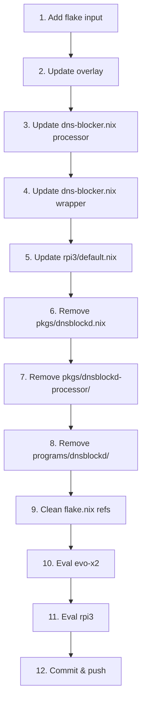

# Plan: Extract dnsblockd from SystemNix

> Date: 2026-05-03 02:52
> Goal: Remove all embedded dnsblockd source code from SystemNix, replace with external flake input

## Pareto Analysis

### 1% → 51% result
- Add dnsblockd as flake input + update overlay → external binary works

### 4% → 64% result
- Replace `dnsblockd-processor` calls with `dnsblockd process` in dns-blocker.nix + rpi3
- Update wrapper script to use `dnsblockd serve -c config.yaml`

### 20% → 80% result
- Delete all embedded source (`programs/dnsblockd/`, `pkgs/dnsblockd-processor/`, `pkgs/dnsblockd.nix`)
- Clean up flake.nix references
- Verify both evo-x2 and rpi3 configs eval

## Execution Graph

## Key Decisions

- **Option A** chosen: Keep SystemNix `dns-blocker.nix` module, just swap binary source
- dnsblockd's own NixOS module NOT used (too different from SystemNix's custom setup)
- The `dnsblockd serve` command uses YAML config instead of CLI flags
- `unbound-socket` not supported by new binary — uses default socket path

## Task Breakdown (each ~5-15 min)

| # | Task | Time | Impact |
|---|------|------|--------|
| 1 | Add dnsblockd flake input to SystemNix flake.nix | 5min | Critical |
| 2 | Replace dnsblockdOverlay to use flake input package | 5min | Critical |
| 3 | Replace `dnsblockd-processor` with `dnsblockd process` in dns-blocker.nix | 10min | Critical |
| 4 | Update dns-blocker.nix wrapper: flags → YAML config | 10min | Critical |
| 5 | Replace `dnsblockd-processor` with `dnsblockd process` in rpi3/default.nix | 5min | Critical |
| 6 | Delete pkgs/dnsblockd.nix | 2min | Medium |
| 7 | Delete pkgs/dnsblockd-processor/ directory | 2min | Medium |
| 8 | Delete platforms/nixos/programs/dnsblockd/ directory | 2min | Medium |
| 9 | Remove dnsblockd-processor from packages output in flake.nix | 2min | Medium |
| 10 | Verify evo-x2 nix eval | 5min | Critical |
| 11 | Verify rpi3-dns nix eval | 5min | Critical |
| 12 | Commit and push SystemNix | 5min | Critical |
