# Setup-Mac De-duplication Implementation Plan

**Date:** 2025-12-26 08:10 CET
**Status:** Ready for Execution
**Estimated Total Time:** 4-6 hours (including testing)
**Strategy:** Pareto Principle (1% → 4% → 20% impact progression)

---

## Executive Summary

This plan provides a systematic, phased approach to eliminate configuration duplications in Setup-Mac. Following the Pareto principle, we focus on high-impact, low-effort tasks first, delivering 80% of benefits with 20% of effort.

**Goal:** Eliminate all identified duplications and establish clear architectural patterns
**Approach:** Incremental execution with testing after each phase
**Risk Level:** Low to Medium (all changes can be rolled back via Nix generations)

---

## Execution Strategy

### Pareto Impact Levels

- **1% Tasks**: Highest impact, trivial effort (5-10 min)
  - Immediate de-duplication wins
  - Single-file changes
  - Zero risk

- **4% Tasks**: High impact, low effort (10-20 min)
  - Structural improvements
  - Multi-file changes with clear patterns
  - Low risk

- **20% Tasks**: Medium impact, medium effort (20-40 min)
  - Organizational refactoring
  - Creating new modules
  - Medium risk (requires testing)

### Execution Phases

- **Phase 1**: Quick Wins (1% tasks) - 15 minutes
- **Phase 2**: Structural Improvements (4% tasks) - 45 minutes
- **Phase 3**: Organizational Refactoring (20% tasks) - 3 hours
- **Phase 4**: Validation & Cleanup (10% tasks) - 30 minutes

---

## Mermaid.js Execution Graph

```mermaid
graph TD
    START[Start Implementation] --> PHASE1[Phase 1: Quick Wins]
    PHASE1 --> P1T1[1.1: Import common Nix settings]
    PHASE1 --> P1T2[1.2: Remove inline exp-features]
    PHASE1 --> P1T3[1.3: Move AI variables to Home Manager]
    PHASE1 --> P1T4[1.4: Update Darwin Fish config]
    P1T1 --> P1T1TEST[Test NixOS config]
    P1T2 --> P1T2TEST[Test NixOS config]
    P1T3 --> P1T3TEST[Test AI services]
    P1T4 --> P1T4TEST[Test Darwin shell]
    P1T1TEST --> PHASE2
    P1T2TEST --> PHASE2
    P1T3TEST --> PHASE2
    P1T4TEST --> PHASE2

    PHASE2[Phase 2: Structural Improvements] --> P2T1[2.1: Create common/fonts.nix]
    PHASE2 --> P2T2[2.2: Import fonts in both systems]
    PHASE2 --> P2T3[2.3: Add Hyprland cache to common]
    PHASE2 --> P2T4[2.4: Update NixOS to import Nix settings]
    PHASE2 --> P2T5[2.5: Remove pavucontrol duplicate]
    P2T1 --> P2T1TEST[Test fonts on both platforms]
    P2T2 --> P2T2TEST[Test fonts on both platforms]
    P2T3 --> P2T3TEST[Test Nix caches]
    P2T4 --> P2T4TEST[Test NixOS build]
    P2T5 --> P2T5TEST[Test audio control]
    P2T1TEST --> PHASE3
    P2T2TEST --> PHASE3
    P2T3TEST --> PHASE3
    P2T4TEST --> PHASE3
    P2T5TEST --> PHASE3

    PHASE3[Phase 3: Organizational Refactoring] --> P3T1[3.1: Create monitoring/gpu.nix]
    PHASE3 --> P3T2[3.2: Create desktop/launchers.nix]
    PHASE3 --> P3T3[3.3: Create desktop/notifications.nix]
    PHASE3 --> P3T4[3.4: Create desktop/screenshots.nix]
    PHASE3 --> P3T5[3.5: Create desktop/terminals.nix]
    PHASE3 --> P3T6[3.6: Create ai/core.nix and ai/inference.nix]
    PHASE3 --> P3T7[3.7: Create security/ subdirectory modules]
    PHASE3 --> P3T8[3.8: Move AI variables to Home Manager]
    PHASE3 --> P3T9[3.9: Remove inline AI variables]
    PHASE3 --> P3T10[3.10: Update system/configuration.nix imports]
    PHASE3 --> P3T11[3.11: Update users/home.nix imports]
    PHASE3 --> P3T12[3.12: Remove empty default.nix]
    PHASE3 --> P3T13[3.13: Remove empty hyprland-config section]
    PHASE3 --> P3T14[3.14: Create environment/variables/common.nix]
    PHASE3 --> P3T15[3.15: Update imports for new modules]
    P3T1 --> P3T1TEST[Test GPU monitoring]
    P3T2 --> P3T2TEST[Test launchers]
    P3T3 --> P3T3TEST[Test notifications]
    P3T4 --> P3T4TEST[Test screenshots]
    P3T5 --> P3T5TEST[Test terminals]
    P3T6 --> P3T6TEST[Test AI tools]
    P3T7 --> P3T7TEST[Test security tools]
    P3T8 --> P3T8TEST[Test Home Manager]
    P3T9 --> P3T9TEST[Test AI variables]
    P3T10 --> P3T10TEST[Test system config]
    P3T11 --> P3T11TEST[Test user config]
    P3T12 --> P3T12TEST[Test no broken imports]
    P3T13 --> P3T13TEST[Test no broken imports]
    P3T14 --> P3T14TEST[Test environment variables]
    P3T15 --> P3T15TEST[Test all imports]

    PHASE4[Phase 4: Validation & Cleanup] --> P4T1[4.1: Run nix flake check]
    PHASE4 --> P4T2[4.2: Run just test for NixOS]
    PHASE4 --> P4T3[4.3: Test Darwin switch]
    PHASE4 --> P4T4[4.4: Run just health]
    PHASE4 --> P4T5[4.5: Run just pre-commit-run]
    PHASE4 --> P4T6[4.6: Update documentation]
    PHASE4 --> P4T7[4.7: Create status report]
    P4T1 --> P4T1TEST[Check flake syntax]
    P4T2 --> P4T2TEST[Check NixOS build]
    P4T3 --> P4T3TEST[Check Darwin build]
    P4T4 --> P4T4TEST[Check system health]
    P4T5 --> P4T5TEST[Check code quality]
    P4T6 --> P4T6TEST[Check documentation]
    P4T7 --> P4T7TEST[Check status report]
    P4T1TEST --> COMMIT[Commit and Push Changes]
    P4T2TEST --> COMMIT
    P4T3TEST --> COMMIT
    P4T4TEST --> COMMIT
    P4T5TEST --> COMMIT
    P4T6TEST --> COMMIT
    P4T7TEST --> COMMIT

    COMMIT --> DONE[All Tasks Complete!]
```



---

## Phase 1: Quick Wins (1% Impact)
**Estimated Time:** 15 minutes
**Risk Level:** Very Low

### Task 1.1: Import common Nix settings in NixOS configuration
**Time:** 5 minutes
**Impact:** High (eliminates duplicate Nix configuration)
**Risk:** Very Low (common settings already tested on Darwin)

**Steps:**
1. Open `platforms/nixos/system/configuration.nix`
2. Add import: `../../common/core/nix-settings.nix` (line 12)
3. Test: `nix flake check`

**Files Modified:**
- `platforms/nixos/system/configuration.nix` (1 import added)

---

### Task 1.2: Remove inline experimental-features from NixOS configuration
**Time:** 2 minutes
**Impact:** High (eliminates duplicate experimental-features)
**Risk:** Very Low (now imported from common)

**Steps:**
1. Open `platforms/nixos/system/configuration.nix`
2. Delete line 56: `nix.settings.experimental-features = ["nix-command" "flakes"];`
3. Test: `nix flake check`

**Files Modified:**
- `platforms/nixos/system/configuration.nix` (1 line deleted)

---

### Task 1.3: Move AI variables from ai-stack.nix to Home Manager
**Time:** 10 minutes
**Impact:** High (fixes variable scope issue)
**Risk:** Low (Ollama service runs as user, user-level variables correct)

**Steps:**
1. Open `platforms/nixos/users/home.nix`
2. Add at line 38 (after sessionVariables):
   ```nix
   home.sessionVariables = {
     # AI/ML environment variables (user-level for Ollama service)
     HIP_VISIBLE_DEVICES = "0";
     ROCM_PATH = "${pkgs.rocmPackages.rocm-runtime}";
     HSA_OVERRIDE_GFX_VERSION = "11.0.0";
     PYTORCH_ROCM_ARCH = "gfx1100";
   };
   ```
3. Open `platforms/nixos/desktop/ai-stack.nix`
4. Delete lines 4-9 (environment.variables with AI settings)
5. Test: `nix flake check`

**Files Modified:**
- `platforms/nixos/users/home.nix` (sessionVariables added)
- `platforms/nixos/desktop/ai-stack.nix` (environment.variables deleted)

---

### Task 1.4: Update Darwin Fish config to use common pattern
**Time:** 5 minutes
**Impact:** High (reduces shell configuration duplication)
**Risk:** Very Low (common pattern already tested)

**Steps:**
1. Open `platforms/darwin/programs/shells.nix`
2. Replace entire content with:
   ```nix
   {
     imports = [../../common/programs/fish.nix];
     programs.fish.shellInit = lib.mkAfter ''
       # Homebrew integration (Darwin-specific)
       if test -f /opt/homebrew/bin/brew
           eval (/opt/homebrew/bin/brew shellenv)
       end
     '';
   }
   ```
3. Test: `nix flake check`

**Files Modified:**
- `platforms/darwin/programs/shells.nix` (complete refactor)

---

### Phase 1 Verification
**Time:** 5 minutes
**Commands:**
```bash
nix flake check
```

**Success Criteria:**
- Flake syntax check passes
- No duplicate experimental-features
- AI variables in Home Manager scope
- Darwin Fish config uses common pattern

---

## Phase 2: Structural Improvements (4% Impact)
**Estimated Time:** 45 minutes
**Risk Level:** Low

### Task 2.1: Create common/fonts.nix module
**Time:** 10 minutes
**Impact:** High (enables cross-platform fonts)
**Risk:** Low (simple module creation)

**Steps:**
1. Create file: `platforms/common/packages/fonts.nix`
2. Add content:
   ```nix
   {pkgs, ...}: {
     fonts.packages = with pkgs; [
       # Monospace fonts
       jetbrains-mono
     ];

     fonts.fontconfig.defaultFonts = {
       monospace = ["JetBrains Mono"];
       sansSerif = ["DejaVu Sans"];
       serif = ["DejaVu Serif"];
     };
   }
   ```
3. Test: `nix flake check`

**Files Created:**
- `platforms/common/packages/fonts.nix` (new)

---

### Task 2.2: Import fonts in both systems
**Time:** 5 minutes
**Impact:** High (cross-platform font consistency)
**Risk:** Very Low (simple import)

**Steps:**
1. Open `platforms/nixos/system/configuration.nix`
2. Add import: `../../common/packages/fonts.nix` (line 12)
3. Delete lines 69-79 (inline font configuration)
4. Open `platforms/darwin/default.nix`
5. Add import: `../common/packages/fonts.nix` (line 13)
6. Test: `nix flake check`

**Files Modified:**
- `platforms/nixos/system/configuration.nix` (import added, 11 lines deleted)
- `platforms/darwin/default.nix` (import added)

---

### Task 2.3: Add Hyprland cache to common Nix settings
**Time:** 5 minutes
**Impact:** Medium (better cache coverage)
**Risk:** Very Low (cache addition is safe)

**Steps:**
1. Open `platforms/common/core/nix-settings.nix`
2. Add "https://hyprland.cachix.org" to substituters (line 23)
3. Add key to trusted-public-keys (line 27):
   `"hyprland.cachix.org-1:a7pgxzMz7+chwVL3/pzj6jIBMioiJM7ypFP8PwtkuGc="`
4. Test: `nix flake check`

**Files Modified:**
- `platforms/common/core/nix-settings.nix` (substituters updated, key added)

---

### Task 2.4: Update NixOS to import Nix settings and override caches
**Time:** 10 minutes
**Impact:** High (consistent Nix configuration)
**Risk:** Low (imports common settings with Hyprland cache override)

**Steps:**
1. Open `platforms/nixos/system/configuration.nix`
2. Replace lines 59-65 (inline nix.settings) with:
   ```nix
   # Override substituters to include Hyprland cache in addition to common
   nix.settings = lib.mkForce {
     substituters = lib.mkAfter ["https://hyprland.cachix.org"];
     trusted-public-keys = lib.mkAfter ["hyprland.cachix.org-1:a7pgxzMz7+chwVL3/pzj6jIBMioiJM7ypFP8PwtkuGc="];
   };
   ```
3. Test: `nix flake check`

**Files Modified:**
- `platforms/nixos/system/configuration.nix` (nix.settings replaced with mkForce override)

---

### Task 2.5: Remove pavucontrol duplicate from multi-wm.nix
**Time:** 5 minutes
**Impact:** Low (code cleanup)
**Risk:** Zero (still in home.nix for user access)

**Steps:**
1. Open `platforms/nixos/desktop/multi-wm.nix`
2. Delete line 76: `pavucontrol # Audio control`
3. Test: `nix flake check`

**Files Modified:**
- `platforms/nixos/desktop/multi-wm.nix` (1 line deleted)

---

### Phase 2 Verification
**Time:** 10 minutes
**Commands:**
```bash
nix flake check
# On NixOS:
sudo nixos-rebuild build --flake .
# On Darwin:
darwin-rebuild build --flake .
```

**Success Criteria:**
- Flake syntax check passes
- NixOS builds successfully
- Darwin builds successfully
- Fonts available on both platforms
- Hyprland cache active

---

## Phase 3: Organizational Refactoring (20% Impact)
**Estimated Time:** 3 hours
**Risk Level:** Medium (module creation requires testing)

### Task 3.1: Create common/packages/monitoring/gpu.nix
**Time:** 15 minutes
**Impact:** Medium (better GPU monitoring organization)
**Risk:** Low (consolidates existing packages)

**Steps:**
1. Create directory: `platforms/common/packages/monitoring/`
2. Create file: `platforms/common/packages/monitoring/gpu.nix`
3. Add content:
   ```nix
   {pkgs, ...}: {
     environment.systemPackages = with pkgs; [
       # GPU monitoring tools
       nvtopPackages.amd
       radeontop
       # Note: amdgpu_top is in hardware/amd-gpu.nix (AMD-specific)
     ];
   }
   ```
4. Test: `nix flake check`

**Files Created:**
- `platforms/common/packages/monitoring/gpu.nix` (new)

---

### Task 3.2: Create common/packages/desktop/launchers.nix
**Time:** 15 minutes
**Impact:** Medium (clearer launcher module)
**Risk:** Low (consolidates existing packages)

**Steps:**
1. Create directory: `platforms/common/packages/desktop/`
2. Create file: `platforms/common/packages/desktop/launchers.nix`
3. Add content:
   ```nix
   {pkgs, ...}: {
     environment.systemPackages = with pkgs; [
       # Application launchers
       rofi # Wayland launcher
       wofi # GTK launcher
     ];
   }
   ```
4. Test: `nix flake check`

**Files Created:**
- `platforms/common/packages/desktop/launchers.nix` (new)

---

### Task 3.3: Create common/packages/desktop/notifications.nix
**Time:** 10 minutes
**Impact:** Medium (clearer notifications module)
**Risk:** Low (consolidates existing packages)

**Steps:**
1. Create file: `platforms/common/packages/desktop/notifications.nix`
2. Add content:
   ```nix
   {pkgs, ...}: {
     environment.systemPackages = with pkgs; [
       # Notification daemons
       dunst # dmenu-based notifications
       mako # GTK notifications
       libnotify # Notification library
     ];
   }
   ```
3. Test: `nix flake check`

**Files Created:**
- `platforms/common/packages/desktop/notifications.nix` (new)

---

### Task 3.4: Create common/packages/desktop/screenshots.nix
**Time:** 15 minutes
**Impact:** Medium (clearer screenshot module)
**Risk:** Low (consolidates existing packages)

**Steps:**
1. Create file: `platforms/common/packages/desktop/screenshots.nix`
2. Add content:
   ```nix
   {pkgs, ...}: {
     environment.systemPackages = with pkgs; [
       # Screenshot tools
       grim # Wayland screenshot
       slurp # Wayland selection
       grimblast # Enhanced screenshot utility
     ];
   }
   ```
3. Test: `nix flake check`

**Files Created:**
- `platforms/common/packages/desktop/screenshots.nix` (new)

---

### Task 3.5: Create common/packages/desktop/terminals.nix
**Time:** 10 minutes
**Impact:** Medium (clearer terminals module)
**Risk:** Low (consolidates existing packages)

**Steps:**
1. Create file: `platforms/common/packages/desktop/terminals.nix`
2. Add content:
   ```nix
   {pkgs, ...}: {
     environment.systemPackages = with pkgs; [
       # Terminal emulators
       alacritty-graphics # GPU-accelerated terminal
       kitty # Fast GPU terminal
       ghostty # Modern terminal
       foot # Wayland terminal
     ];
   }
   ```
3. Test: `nix flake check`

**Files Created:**
- `platforms/common/packages/desktop/terminals.nix` (new)

---

### Task 3.6: Create common/packages/ai/core.nix and ai/inference.nix
**Time:** 20 minutes
**Impact:** Medium (better AI module organization)
**Risk:** Low (reorganizes existing packages)

**Steps:**
1. Create directory: `platforms/common/packages/ai/`
2. Create file: `platforms/common/packages/ai/core.nix`:
   ```nix
   {pkgs, ...}: {
     environment.systemPackages = with pkgs; [
       # Core AI/ML tools
       python311
       jupyter
     ];
   }
   ```
3. Create file: `platforms/common/packages/ai/inference.nix`:
   ```nix
   {pkgs, ...}: {
     environment.systemPackages = with pkgs; [
       # Model inference tools
       ollama
       llama-cpp
       vllm
       tesseract4
       poppler-utils
     ];
   }
   ```
4. Test: `nix flake check`

**Files Created:**
- `platforms/common/packages/ai/core.nix` (new)
- `platforms/common/packages/ai/inference.nix` (new)

---

### Task 3.7: Create common/packages/security/ subdirectory modules
**Time:** 20 minutes
**Impact:** Medium (better security module organization)
**Risk:** Low (reorganizes existing packages)

**Steps:**
1. Create directory: `platforms/common/packages/security/`
2. Create file: `platforms/common/packages/security/authentication.nix`:
   ```nix
   {pkgs, ...}: {
     environment.systemPackages = with pkgs; [
       # Authentication tools
       gnupg
       pass
       openssl
     ];
   }
   ```
3. Create file: `platforms/common/packages/security/network.nix`:
   ```nix
   {pkgs, ...}: {
     environment.systemPackages = with pkgs; [
       # Network security tools
       wireshark
       wireshark-cli
       nmap
       aircrack-ng
       tor-browser
       openvpn
       wireguard-tools
     ];
   }
   ```
4. Create file: `platforms/common/packages/security/system.nix`:
   ```nix
   {pkgs, ...}: {
     environment.systemPackages = with pkgs; [
       # System security tools
       aide
       osquery
       clamav
       lynis
     ];
   }
   ```
5. Test: `nix flake check`

**Files Created:**
- `platforms/common/packages/security/authentication.nix` (new)
- `platforms/common/packages/security/network.nix` (new)
- `platforms/common/packages/security/system.nix` (new)

---

### Task 3.8: Remove inline AI variables from ai-stack.nix
**Time:** 5 minutes
**Impact:** Medium (fixes variable scope)
**Risk:** Zero (already moved to Home Manager in 1.3)

**Steps:**
1. Open `platforms/nixos/desktop/ai-stack.nix`
2. Verify lines 4-9 are deleted (environment.variables)
3. If not, delete them
4. Test: `nix flake check`

**Files Modified:**
- `platforms/nixos/desktop/ai-stack.nix` (cleanup if needed)

---

### Task 3.9: Update system/configuration.nix imports
**Time:** 10 minutes
**Impact:** High (use new monitoring and security modules)
**Risk:** Low (simple import updates)

**Steps:**
1. Open `platforms/nixos/system/configuration.nix`
2. Add imports (line 12):
   ```nix
   ../../common/packages/monitoring/gpu.nix
   ../../common/packages/desktop/launchers.nix
   ../../common/packages/desktop/notifications.nix
   ../../common/packages/desktop/screenshots.nix
   ../../common/packages/desktop/terminals.nix
   ../../common/packages/ai/core.nix
   ../../common/packages/ai/inference.nix
   ```
3. Delete lines: `../desktop/monitoring.nix` (line 19)
4. Test: `nix flake check`

**Files Modified:**
- `platforms/nixos/system/configuration.nix` (7 imports added, 1 deleted)

---

### Task 3.10: Update monitoring.nix to remove GPU packages
**Time:** 5 minutes
**Impact:** Medium (cleaner monitoring module)
**Risk:** Zero (GPU packages moved to dedicated module)

**Steps:**
1. Open `platforms/nixos/desktop/monitoring.nix`
2. Delete lines 4-7 (GPU monitoring packages)
3. Keep only system/network monitoring (lines 9-19)
4. Test: `nix flake check`

**Files Modified:**
- `platforms/nixos/desktop/monitoring.nix` (4 lines deleted)

---

### Task 3.11: Update multi-wm.nix to remove launcher packages
**Time:** 5 minutes
**Impact:** Medium (cleaner multi-wm module)
**Risk:** Zero (launcher packages moved to dedicated module)

**Steps:**
1. Open `platforms/nixos/desktop/multi-wm.nix`
2. Delete lines 55 (wofi)
3. Delete line 67 (mako)
4. Test: `nix flake check`

**Files Modified:**
- `platforms/nixos/desktop/multi-wm.nix` (2 lines deleted)

---

### Task 3.12: Update multi-wm.nix to remove screenshot packages
**Time:** 5 minutes
**Impact:** Medium (cleaner multi-wm module)
**Risk:** Zero (screenshot packages moved to dedicated module)

**Steps:**
1. Open `platforms/nixos/desktop/multi-wm.nix`
2. Delete lines 79-80 (grim, slurp)
3. Test: `nix flake check`

**Files Modified:**
- `platforms/nixos/desktop/multi-wm.nix` (2 lines deleted)

---

### Task 3.13: Remove empty default.nix from desktop
**Time:** 2 minutes
**Impact:** Low (code cleanup)
**Risk:** Zero (file is unused)

**Steps:**
1. Delete file: `platforms/nixos/desktop/default.nix`
2. Test: `nix flake check`

**Files Deleted:**
- `platforms/nixos/desktop/default.nix` (unused placeholder)

---

### Task 3.14: Remove empty xserver config from hyprland-config.nix
**Time:** 5 minutes
**Impact:** Low (code cleanup)
**Risk:** Zero (config is empty)

**Steps:**
1. Open `platforms/nixos/desktop/hyprland-config.nix`
2. Delete lines 6-12 (empty xserver config)
3. Test: `nix flake check`

**Files Modified:**
- `platforms/nixos/desktop/hyprland-config.nix` (7 lines deleted)

---

### Task 3.15: Create environment/variables/common.nix
**Time:** 10 minutes
**Impact:** Medium (clearer variable organization)
**Risk:** Low (reorganizes existing variables)

**Steps:**
1. Create directory: `platforms/common/environment/variables/`
2. Move content of `platforms/common/environment/variables.nix` to:
   `platforms/common/environment/variables/common.nix`
3. Update `platforms/common/environment/variables.nix` to import:
   ```nix
   {pkgs, lib, ...}: {
     imports = [./variables/common.nix];

     environment.variables = commonEnvVars;
   }
   ```
4. Test: `nix flake check`

**Files Created:**
- `platforms/common/environment/variables/common.nix` (new)

**Files Modified:**
- `platforms/common/environment/variables.nix` (refactored)

---

### Phase 3 Verification
**Time:** 20 minutes
**Commands:**
```bash
nix flake check
# On NixOS:
sudo nixos-rebuild test --flake .
# On Darwin:
darwin-rebuild build --flake .
```

**Success Criteria:**
- Flake syntax check passes
- NixOS test build succeeds
- Darwin build succeeds
- All new modules imported correctly
- No duplicate packages
- Empty files removed

---

## Phase 4: Validation & Cleanup (10% Impact)
**Estimated Time:** 30 minutes
**Risk Level:** Very Low

### Task 4.1: Run nix flake check
**Time:** 2 minutes
**Impact:** High (validates all changes)
**Risk:** Zero (read-only validation)

**Steps:**
1. Run: `nix flake check`
2. Fix any errors found
3. Re-run until clean

---

### Task 4.2: Run just test for NixOS
**Time:** 5 minutes
**Impact:** High (validates NixOS configuration)
**Risk:** Zero (read-only validation)

**Steps:**
1. Run: `just test` (on NixOS or with NixOS target)
2. Fix any errors found
3. Re-run until clean

---

### Task 4.3: Test Darwin switch (if on macOS)
**Time:** 5 minutes
**Impact:** High (validates Darwin configuration)
**Risk:** Zero (dry-run validation)

**Steps:**
1. Run: `just test` (on Darwin or with Darwin target)
2. Fix any errors found
3. Re-run until clean

---

### Task 4.4: Run just health
**Time:** 5 minutes
**Impact:** High (comprehensive system check)
**Risk:** Zero (read-only validation)

**Steps:**
1. Run: `just health`
2. Review output for issues
3. Address any problems found

---

### Task 4.5: Run just pre-commit-run
**Time:** 3 minutes
**Impact:** Medium (code quality check)
**Risk:** Zero (read-only validation)

**Steps:**
1. Run: `just pre-commit-run`
2. Fix any issues found (formatting, trailing whitespace, gitleaks)
3. Re-run until clean

---

### Task 4.6: Update documentation
**Time:** 8 minutes
**Impact:** Medium (documentation completeness)
**Risk:** Zero (documentation only)

**Steps:**
1. Update `AGENTS.md` with new package structure
2. Document de-duplication patterns used
3. Update package organization section

**Files Modified:**
- `AGENTS.md` (documentation updates)

---

### Task 4.7: Create status report
**Time:** 2 minutes
**Impact:** Medium (project documentation)
**Risk:** Zero (documentation only)

**Steps:**
1. Create: `docs/status/2025-12-26_XX-XX_de-duplication-implementation-complete.md`
2. Document all changes made
3. Include metrics (duplications removed, files created/deleted)

**Files Created:**
- `docs/status/2025-12-26_XX-XX_de-duplication-implementation-complete.md` (new)

---

### Phase 4 Verification
**Time:** 5 minutes
**Commands:**
```bash
git status
git diff --stat
```

**Success Criteria:**
- All validations pass
- Documentation updated
- Status report created
- Ready for commit

---

## Final Commit & Push

### Commit Strategy
1. Commit in logical groups (Phase 1, Phase 2, etc.)
2. Use descriptive commit messages following Conventional Commits
3. Include attribution and Crush signature

### Commit Message Template
```
refactor(phase): description

Detailed explanation of changes.

- Change 1
- Change 2
- Change 3

Related to: comprehensive de-duplication plan


💘 Generated with Crush


Assisted-by: GLM-4.7 via Crush <crush@charm.land>


```

### Push Commands
```bash
git add -A
git commit -m "..."
git push
```

---

## Success Metrics

### Duplications Eliminated
- [ ] 0 GPU monitoring tool duplicates
- [ ] 0 wallpaper tool duplicates
- [ ] 0 desktop tool duplicates
- [ ] 0 clipboard tool duplicates
- [ ] 0 Nix configuration duplicates
- [ ] 0 Fish shell duplicates
- [ ] 0 environment variable duplicates

### Module Organization
- [ ] All packages in focused, single-purpose modules
- [ ] Clear module boundaries (<50 lines each)
- [ ] Platform guards used appropriately
- [ ] System vs user-level configs separated
- [ ] No empty placeholder files

### Quality Metrics
- [ ] `nix flake check` passes
- [ ] `just test` passes on both platforms
- [ ] `just health` shows no critical issues
- [ ] `just pre-commit-run` passes cleanly
- [ ] Documentation up-to-date

### Project Health
- [ ] Working tree clean
- [ ] All commits pushed to remote
- [ ] Status report created
- [ ] Implementation time < 6 hours

---

## Risk Mitigation

### Backup Strategy
- Nix generations provide automatic rollback
- Use `just rollback` if switch fails
- Git commit after each phase (incremental)

### Testing Strategy
- Test after each phase
- Use dry-run (`just test` or `darwin-rebuild build`)
- Full switch only after all phases complete

### Rollback Plan
If critical issue occurs:
1. `just rollback` (previous generation)
2. `git reset --hard HEAD` (undo changes)
3. Document issue and adjust plan

---

## Timeline

### Phase 1: Quick Wins (15 min)
- Task 1.1: 5 min
- Task 1.2: 2 min
- Task 1.3: 10 min
- Task 1.4: 5 min
- Verification: 5 min

### Phase 2: Structural (45 min)
- Task 2.1: 10 min
- Task 2.2: 5 min
- Task 2.3: 5 min
- Task 2.4: 10 min
- Task 2.5: 5 min
- Verification: 10 min

### Phase 3: Refactoring (3 hours)
- Task 3.1-3.7: 90 min
- Task 3.8-3.15: 90 min
- Verification: 20 min

### Phase 4: Validation (30 min)
- Task 4.1-4.7: 30 min

**Total Estimated Time:** 4.5 hours
**Buffer for Issues:** +1.5 hours
**Total with Buffer:** 6 hours

---

## Next Actions

1. **Review Plan**: Read entire plan and confirm understanding
2. **Start Execution**: Begin with Phase 1, Task 1.1
3. **Follow Mermaid Graph**: Execute tasks in dependency order
4. **Test After Each Phase**: Verify changes before proceeding
5. **Document Progress**: Update status as you go
6. **Commit & Push**: Final commit after Phase 4

---

*Plan created: 2025-12-26 08:10 CET*
*Prepared by: Crush AI Assistant*
*Status: Ready for Execution*
